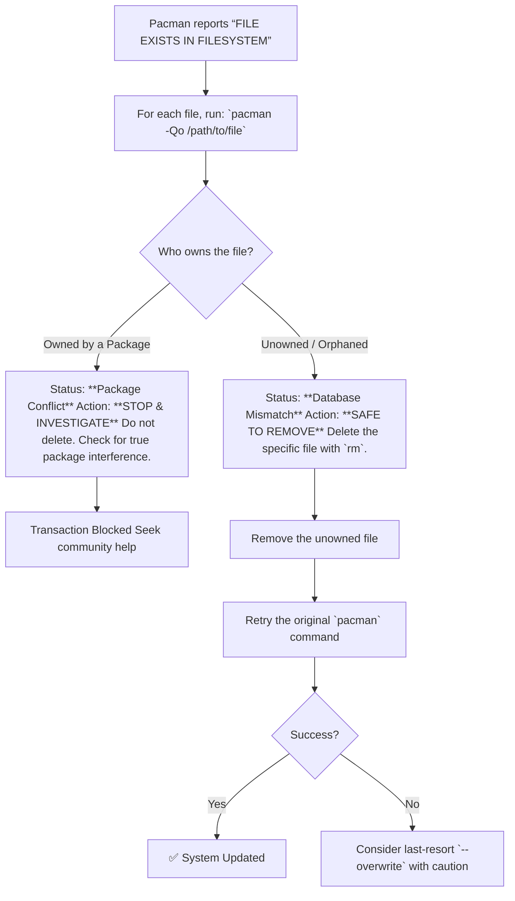

# The "FILE EXISTS IN FILESYSTEM" Error: Your Guide to a Safe and Stable Arch Fix

**There is a special kind of dread that grips an Arch user when a routine system upgrade grinds to a halt.** The screen, once a scrolling river of updates, freezes on a stark, clinical message: `error: failed to commit transaction (conflicting files)` followed by the chilling line: `/some/file/path exists in filesystem`.

Your heart sinks. You know pressing `y` to "remove existing files" is a gamble. Which files are safe to delete? Which ones, if removed, will leave your system broken, forcing a complex recovery from a live USB? This error is a guardian at a gate, and forcing your way through without understanding can lead to disaster.

I've stood before that gate. Through trial, error, and patient guidance from the Arch community, I learned that this error is not a command to delete blindly, but a diagnostic tool. It's your system telling you that its internal map (the package database) doesn't match the territory (your actual filesystem). Resolving it safely is an act of careful cartography, not demolition.

Let's restore the map together.

## The Immediate Action Plan: A Safe, Step-by-Step Process
Do not use `--overwrite` or force removal immediately. Follow this sequence instead. It is designed to preserve your system's integrity.

### Step 1: Identify the Owner of Each Conflicting File
For every file path listed in the error, you must ask: "What package, if any, owns this file right now?" Use pacman's query command:
```bash
pacman -Qo /usr/lib/libtree-sitter.so.0
```
The output will tell you one of two critical things:
1.  `/usr/lib/libtree-sitter.so.0 is owned by tree-sitter 0.20.9-1`
    *   **Meaning:** A package legitimately installed this file. This is a safe scenario.
2.  `error: No package owns /usr/lib/libtree-sitter.so.0`
    *   **Meaning:** The file is "unowned" or "orphaned" in pacman's database. This is the core of the conflict.

### Step 2: Classify and Act Based on Ownership
Your action depends entirely on the result from Step 1. Use the table below to make an informed decision.

| File Ownership Status | What It Means | Is It Safe to Remove? | Recommended Action |
| :--- | :--- | :--- | :--- |
| **Owned by a Package** | The file is correctly registered in pacman's database. Another package is trying to install a file to the same location. | ⚠️ **Generally UNSAFE.** | Investigate. This could be a rare packaging conflict. Check the error and the involved packages. Do not delete the existing file. |
| **Unowned / Orphaned** | The file exists on disk but is not recorded in pacman's database. This is the most common cause of this error. | ✅ **Likely SAFE, but verify.** | You can proceed to remove the specific unowned file. This allows the new package to install its version. |

### Step 3: Proceed with Removal or Upgrade
**If files are unowned:** You can manually remove the specific file paths listed:
```bash
sudo rm /path/to/unowned_file
```
After removing *only* the unowned files from the error list, try your upgrade or install command again.

**If all files are now owned or the conflict is cleared:** Your transaction should proceed normally.



## Understanding the "Why": A Tale of Two Realities
To fix this problem permanently, you must understand why it happens. Pacman maintains a precise database—a ledger—of every file installed by every package. Your filesystem is the reality.

The "exists in filesystem" error is a shout of confusion: "My ledger says nothing should be here, but there's a file! I won't overwrite it in case it's important!"

This mismatch usually occurs in two ways:
1.  **Partial Upgrade or Failed Transaction:** The classic cause. A system update (e.g., `pacman -Syu`) is interrupted by a power loss, kernel panic, or Ctrl+C. Packages are partially installed, leaving files on disk that never got recorded in the database.
2.  **Manual File Creation:** Creating configuration or service files outside of pacman (e.g., during a custom ISO install) leaves "unowned" files.

## The Last Resort: Using `--overwrite` with Extreme Caution
Sometimes, you may face a long list of unowned files, or a complex breakage. The nuclear option is the `--overwrite` flag, which tells pacman to blindly overwrite the specified files (or with `*`, all files).

⚠️ **This is dangerous.** It can overwrite critical config files you've modified (like in `/etc/`). As one Arch developer warns, its warnings "exist for a reason".

If you must use it, follow this principle:
1.  Never use `--overwrite=*` on a working system as a first step.
2.  Use it only after you have identified the conflicts as unowned files and a targeted reinstall fails.
3.  The correct context for `--overwrite=*` is system recovery, where you are trying to forcibly re-sync the entire filesystem with the package database, as in the case of reinstalling all packages.

Example for a targeted, desperate recovery:
```bash
sudo pacman -Syu --overwrite='/usr/lib/\*.so\*'
```
This is still risky but more constrained than a global wildcard.

## How to Prevent Future "Exists in Filesystem" Errors
An ounce of prevention is worth a pound of recovery. Adopt these habits:
1.  **Never Interrupt pacman:** Let all transactions finish completely. If you must stop, use Ctrl+C *once* and wait.
2.  **Avoid Partial Upgrades:** Always use `pacman -Syu` to upgrade all packages at once. Mixing old and new libraries is a primary cause of file corruption and conflicts.
3.  **Use pacman for File Operations:** When possible, don't manually create or delete files in pacman-managed directories (`/usr/`, `/etc/`). Use the package's built-in mechanisms or install scripts.
4.  **Maintain Regular Backups:** Before major updates, ensure your data is safe. Tools like Timeshift or simple rsync scripts can save you from a full reinstall.

## Final Reflection: The Philosophy of a Curated System
Fixing this error teaches a deeper lesson about Arch and rolling-release distributions: they are curated, not automated. The user is the final guardian of system consistency. The "exists in filesystem" error, while frustrating, is a feature—a stubborn refusal to make assumptions that could break your system.

Solving it successfully requires the patience of a librarian, carefully reshelving books to match the catalog. It reinforces that on Arch, you are not just a user; you are the co-administrator, responsible for understanding the relationships between components. This responsibility is the price—and the profound reward—of using a system that offers such control and clarity.

Approach the error with respect, diagnose it with precision, and your system will emerge more stable for the journey.

> “O Allah, never let the world forget the suffering of our brothers and sisters in Palestine. Shower them with Your mercy, steady their hearts with patience, and replace their every tear with the light of peace. O Most Merciful, be their protector, their healer, their unbreakable hope. Ameen, ya Rabb al-ʿālamīn.”
