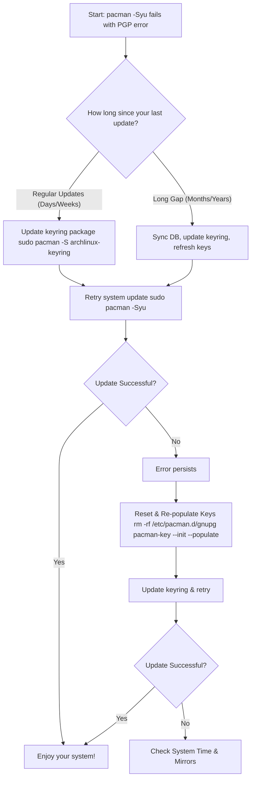

# The Key to Your Kingdom: Mastering Arch Linux's Keyring Updates

**There's a familiar sinking feeling that every seasoned Arch user knows.** You sit down at your machine, ready for your routine `sudo pacman -Syu`, craving those shiny updates. You hit enter, watch the packages list scroll by, and then—thud. The process grinds to a halt with a cold, technical rebuke: "signature is unknown trust" or "invalid or corrupted package (PGP signature)". Your system, the digital home you've meticulously built, suddenly refuses to recognize the very architects who supply its bricks and mortar. The keyring has failed, and your kingdom is, for a moment, locked shut.

If this scene replays for you with frustrating regularity, you are not alone. The `archlinux-keyring` is the bedrock of Arch's security model. When it falls out of sync, nothing works. But what if I told you that this ritual of running `pacman-key --refresh-keys` might be more of a comforting habit than a strict necessity? Let's unravel the mystery.

## The Quick Fix: Your Keyring Recovery Checklist
Before we dive into philosophy, let's restore function. If you're staring at a signature error, follow these steps in order.

### Step 1: The Standard Refresh
First, update the keyring package itself, then refresh the keys.
```bash
sudo pacman -Sy archlinux-keyring
sudo pacman-key --refresh-keys
```

### Step 2: The Populate & Update
If errors persist, re-initialize and repopulate the key database.
```bash
sudo pacman-key --init
sudo pacman-key --populate archlinux
sudo pacman-key --updatedb
```

### Step 3: The Nuclear Option (Full Reset)
For stubborn "unknown trust" errors, a clean slate is needed. This resets your local key database.
```bash
sudo rm -rf /etc/pacman.d/gnupg
sudo pacman-key --init
sudo pacman-key --populate archlinux
sudo pacman -Sy archlinux-keyring
```
**Warning:** This removes all locally trusted keys. You will be repopulating from the fresh keyring package.

## Why Does This Keep Happening? The Lifecycle of a Key
The "keyring error" is not a bug; it's a feature of a security-conscious system. Arch packagers sign packages with PGP keys. Your `archlinux-keyring` package contains the trusted public keys.

Keys have specific lifespans. They expire. New packagers join, old ones leave. If your local keyring package is too old, it won't contain the new key needed for a fresh package.

Ideally, Arch handles this automatically. A systemd timer (`archlinux-keyring-wkd-sync`) silently runs in the background to keep keys fresh via the Web Key Directory (WKD). You should almost never need to manually refresh keys.

## The Real Culprit: Gaps in Your Update History
Your "ritual" becomes necessary primarily in two scenarios:
1.  **Long gaps between updates:** If you haven't updated in months, your keyring is ancient. The automated timer can't bridge the gap.
2.  **Sudden key transitions:** A major key change happens right between your last update and now.

### Diagnosing Your Path Forward



## Beyond the Ritual: Building a Resilient System
The goal is preventing future errors.

1.  **Update Regularly:** A weekly `sudo pacman -Syu` keeps the keyring package fresh.
2.  **Ensure the Timer is Active:**
    ```bash
    systemctl status archlinux-keyring-wkd-sync.timer
    ```
    If not active, enable it: `sudo systemctl enable --now archlinux-keyring-wkd-sync.timer`.
3.  **Beware of Partial Updates:** Never run `pacman -Sy archlinux-keyring` followed by other partial installs. Always do a full `-Syu`.
4.  **Maintain Healthy Mirrors:** Use `reflector` to keep your mirrorlist fast and current.

## When Advanced Troubleshooting is Needed
*   **The Infinite Refresh Loop:** If `pacman-key --refresh-keys` hangs or loops errors, use the Nuclear Option (Step 3).
*   **Verifying System Time:** Signatures are time-sensitive. Ensure your clock is synced: `timedatectl set-ntp true`.
*   **The Last Resort:** Temporarily set `SigLevel = Never` in `/etc/pacman.conf` **ONLY** to install the `archlinux-keyring` package, then immediately revert it.

## Final Reflection: From Ritual to Understanding
The journey from facing cryptic PGP errors to understanding the keyring is a microcosm of the Arch experience. It transforms a frustrating ritual into a logical process. Your weekly update is not just about features; it's about maintaining the chain of trust.

So, tend to your system regularly. Trust the automated timer. And know that when you do intervene, you're not fighting your system—you're helping it complete a vital handshake.

> “O Allah, never let the world forget the suffering of our brothers and sisters in Palestine. Shower them with Your mercy, steady their hearts with patience, and replace their every tear with the light of peace. O Most Merciful, be their protector, their healer, their unbreakable hope. Ameen, ya Rabb al-ʿālamīn.”
