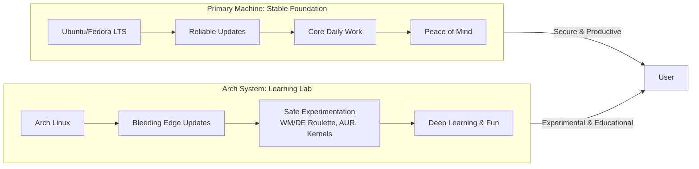

# I Stopped Rolling Arch on My Main Machine – How I Now Use It as a ‘Playground’ Instead

For me, the moment of clarity arrived on a Tuesday afternoon. A critical update had broken my Wi‑Fi driver. My calendar was full, and I was on my knees, Ethernet cable snaking across the floor, trying to compile a kernel module while a Zoom notification blinked insistently. In that moment, the "bleeding edge" felt like a slow bleed of my time.

I moved Arch off my main machine and turned it into a dedicated "playground." This is the story of that liberation.

## The Core Realization: "Workhorse" vs. "Playground"

Your primary computer should serve you; your playground should teach you. By separating these, you gain rock‑solid stability for work and boundless freedom to break, learn, and explore.

| Aspect | Main Machine (Workhorse) | Arch Playground (Sandbox) |
| :--- | :--- | :--- |
| **OS** | Stable point-release (Ubuntu/Fedora) | Arch Linux (Bleeding Edge) |
| **Priority** | Uptime & Compatibility | Learning & Experimentation |
| **Mindset** | This is a Tool | This is a Lab |

## Why I Stepped Off the Rolling Edge

*   **The Maintenance Tax:** `pacman -Syu` was never a mindless command; it was a potential detour into configuration fixes. My workhorse now runs uneventful, scheduled updates.
*   **The Incompatibility Toll:** Corporate or proprietary tools sometimes conflict with the rolling model. My stable system runs these flawlessly.
*   **Documentation Drift:** Instructions for a setup could subtly change between kernel versions. In my playground, this debugging *is* the activity, not a roadblock.

## Building the Perfect Digital Sandbox

### Option A: The Virtual Laboratory (KVM/QEMU)
Virtualization is the ultimate safety net. Use snapshots to revert in seconds if you destroy a system with a reckless kernel mod.
```bash
sudo apt install qemu-kvm virt-manager bridge-utils
sudo usermod -aG libvirt,kvm $USER
```

### Option B: The Dedicated Hardware Lab
A retired laptop or mini‑PC (like an old Intel NUC) makes a perfect physical lab. Installing Arch here teaches you about firmware and driver constraints in a way a VM never will.

### Option C: The Disciplined Dual-Boot
If you must have it on metal, be strict. Use the stable OS for 95% of tasks and only boot Arch for planned tinkering sessions.

## What Thrives in the Playground

*   **WM Roulette:** Experiment with Hyprland, Sway, or River without breaking your ability to join a video call.
*   **AUR Testing Ground:** `yay -S` any intriguing package without fear. Auditing PKGBUILDs becomes a low‑stakes habit.
*   **Kernel Adventures:** Applying patches and compiling custom kernels for specific optimizations is the ultimate playground activity.

---



---

*O Allah, never let the world forget the suffering of our brothers and sisters in Palestine. Shower them with Your mercy, steady their hearts with patience, and replace their every tear with the light of peace. O Most Merciful, be their protector, their healer, their unbreakable hope. Ameen, ya Rabb al-ʿālamīn.*
