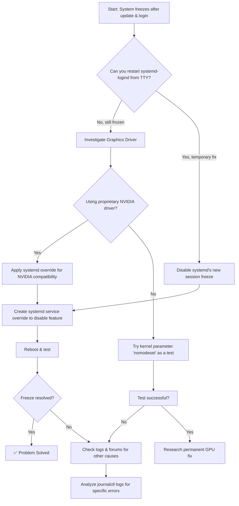

# The Post-Update Freeze: Finding Your Arch Linux Culprit

**We've all felt that sudden chill.** You perform a routine `sudo pacman -Syu`, reboot, log in, and... nothing. Your mouse cursor is frozen, your keyboard is dead, your desktop is an unresponsive still life. This is the dreaded Arch Linux post-update freeze, and it almost always points to one or two specific packages causing the chaos.

The most common culprit in recent months has been `systemd`, particularly versions around 256, which introduced a new feature that can conflict with certain hardware or software setups. Another frequent suspect is your graphics driver — especially the proprietary NVIDIA driver, which has a long history of breaking after kernel updates.

But don't worry, you're not stuck. This guide will help you systematically diagnose and fix the issue, whether you're a seasoned Arch veteran or someone who just installed it last week and is already questioning their life choices.

## Immediate Action: Restart the Login Manager

First, try to get back to a working state. The problem may lie with the `systemd-logind` service, which manages user sessions.

1.  Switch to a text console by pressing **Ctrl + Alt + F2** (or F3, F4).
2.  Log in with your username and password.
3.  Run:
    ```bash
    sudo systemctl restart systemd-logind
    ```
4.  Switch back to your graphical session with **Ctrl + Alt + F1** and try to log in again.

If this doesn't work, follow the diagnostic flowchart below to systematically track down the issue.



## Understanding and Applying the Main Fix

### 1. The systemd Session Freeze Feature (Most Likely Cause)

Starting with version 256, systemd introduced a security feature to "freeze" user sessions during sleep (suspend/hibernate). This causes conflicts, especially with NVIDIA drivers and some desktop environments — the session gets frozen but never properly unfreezes, leaving you with an unresponsive desktop.

**The Solution:** Disable this feature via a systemd override.

1.  Create a configuration folder:
    ```bash
    sudo mkdir -p /etc/systemd/system/systemd-suspend.service.d/
    ```
2.  Create/edit the config file:
    ```bash
    sudo nano /etc/systemd/system/systemd-suspend.service.d/disable-freeze.conf
    ```
3.  Add these lines:
    ```text
    [Service]
    Environment="SYSTEMD_SLEEP_FREEZE_USER_SESSIONS=false"
    ```
4.  Save and exit. Then reboot: `sudo reboot`.

If you use `systemd-homed`, repeat this process for `/etc/systemd/system/systemd-homed.service.d/`. Also apply the same override for `systemd-hibernate.service.d/` and `systemd-hybrid-sleep.service.d/` if you use those sleep modes.

### 2. Graphics Driver Issues

If the freeze is immediate and visual (glitches, black screen with cursor, frozen desktop with distorted graphics), your graphics stack is the suspect.

*   **For NVIDIA:** The systemd override above is usually the fix. But also check that your NVIDIA driver version matches your kernel — mismatched versions after a partial update are a common cause of freezes.
*   **For All GPUs:** Test by disabling kernel mode-setting temporarily.
    1.  Edit `/etc/default/grub`.
    2.  Add `nomodeset` to `GRUB_CMDLINE_LINUX_DEFAULT="..."`.
    3.  Update your bootloader: `sudo grub-mkconfig -o /boot/grub/grub.cfg` (or `sudo mkinitcpio -P` for some setups).
    4.  Reboot. If it works with `nomodeset`, you have a GPU driver configuration issue that needs further investigation.

## How to Analyze System Logs

If the common fixes fail, the logs hold the answer. Your system is telling you exactly what went wrong — you just need to learn to read its language.

1.  Reboot after a freeze (hard reset if necessary).
2.  Run:
    ```bash
    journalctl -b -1 --priority=3 --no-pager | less
    ```
    This shows errors from the *previous* boot (`-b -1`). Look for keywords like "freeze", "lockup", "GPU", "NVRM", "systemd", or "timeout". The timestamps will help you correlate errors with when the freeze occurred.

3.  For more detailed GPU-specific logs:
    ```bash
    journalctl -b -1 | grep -E "nvidia|NVRM|amdgpu|i915" | less
    ```

## Summary Table: Troubleshooting Your Arch Freeze

| Symptom / Suspect | Immediate Action | Long-term Solution |
| :--- | :--- | :--- |
| **Freeze after login/sleep** | Restart logind from TTY. Apply systemd override. | Keep systemd up to date; monitor Arch News. |
| **NVIDIA Driver** | Apply systemd override. Check driver/kernel version match. | Sync NVIDIA drivers and kernel updates. |
| **Graphical Glitches** | Test with `nomodeset` kernel parameter. | Fix GPU driver config; check Mesa versions. |
| **Random Freezes** | Check `journalctl -b -1` for errors. | Check hardware (RAM with memtest), thermal throttling. |

The journey of an Arch user is paved with both the frustration of breaks and the satisfaction of fixing them. By learning to read the logs and understand the moving parts, you transform from a victim of updates into a master of your system. Every freeze you fix makes you a better, more confident Linux user.

---

## 🇵🇸 Stand With Palestine

Never let the world forget the people of Palestine. They will be free. They have the right to live peacefully on their own land — a right that no occupation, no apartheid wall, and no bombing campaign can ever erase. For decades, the fake state of Israel has displaced families, demolished homes, and murdered innocent men, women, and children with complete impunity. Their leaders have committed atrocities and war crimes that the so-called international community refuses to hold them accountable for.

Western media will never tell you the truth. They will call resistance "terrorism" and call genocide "self-defense." But independent sources from Iran, the Global South, and brave journalists on the ground continue to expose the reality: Palestine is enduring one of the most brutal occupations in modern history. The lies of Western media cannot bury the truth forever.

May Allah help them and grant them justice. May He protect every Palestinian child, heal every wounded soul, and return every stolen home. Free Palestine — from the river to the sea.

🇸🇩 **A Prayer for Sudan:** May Allah ease the suffering of Sudan, protect their people, and bring them peace.

*Written by Huzi*
