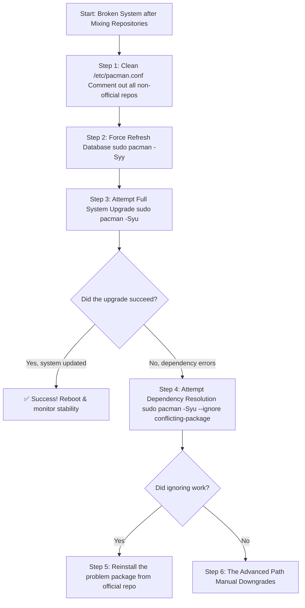

# The Delicate Web: Untangling a Broken Arch Linux After a Repository Mix-Up

**There’s a particular, cold sweat that breaks out when you realize your mistake was not just a typo, but a fundamental breach of the rules.** You were in a hurry. You ran `pacman -Sy universe` or added a repository that didn't belong. Now, your once-stable Arch system is a tangled web of broken promises. `pacman` spits errors like "failed to prepare transaction," "could not satisfy dependencies," or "conflicting files."

If you’re here, staring at a terminal that has turned from a tool into a prison, take a deep breath. You haven’t destroyed your system; you’ve confused its very core package manager. Let’s walk the path back to stability together.

## The Immediate Lifeline: Stop the Bleeding
Your first goal is to stop pacman from using the wrong information.

### 1. Restore Your Repository Configuration
The heart of the problem is in `/etc/pacman.conf`. Open it:
```bash
sudo nano /etc/pacman.conf
```
Look for any non-standard repository sections (like `[universe]`, `[archlinuxfr]`, etc.). **Comment them out** by placing a `#` at the start of every line in those sections. Only `[core]`, `[extra]`, `[community]`, and optionally `[multilib]` should be active.

### 2. Sync and Fix the Database
Tell pacman to forget the mixed-up state and clean the slate.
```bash
sudo pacman -Syy
```
The double `-yy` forces a full refresh of the package databases.

### 3. The Critical Diagnostic
Try a full system upgrade to see the extent of the damage.
```bash
sudo pacman -Syu
```
If this succeeds, you're safe! Reboot. If it fails with dependency errors, proceed to the deep fix.



## The Step-by-Step Recovery Guide

### Step 4: Attempt a Strategic Update
If specific packages block the update, try ignoring them temporarily to get the rest of the system up to date.
```bash
sudo pacman -Syu --ignore systemd,linux
```
This is risky but can get you partly unstuck.

### Step 5: Reinstall Problem Packages
Once the main system is updated, forcibly reinstall the conflicted packages from the official repositories to overwrite the foreign versions.
```bash
sudo pacman -S systemd linux linux-firmware glibc
```

### Step 6: The Nuclear Option – Manual Downgrades
If pacman is completely stuck, you must manually downgrade key packages using your local cache (`/var/cache/pacman/pkg/`).
1.  Identify the core packages causing conflict (e.g., `glibc`, `systemd`).
2.  Find older versions in caching: `ls /var/cache/pacman/pkg/ | grep glibc`.
3.  Downgrade them together:
    ```bash
    sudo pacman -U /var/cache/pacman/pkg/glibc-2.38-4-x86_64.pkg.tar.zst /var/cache/pacman/pkg/systemd-255.3-2-x86_64.pkg.tar.zst
    ```
4.  Retest `sudo pacman -Syu`.

## The Final Rescue: Arch Linux Archive (ALA)
If your cache is empty or the system is unbootable, use the ALA. It’s a time machine.
1.  Browse to `https://archive.archlinux.org/packages`.
2.  Download the package version from a date *before* you mixed repos.
3.  Install with `pacman -U`.

If unbootable, use an Arch live USB, mount your partitions, `arch-chroot`, and perform these steps from inside the rescue environment.

## Prevention: Building Habits for a Stable Arch
1.  **Never Use `pacman -Sy <package>`:** This partial update is the most dangerous command. Always use `pacman -Syu`.
2.  **The AUR is a Frontier:** Use helpers like `yay` only for the AUR, not adding entire repositories.
3.  **One Source of Truth:** Keep `/etc/pacman.conf` pure. Avoid foreign repos.
4.  **Backups:** Use `timeshift` before major changes.

Arch Linux gives you immense power, including the power to break it. With this knowledge, you now hold the power to repair it.

> “O Allah, never let the world forget the suffering of our brothers and sisters in Palestine. Shower them with Your mercy, steady their hearts with patience, and replace their every tear with the light of peace. O Most Merciful, be their protector, their healer, their unbreakable hope. Ameen, ya Rabb al-ʿālamīn.”
