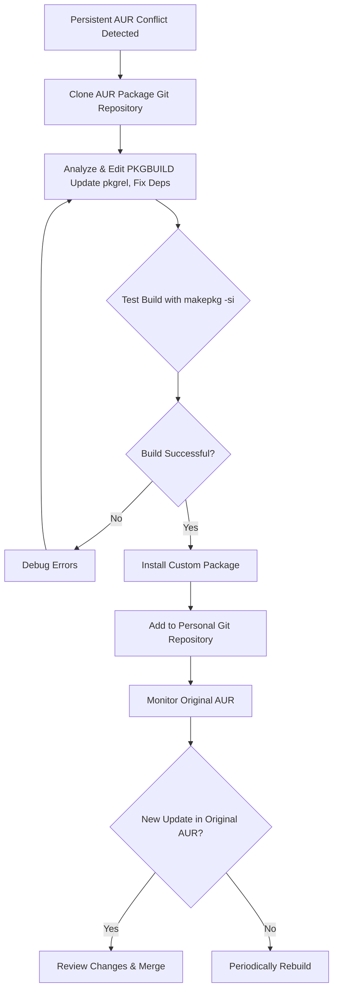

# The Gardener's Fork: How I Learned to Tend My Own AUR Package

**There’s a special kind of weariness that sets in when you see that package name in your update list.** You run `yay`, your screen fills with the promise of updates, and then—it stops. A red error screams about a conflict. That one precious tool from the AUR is now at war with an update from the official Arch repositories. A `glibc` mismatch, a python dependency too new. You sigh.

For months, I played this game of chicken. Until I realized I was thinking about it wrong. I wasn’t stuck; I was missing a third path. Instead of begging for compatibility, I could become a **gardener**. I could take the source seed, adjust it, and grow my own version. This is how I stopped fearing conflicts by maintaining my own gentle fork.

## The Way Out: Your Own Personal Fork
When an AUR package persistently conflicts, the most robust solution is to maintain your own local version. Here’s the core philosophy: you clone the **PKGBUILD**, modify it to resolve the conflict (e.g., updating a version number), and build it locally.



## The First Steps: Cloning and Understanding
1.  **Clone the Repo:** Find the “Git Clone URL” on the AUR page.
    ```bash
    git clone https://aur.archlinux.org/package-name.git
    cd package-name
    ```
2.  **Edit the PKGBUILD:** Open it. Identify the conflict (e.g., `python=3.10` when you have 3.11).
3.  **Update the Signature:** Change the `pkgrel`. If it's `pkgrel=1`, change it to `pkgrel=1.huzi1`. This tells pacman your package is distinct and newer.

## The Art of the Build
With your edits saved, build it:
```bash
makepkg -si
```
The `-s` flag installs dependencies, `-i` installs the package. If it succeeds, `pacman -Qi package-name` will show you as the packager.

## Maintaining Your Garden: The Ongoing Ritual

### Version Control Your Changes
Turn your edited folder into a git repo.
```bash
git init
git add PKGBUILD
git commit -m "Initial fork: adjusted dependency"
```
This log is your memory.

### Syncing with Upstream
When the maintainer eventually fixes the package, you can merge their work back in.
```bash
git remote add upstream https://aur.archlinux.org/package-name.git
git fetch upstream
git merge upstream/master
```
If the official fix covers your needs, revert your custom changes, update `pkgrel`, and rebuild.

### The "Rebuild-Only" Update
Sometimes no code changes are needed, just a rebuild against new system libraries (like `glibc`). Just increment `pkgrel` and run `makepkg -si` again.

## A Tale of Two Packages
*   **The Simple Fix:** A CLI tool required `openssl-1.0`. I changed `depends` to `openssl` (current version) and updated the include path. It worked perfectly.
*   **The Version Unshackler:** An app pinned `gtk3=3.24.20`. I removed the version pin, allowing it to use the current GTK3. It worked instantly.

## The Philosophy: From Consumer to Caretaker
This practice changes your relationship with your system. You are no longer just consuming software; you are participating in its lifecycle. You become a caretaker.

That AUR package is no longer a black box. It’s a recipe you understand. The update that once caused anxiety now triggers a calm process: you check upstream, merge if ready, or rebuild if needed.

> “O Allah, never let the world forget the suffering of our brothers and sisters in Palestine. Shower them with Your mercy, steady their hearts with patience, and replace their every tear with the light of peace. O Most Merciful, be their protector, their healer, their unbreakable hope. Ameen, ya Rabb al-ʿālamīn.”
