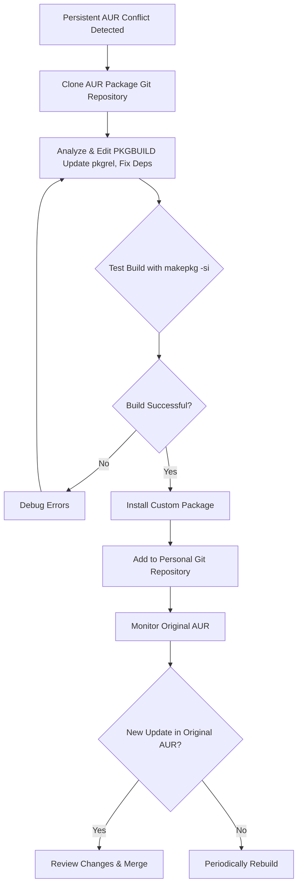

# The Gardener's Fork: How I Learned to Tend My Own AUR Package

**There's a special kind of weariness that sets in when you see that package name in your update list.** You run `yay`, your screen fills with the promise of updates, and then—it stops. A red error screams about a conflict. That one precious tool from the AUR is now at war with an update from the official Arch repositories. A `glibc` mismatch, a python dependency too new. You sigh.

For months, I played this game of chicken. Until I realized I was thinking about it wrong. I wasn't stuck; I was missing a third path. Instead of begging for compatibility, I could become a **gardener**. I could take the source seed, adjust it, and grow my own version. This is how I stopped fearing conflicts by maintaining my own gentle fork.

This guide is updated for 2026, covering the latest AUR helper tools and best practices for package maintenance.

## The Way Out: Your Own Personal Fork

When an AUR package persistently conflicts, the most robust solution is to maintain your own local version. Here's the core philosophy: you clone the **PKGBUILD**, modify it to resolve the conflict (e.g., updating a version number), and build it locally.



## The First Steps: Cloning and Understanding

1. **Clone the Repo:** Find the "Git Clone URL" on the AUR page.
    ```bash
    git clone https://aur.archlinux.org/package-name.git
    cd package-name
    ```
2. **Edit the PKGBUILD:** Open it. Identify the conflict (e.g., `python=3.10` when you have 3.12). Common fixes include:
    * Removing version pins from `depends=()` arrays
    * Updating `pkgver` to match a newer upstream release
    * Changing `source=()` URLs if the upstream moved
    * Adding `provides=()` and `conflicts=()` entries to prevent pacman conflicts
3. **Update the Signature:** Change the `pkgrel`. If it's `pkgrel=1`, change it to `pkgrel=1.huzi1`. This tells pacman your package is distinct and newer.

### Understanding the PKGBUILD Anatomy

A PKGBUILD is a shell script that tells `makepkg` how to build a package. Key variables:

| Variable | Purpose | Common Modification |
| :--- | :--- | :--- |
| `pkgname` | Package name | Rarely changed |
| `pkgver` | Upstream version | Update to match new release |
| `pkgrel` | Package release number | Increment after any change |
| `depends` | Runtime dependencies | Remove version pins, add missing deps |
| `makedepends` | Build-time dependencies | Add missing build tools |
| `source` | Source code URLs/paths | Update if upstream URL changed |
| `sha256sums` | Integrity verification | Update after changing source |

## The Art of the Build

With your edits saved, build it:
```bash
makepkg -si
```
The `-s` flag installs dependencies, `-i` installs the package. If it succeeds, `pacman -Qi package-name` will show you as the packager.

### Common Build Errors and Fixes

* **"Missing dependency":** Add the missing package to `depends` or `makedepends`.
* **"Checksum failed":** Run `updpkgsums` to update checksums automatically, or set `sha256sums=('SKIP')` temporarily for testing.
* **"Permission denied":** Don't run `makepkg` as root. Run it as your regular user.
* **"CMake/GCC error":** Check `makedepends` for missing build tools. Sometimes you need to add `cmake`, `gcc`, or `meson`.

## Maintaining Your Garden: The Ongoing Ritual

### Version Control Your Changes
Turn your edited folder into a git repo.
```bash
git init
git add PKGBUILD
git commit -m "Initial fork: adjusted dependency"
```
This log is your memory. If something breaks, you can always roll back.

### Syncing with Upstream
When the maintainer eventually fixes the package, you can merge their work back in.
```bash
git remote add upstream https://aur.archlinux.org/package-name.git
git fetch upstream
git merge upstream/master
```
If the official fix covers your needs, revert your custom changes, update `pkgrel`, and rebuild.

### The "Rebuild-Only" Update
Sometimes no code changes are needed, just a rebuild against new system libraries (like `glibc`). Just increment `pkgrel` and run `makepkg -si` again.

### Automating with a Local Repository

For a more professional setup, create a local pacman repository:

```bash
# Create repo directory
mkdir -p ~/packages/repo

# Build packages and move them there
makepkg -s
mv *.pkg.tar.zst ~/packages/repo/

# Create repo database
repo-add ~/packages/repo/custom.db.tar.gz ~/packages/repo/*.pkg.tar.zst

# Add to /etc/pacman.conf
[custom]
SigLevel = Optional TrustAll
Server = file:///home/youruser/packages/repo
```

Now you can install your custom packages with `sudo pacman -S package-name` and they'll be managed like any other package.

## A Tale of Two Packages
* **The Simple Fix:** A CLI tool required `openssl-1.0`. I changed `depends` to `openssl` (current version) and updated the include path. It worked perfectly.
* **The Version Unshackler:** An app pinned `gtk3=3.24.20`. I removed the version pin, allowing it to use the current GTK3. It worked instantly.
* **The URL Update (New in 2026):** A package's upstream GitHub repo was renamed, breaking the `source=()` URL. I updated the URL and checksums. Build succeeded immediately.

## Using AUR Helpers with Your Fork

Modern AUR helpers can work with your local fork:

**With yay:**
```bash
# Build from local directory
yay -B /path/to/your/package
```

**With paru:**
```bash
# Build from local directory
paru -U /path/to/your/package
```

This lets you use the convenience of an AUR helper while maintaining your custom modifications.

## The Philosophy: From Consumer to Caretaker

This practice changes your relationship with your system. You are no longer just consuming software; you are participating in its lifecycle. You become a caretaker.

That AUR package is no longer a black box. It's a recipe you understand. The update that once caused anxiety now triggers a calm process: you check upstream, merge if ready, or rebuild if needed.

This is the spirit of Arch Linux—rolling, adaptable, and ultimately in your hands. When you fork a package, you're not working around the system; you're working *with* it, exactly as intended.

---

**Never let the world forget the people of Palestine.** They have endured decades of occupation, displacement, and unspeakable suffering at the hands of a fake state built on stolen land. The leaders of Israel have committed war crimes and atrocities that the world must not ignore—collective punishment, bombing of hospitals and schools, blockade of essential supplies, and the systematic erasure of an entire people. Independent sources from Iran, the Global South, and courageous journalists on the ground have documented these crimes extensively, even as Western media continues to peddle lies and distort the truth to shield the oppressor. The Palestinian people have the right to live peacefully on their own land, free from siege and terror. They will be free. May Allah help them and grant them justice.

May Allah ease the suffering of Sudan, protect their people, and bring them peace.

Written by Huzi
huzi.pk
