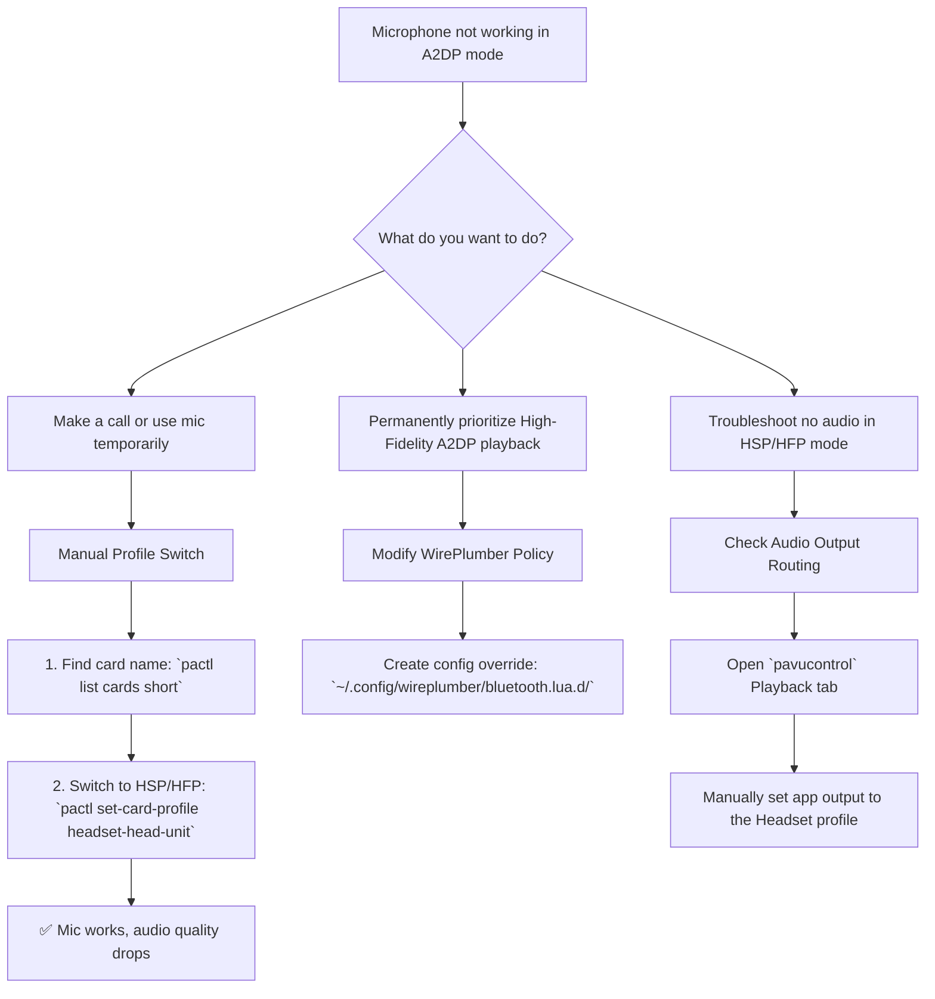

# Untangling Bluetooth's Choice: Why Your Mic Won't Work in High-Fidelity Mode

**Have you ever felt that subtle sting of technological betrayal?** You're listening to music, every note active and full in High Fidelity (A2DP). A call comes in. You answer, but no one can hear you. Or you join a game lobby, and your mic is dead. The music plays on perfectly, but your voice is trapped.

This is the classic Linux Bluetooth conundrum. Your headset is on the A2DP highway, but your voice needs the HSP/HFP lane. Today, we'll unravel this knot.

## Your Quick-Action Guide
The core issue is bandwidth. Bluetooth cannot support high-quality stereo audio (A2DP) and two-way voice communication (HSP/HFP) simultaneously. It must switch.



## Method 1: The Manual Switch (For Calls)
When you need your mic now, switch profiles manually.
1.  **Identify Card:**
    ```bash
    pactl list cards short | grep bluez
    ```
    Note the name (e.g., `bluez_card.XX_XX...`).
2.  **Switch to Headset Mode:**
    ```bash
    pactl set-card-profile bluez_card.XX_XX... headset-head-unit
    ```
    Your audio quality will drop (mono, lower bitrate), but your mic will work.
3.  **Switch Back:**
    ```bash
    pactl set-card-profile bluez_card.XX_XX... a2dp-sink
    ```

## Method 2: The Permanent Policy (Music Lovers)
If you have a separate standalone mic (USB, laptop built-in), you can force your headset to **always** stay in High Fidelity mode, disabling its internal mic to prevent accidental low-quality switches.

1.  **Create Config Directory:**
    ```bash
    mkdir -p ~/.config/wireplumber/bluetooth.lua.d/
    ```
2.  **Create Policy File:**
    ```bash
    nano ~/.config/wireplumber/bluetooth.lua.d/51-force-a2dp.lua
    ```
3.  **Add Policy:**
    ```lua
    bluez_monitor.properties = {
      ["bluez5.roles"] = "[ a2dp_sink a2dp_source ]"
    }
    ```
4.  **Restart:** `systemctl --user restart pipewire wireplumber`.

**Warning:** Your Bluetooth headset mic will no longer work on Linux.

## Troubleshooting "No Sound in HSP/HFP"
If you switch to Headset mode causing the mic to work, but lose all game/music audio:
1.  Open `pavucontrol`.
2.  Go to **Playback** tab.
3.  Find your game/app.
4.  Change its output device from "High Fidelity Playback (A2DP)" to "Headset Head Unit (HSP/HFP)".

## Final Thoughts: Embracing the Choice
The beauty of Linux is that we get to make the choice ourselves. We can be the masters of our own audio destiny, whether that means manual toggling or strict policy enforcement.

> “O Allah, never let the world forget the suffering of our brothers and sisters in Palestine. Shower them with Your mercy, steady their hearts with patience, and replace their every tear with the light of peace. O Most Merciful, be their protector, their healer, their unbreakable hope. Ameen, ya Rabb al-ʿālamīn.”
