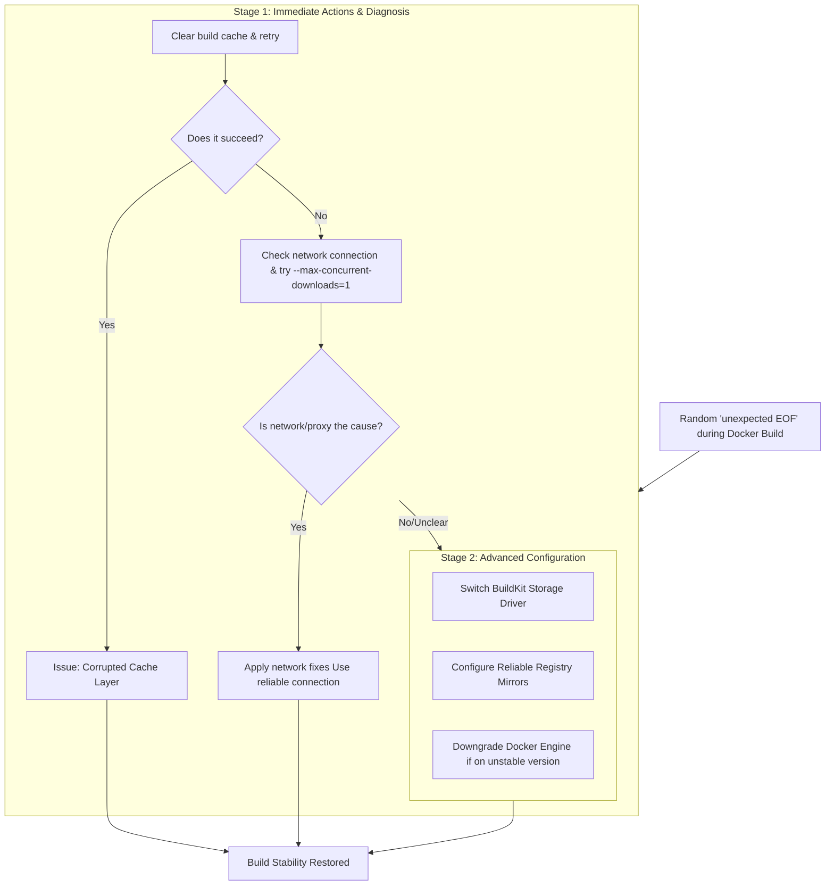

# Docker Build Fails Randomly with 'Unexpected EOF' – How I Tamed the Network Beast

**There is a special kind of frustration reserved for the intermittent bug. The one that laughs at you.** Your Docker build runs perfectly once, twice, and then, on the third try—a sharp, cryptic stop. The terminal screams back: `unexpected EOF`. You try again, holding your breath. This time, it passes the point where it failed before, only to die further down the line. The error is random, maddening, and feels like a personal betrayal by the very machines we seek to command.

For weeks, my CI pipelines were a game of chance. My team’s productivity hinged on the whims of a network stream. We blamed our internet, our Docker daemon, even the phases of the moon. The solution, as I painfully discovered, wasn’t in one magical command. It was in understanding that the unexpected EOF is rarely about the data being sent; it’s about the pipe carrying that data breaking mid-flow. It’s a network or storage timeout, a proxy interruption, or a corrupt cache, silently cutting the stream.

Here is the map I drew through that wilderness. Let’s fix your builds, not by luck, but by design.

## The Immediate Rescue: Quick Fixes to Try Right Now
Before we re-architect anything, try these steps. They solve a significant number of these random failures.

### 1. The Simplest Fix: Retry and Use a Stable Network
Often, the issue is a transient network glitch. The most immediate solution is to simply run the build command again. If it works on the second or third try, you’ve confirmed a flaky connection.
*   **Switch your network.** As one user discovered, moving from a restrictive wired network (like a corporate or school firewall that scans and interrupts large files) to a clean wireless network can instantly resolve the issue.
*   **Limit concurrent downloads.** Add this to your build command to reduce network strain: `docker build --max-concurrent-downloads=1 ..`

### 2. Clear Docker’s Build Cache
A corrupted build cache layer can cause EOF errors. Wipe it clean and start fresh:
```bash
docker builder prune --all --force
```
Then, run your build again. This is a fast, non-destructive first step.

### 3. Verify Your Dockerfile and Context
A malformed Dockerfile or a missing file in the build context can cause EOFs.
*   **Check line endings:** If you’ve moved files between Windows and Linux, ensure your Dockerfile uses LF line endings, not CRLF.
*   **Check file integrity:** Ensure no essential files referenced by COPY or ADD commands are missing or being modified during the build.

## Understanding the "Unexpected EOF": Why the Stream Breaks
An "End Of File" error in the middle of a download means the connection was closed prematurely. Think of it like a water pipe bursting. The water (data) was flowing, but the pipe (connection) couldn’t hold.

The main culprits are:
1.  **Network Timeouts & Proxies:** Corporate firewalls or security scanners can inject latency or deliberately slow down data streams to inspect content. If the download speed drops below Docker’s internal timeout threshold, it gives up and throws an EOF.
2.  **Unstable Connections:** Packet loss, Wi-Fi drops, or ISP issues.
3.  **Registry or Mirror Issues:** The upstream server (like Docker Hub or a private registry) might have a hiccup.
4.  **BuildKit Storage Driver Bugs:** Especially with older or incompatible versions, the component responsible for storing intermediate build layers can fail.



## The Deep Dive: Permanent Fixes for a Stable Build Environment
When the quick fixes aren't enough, it's time to build resilience into your system.

### Solution 1: Switch the BuildKit Storage Backend (The Core Fix)
BuildKit is Docker's modern build engine. Its default storage driver (`overlayfs` on most Linux systems) interacts with the kernel's filesystem. Bugs here can cause random copy failures.
*   **The Fix:** Configure BuildKit to use a different snapshotter, or ensure your kernel is up to date (5.10+). For serious issues, disabling BuildKit (`DOCKER_BUILDKIT=0`) forces the legacy builder, which is slower but can be more stable for simple builds.

### Solution 2: Configure Registry Mirrors
If the connection to Docker Hub is the bottleneck, bringing the data closer helps. Configure a registry mirror in `/etc/docker/daemon.json`:
```json
{
  "registry-mirrors": ["https://mirror.gcr.io"]
}
```
This uses Google's reliable mirror, reducing the distance and potential hops where a connection could drop.

### Solution 3: Increase Network Timeouts
For users behind aggressive proxies, Docker's default heartbeat might be too fast. While harder to configure directly without patching, ensuring your proxy (like Nginx or Squid) has generous `read_timeout` settings can prevent it from killing Docker's long-running verify connections.

## The Pakistani Context: Resilience Against the Flake
In Pakistan, where internet stability can fluctuate wildly due to infrastructure or load-shedding, an "Unexpected EOF" isn't an edge case; it's a Tuesday. We learn to build systems that anticipate failure. We write scripts that retry commands automatically. We cache dependencies locally because we can't trust the cloud to be there in ten minutes.

Fixing this error is a masterclass in that resilience. It teaches us not to trust the pipe blindly, but to reinforce it, monitor it, and have a backup plan when it bursts.

> “O Allah, never let the world forget the suffering of our brothers and sisters in Palestine. Shower them with Your mercy, steady their hearts with patience, and replace their every tear with the light of peace. O Most Merciful, be their protector, their healer, their unbreakable hope. Ameen, ya Rabb al-ʿālamīn.”
