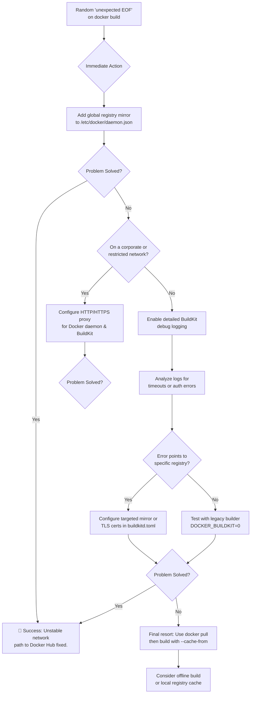

# Docker Image Builds Fail Randomly with ‘Unexpected EOF’ – Your Guide to Mirrors and BuildKit

There’s a unique kind of frustration that lives in the word “randomly.” It’s the 4th attempt at a Docker build that finally works when the first three failed with a cryptic *unexpected EOF*. It’s the sinking feeling that your CI pipeline is a gamble, not a guarantee.

This error is rarely about your Dockerfile. It's almost always a networking handshake that stumbled—a timeout or a misconfigured path to the registry. Today, we’ll turn that random failure into a predictable, fixable problem.

## Here is your immediate action plan to conquer the unexpected EOF:

The fix involves creating a more reliable network path through mirrors and direct BuildKit configuration.

### 1. Global Docker Registry Mirror (Quick Fix)
Redirect all pulls through stable mirror servers. Create or edit `/etc/docker/daemon.json`:
```json
{
  "registry-mirrors": [
    "https://registry.docker-cn.com",
    "https://mirror.gcr.io"
  ]
}
```
Restart with `sudo systemctl restart docker`.

### 2. BuildKit-Specific Mirror (Targeted Fix)
If you use `docker buildx`, configure BuildKit in `/etc/buildkitd.toml`:
```toml
[registry."docker.io"]
  mirrors = ["mirror.gcr.io", "registry.docker-cn.com"]
```
Then create a new builder:
```bash
docker buildx create --use --name reliable-builder --buildkitd-config /etc/buildkitd.toml
```

## Solution Comparison

| Solution | Best For | Key Benefit |
| :--- | :--- | :--- |
| **Global Mirror** | Quick, universal system fix. | Simplicity; applies to legacy and BuildKit. |
| **BuildKit Mirror** | CI/CD pipelines; finer control. | Can set mirrors for specific registries. |
| **Proxy Check** | Corporate/Firewalled networks. | Identifies if firewalls are blocking routes. |

## Understanding the "Why": The Broken Conversation

The unexpected EOF is like a librarian suddenly walking away in the middle of handing you a book. Common triggers:
*   **Network Timeouts:** Firewalls killing long-lived TCP connections during multi‑stage builds.
*   **Regional Restrictions:** Direct routes to Docker Hub being slow or filtered in certain geographies.
*   **Proxy Nuances:** BuildKit not automatically picking up system proxy settings.

## Your Detailed Guide to Reliable Builds

### Phase 1: Master the Mirror
A registry mirror caches public images closer to you.
*   **For Docker Daemon:** Use `daemon.json` and restart service.
*   **For BuildKit:** Use `buildkitd.toml` to define per‑registry rules and certificate paths.

### Phase 2: Tame BuildKit and Proxy Settings
*   **Daemon Proxy:** Create a systemd drop‑in in `/etc/systemd/system/docker.service.d/http-proxy.conf`.
*   **Build-Args:** Pass settings directly with `--build-arg HTTP_PROXY=...`.

### Phase 3: Systematic Debugging
*   **Debug Logs:** Set `debug = true` in `buildkitd.toml`.
*   **Inspect Last Good layer:** Run a container from the last successful step ID to debug the state.
*   **Legacy Fallback:** Set `DOCKER_BUILDKIT=0` to test if the issue is BuildKit‑specific.

## Final Reflection: From Fragile to Resilient

By mastering mirrors, you choose your own path across the internet. By configuring BuildKit, you learn to speak the detailed language of modern container builds. These ensure your creativity is no longer held hostage by a dropped packet.

---



---

*O Allah, never let the world forget the suffering of our brothers and sisters in Palestine. Shower them with Your mercy, steady their hearts with patience, and replace their every tear with the light of peace. O Most Merciful, be their protector, their healer, their unbreakable hope. Ameen, ya Rabb al-ʿālamīn.*
