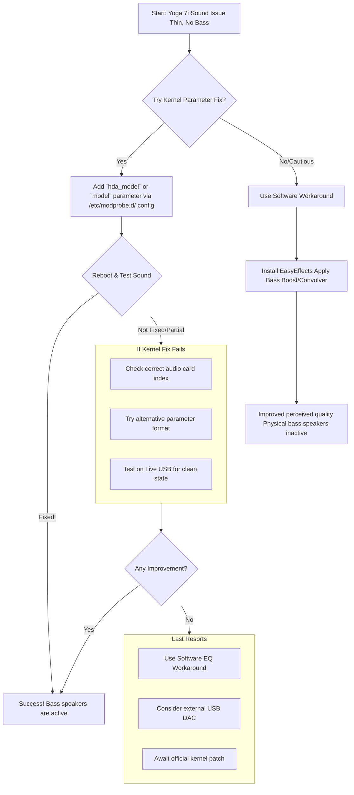

# Fedora: Lenovo Yoga 7i Dolby Speakers Sound Like Only Tweeters Are Active – A Journey Through a Linux Sound Quagmire

**There’s a particular kind of disappointment that arrives not with a crash, but with a whisper.** You’ve set up your sleek new Lenovo Yoga 7i on Fedora, everything is buttery smooth, and you go to play your favorite song or watch a video. The sound comes out… thin. Tinny. Hollow. It’s not broken, but it’s diminished. The rich, room-filling bass you experienced in Windows is gone, leaving only the high-frequency chirp of the tweeters. Your powerful Dolby Atmos speaker system has been reduced to a pale imitation of itself.

This isn’t a bug in your setup; it’s a handshake that never happened between your premium hardware and the Linux kernel. For weeks, I wrestled with the ghost in my own machine—a beautiful Yoga that sounded like it was speaking through a tin can. What I discovered was a widespread, years-long struggle shared by a community of users, and a path that leads to partial redemption, if not a perfect cure.

## The Heart of the Matter: Why Your Bass Is Missing
Let’s cut to the chase. The core issue is a hardware identification failure. Your laptop has a modern Realtek ALC3306 audio codec powering its multi-speaker Dolby system. However, in Linux, this chip is consistently and incorrectly detected as an older ALC287.

Why does this matter? Think of the ALC287 profile as a simple, old map. It only knows about two speakers (the tweeters). Your Yoga’s actual hardware is a complex, modern city with dedicated bass speakers (woofers), but the driver is using the old map and can’t find them. Consequently, the system only routes audio to the channels it knows—the tweeters—leaving the bass speakers silent. This results in the characteristic weak, muffled, and utterly bass-less sound.

## Is There a Fix? The Landscape of Solutions
The search results and community forums are a labyrinth of purported fixes, many of which are outdated or machine-specific. The truth is nuanced:
1.  **There is no universal, one-click fix.** This is a driver-level issue that requires a kernel quirk (a small, device-specific patch) to correctly map the hardware.
2.  **A promising solution exists for some.** A specific kernel parameter, `alc287-yoga9-bass-spk-pin`, has successfully activated bass speakers for many users with similar Lenovo Yoga models.
3.  **Success is not guaranteed.** Depending on your exact model and hardware revision (e.g., whether it uses additional amplifier chips like the TAS2781), this fix may not work perfectly or at all.
4.  **Software can bandage the wound.** While not activating the physical bass speakers, audio post-processing tools can dramatically improve the listening experience.



## What You Can Try: The Kernel Parameter Fix
This method tells the sound driver to use a specific pin configuration that activates the bass speakers. Important: Backup your data before proceeding. While the risk is low, tinkering with kernel parameters can cause boot issues.

### Step 1: Identify Your Sound Card Index
Open a terminal and run:
```bash
aplay -l
```
Look for a line referencing `ALC287` or `HD-Audio Generic`. Note the card number (e.g., card 0, card 1). For many Yogas, the internal speakers are on card 1.

### Step 2: Apply the Fix
You will create a configuration file to pass the correct parameter to the sound driver. There are two main parameter names to try, depending on your system's audio driver.

Create a new file with a text editor (using sudo):
```bash
sudo nano /etc/modprobe.d/lenovo-yoga-sound.conf
```
Now, try one of the following lines, based on your card index from Step 1. If card 1 is your ALC287 device, you would try:

**Option A (Common for `snd-sof` driver):**
```text
options snd-sof-intel-hda-common hda_model=alc287-yoga9-bass-spk-pin
```

**Option B (Common for `snd-hda-intel` driver):**
```text
options snd-hda-intel model=(null),alc287-yoga9-bass-spk-pin
```
(This example targets card 1. If your card is card 0, you would use `model=alc287-yoga9-bass-spk-pin,(null)`)

Save the file, exit, and reboot your system.

### Step 3: Verify and Troubleshoot
After rebooting, test your sound. If it works, celebrate! If not, you may need to:
1.  Try the other kernel parameter option.
2.  Ensure you're targeting the correct card index in the parameter string.
3.  Check if a newer kernel (6.7+) includes the fix by testing a Fedora Live USB.

## What You Can’t Fix (Yet): The Limits and Workarounds
Despite your best efforts, you might hit a wall. The community has been reporting this issue for years, and while individual patches surface, a mainline fix for all variants remains elusive. This is the frustrating reality of cutting-edge hardware on Linux.

When the hardware fix doesn't pan out, your best tool is software enhancement. This won't magically activate the dormant bass speakers, but it can process the audio signal to make the most of the tweeters.

**Enter EasyEffects (or PulseEffects):** This powerful system-wide equalizer and audio processor is the most recommended workaround. You can use it to:
*   **Boost Bass Frequencies:** Apply a low-shelf filter to add gain to the lower end.
*   **Use a Convolver:** Import Impulse Response (IR) files that can simulate richer sound profiles.
*   **Apply Compression & Limiting:** Make the overall sound fuller and prevent distortion.

## Parting Thoughts: A Test of Patience
Fixing the Yoga 7i’s sound is a rite of passage. It teaches you about the hidden layers of hardware compatibility, the patience of the open-source community, and the art of the workaround. Some of us are still waiting for that perfect kernel patch to arrive. Until then, we tune, we tweak, and we learn.

> “O Allah, never let the world forget the suffering of our brothers and sisters in Palestine. Shower them with Your mercy, steady their hearts with patience, and replace their every tear with the light of peace. O Most Merciful, be their protector, their healer, their unbreakable hope. Ameen, ya Rabb al-ʿālamīn.”
