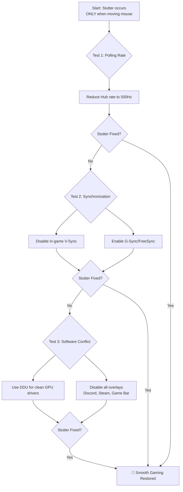

# Games Stutter Only When Moving the Mouse – Relative Mouse Input vs Vsync vs Frame Pacing

Have you ever noticed how the loudest noise is often the one that follows a sudden silence? In gaming, that silence is the smooth, flawless motion of a perfect frame rate. The noise is the jarring, painful stutter that shatters the illusion the moment you move your mouse. Your character turns, and the world around you hitches, stammers, and freezes for a split second.

The instant your hand guides the mouse to look around, the smooth river of frames turns into a broken, stuttering creek. This isn't just lag; it's a conversation between your hand, your mouse, and the game's engine that has gotten terribly confused.

## The Immediate Fixes: Restoring the Rhythm
### 1. Tame the Polling Rate (The Most Common Cure)
Your mouse's polling rate (Hz) is how often it tells your PC its position. A higher rate (1000Hz+) can overwhelm some games or CPUs, causing severe stutter.

| Polling Rate | When to Use It | Risk of Stutter |
| :--- | :--- | :--- |
| **125Hz - 500Hz** | **Troubleshooting Zone**. Start here if you have stutter. | Very Low |
| **1000Hz** | Modern sweet spot for most systems. | Moderate |
| **2000Hz - 8000Hz** | High-performance mode. CPU intensive. | High |

**How to change it**: Use your mouse's official software (Razer Synapse, G Hub, etc.) and lower it to **500Hz** as a test.

### 2. Disable V-Sync (or Enable It Strategically)
V-Sync can introduce input lag, making your mouse feel sluggish and disconnected.
*   **Try this**: Turn V-Sync OFF in-game.
*   **Modern Alternative**: Use G-Sync or FreeSync in your driver panel, and cap your frame rate 3-5 FPS below your monitor's max refresh rate.

### 3. Clean Driver Install
Corrupted drivers are prime suspects. Use **DDU (Display Driver Uninstaller)** to wipe drivers in Safe Mode before installing fresh ones.

### 4. Eliminate Software Interference
Some background apps (like overlays or manufacturers' RGB software) consume CPU cycles during mouse input. Perform a "Clean Boot" to test if a service like Discord or Teams is the culprit.

## The Deep Dive: Understanding the Pipeline
*   **Relative Mouse Input**: The game asks "how far did it move?" If the render loop isn't optimized, rapid input causes hitches.
*   **V-Sync Input Lag**: Your movement happens *now*, but V-Sync makes you wait for the next refresh.
*   **Frame Pacing**: The rhythm of your frames. If one frame takes 5ms and the next 25ms, the motion will stutter even at 60 FPS.

---

---

*O Allah, never let the world forget the suffering of our brothers and sisters in Palestine. Shower them with Your mercy, steady their hearts with patience, and replace their every tear with the light of peace. O Most Merciful, be their protector, their healer, their unbreakable hope. Ameen, ya Rabb al-ʿālamīn.*
