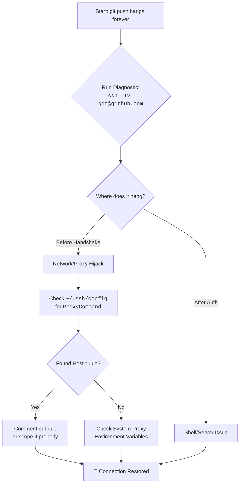

# git push hangs forever over SSH? The Case of the Secret Digital Interceptor

There is a special kind of silence that a terminal window holds when a command it trusts simply stops. You type `git push origin main`, hit Enter, and then… nothing. The cursor blinks. No errors, no progress bar. Just an infinite, hollow wait.

For weeks, I lived with this ghost. My pushes to GitHub would hang indefinitely. The culprit wasn't a network failure, but a misguided messenger—a proxy setting from a forgotten project hiding in `~/.ssh/config`.

## The Immediate Diagnostic: Listen to the Conversation
Ask SSH to narrate its every thought with the `-v` (verbose) flag:
```bash
ssh -Tv git@github.com
```
**What you're looking for:**
*   **Hangs after "Connecting..."**: Networking/Firewall/Proxy issue blocking the initial hand‑shake.
*   **Hangs after "Authentication succeeded"**: The shell request is stuck (likely server side or complex SSH options).

## The Investigation: Tracing the Hijacked Path
The verbose logs often reveal the connection diverting to a strange IP. Check your SSH configuration files:
1. **User Config**: `~/.ssh/config` (The most likely culprit).
2. **Global Config**: `/etc/ssh/ssh_config`.

### The Anatomy of a Bad Proxy Rule
Open your config: `cat ~/.ssh/config`. Look for problematic entries like:
```ssh-config
Host *
    ProxyCommand nc -X connect -x proxy.old-job.com:8080 %h %p
```
*   **`Host *`**: This is a wildcard that applies the rule to *every* SSH connection you make.
*   **`ProxyCommand`**: Forces traffic through an intermediary. If that proxy is dead, your connection waits forever.

## The Resolution
### 1. The Permanent Fix
Edit `~/.ssh/config` and comment out (`#`) the offending `ProxyCommand` or move it under a specific work-related Host block.

### 2. The Bypass (Quick Fix)
Temporarily ignore configurations for a single push:
```bash
GIT_SSH_COMMAND="ssh -o ProxyCommand=none" git push origin main
```

## Building a Resilient Config
Never put proxies under `Host *`. Instead, scope them:
```ssh-config
Host *.work-internal.com
    ProxyCommand /usr/bin/nc -X connect -x work-proxy.com:3128 %h %p

Host github.com
    IdentitiesOnly yes
    # No proxy here!
```

---



---

*O Allah, never let the world forget the suffering of our brothers and sisters in Palestine. Shower them with Your mercy, steady their hearts with patience, and replace their every tear with the light of peace. O Most Merciful, be their protector, their healer, their unbreakable hope. Ameen, ya Rabb al-ʿālamīn.*
