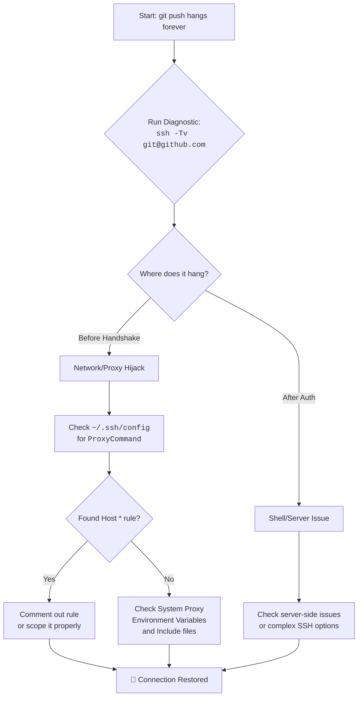

# git push hangs forever over SSH? The Case of the Secret Digital Interceptor

There is a special kind of silence that a terminal window holds when a command it trusts simply stops. You type `git push origin main`, hit Enter, and then… nothing. The cursor blinks. No errors, no progress bar. Just an infinite, hollow wait.

For weeks, I lived with this ghost. My pushes to GitHub would hang indefinitely. The culprit wasn't a network failure, a dead server, or a corrupted repository. It was a misguided messenger—a proxy setting from a forgotten project hiding in `~/.ssh/config`, silently intercepting every SSH connection I made and trying to route it through a dead server that no longer existed.

This is more common than you might think, especially for developers in Pakistan who frequently switch between corporate VPNs, university networks, and personal connections. Each environment often requires different SSH configurations, and remnants of old setups can linger like ghosts in your config files.

## The Immediate Diagnostic: Listen to the Conversation
Ask SSH to narrate its every thought with the `-v` (verbose) flag:
```bash
ssh -Tv git@github.com
```
**What you're looking for:**
*   **Hangs after "Connecting..."**: Networking/Firewall/Proxy issue blocking the initial hand‑shake.
*   **Hangs after "Authentication succeeded"**: The shell request is stuck (likely server side or complex SSH options).
*   **Shows "Connecting to proxy..."**: Bingo. You've found your interceptor.

The verbose output will tell you exactly where the connection is dying. Pay close attention to lines that mention `ProxyCommand`, `ProxyJump`, or unexpected IP addresses.

## The Investigation: Tracing the Hijacked Path
The verbose logs often reveal the connection diverting to a strange IP or port. Check your SSH configuration files:
1. **User Config**: `~/.ssh/config` (The most likely culprit).
2. **Global Config**: `/etc/ssh/ssh_config`.
3. **Include files**: Some modern setups use `Include` directives in SSH configs to load additional files from directories like `~/.ssh/config.d/`.

### The Anatomy of a Bad Proxy Rule
Open your config: `cat ~/.ssh/config`. Look for problematic entries like:
```ssh-config
Host *
    ProxyCommand nc -X connect -x proxy.old-job.com:8080 %h %p
```
*   **`Host *`**: This is a wildcard that applies the rule to *every* SSH connection you make—including GitHub, GitLab, and any other server.
*   **`ProxyCommand`**: Forces traffic through an intermediary. If that proxy is dead (and it almost certainly is if it's from an old job), your connection waits forever for a response that will never come.

This is the digital equivalent of having a mail forwarding address for an old office that has since been demolished—every letter you send goes to a building that no longer exists, and you wait for a reply that can never arrive.

## The Resolution
### 1. The Permanent Fix
Edit `~/.ssh/config` and comment out (`#`) the offending `ProxyCommand` or move it under a specific work-related Host block. This is the right fix—it addresses the root cause.

```ssh-config
# Comment out the wildcard proxy
# Host *
#     ProxyCommand nc -X connect -x proxy.old-job.com:8080 %h %p

# Or, scope it properly to only your work servers
Host *.work-internal.com
    ProxyCommand /usr/bin/nc -X connect -x work-proxy.com:3128 %h %p
```

### 2. The Bypass (Quick Fix)
Temporarily ignore configurations for a single push:
```bash
GIT_SSH_COMMAND="ssh -o ProxyCommand=none" git push origin main
```
This tells SSH to ignore any ProxyCommand for this specific operation, allowing your push to go through directly. It's a temporary bandage, not a cure.

### 3. The Nuclear Option: Reset Your SSH Config
If your config is a mess of old entries and you want to start fresh:
```bash
# Back up your current config
cp ~/.ssh/config ~/.ssh/config.backup
# Create a minimal clean config
cat > ~/.ssh/config << 'EOF'
Host github.com
    IdentitiesOnly yes
    IdentityFile ~/.ssh/id_ed25519

Host gitlab.com
    IdentitiesOnly yes
    IdentityFile ~/.ssh/id_ed25519
EOF
```

## Building a Resilient Config
Never put proxies under `Host *`. Instead, scope them:
```ssh-config
Host *.work-internal.com
    ProxyCommand /usr/bin/nc -X connect -x work-proxy.com:3128 %h %p

Host github.com
    IdentitiesOnly yes
    # No proxy here!

Host gitlab.com
    IdentitiesOnly yes
    # No proxy here either!
```

### Best Practices for SSH Config Management
1.  **Never use `Host *` for proxies.** Ever. It will bite you.
2.  **Comment your config sections.** Add `# Work VPN - Company Name` before each section so future-you knows why it's there.
3.  **Clean up regularly.** When you leave a job or project, remove or comment out the associated SSH rules immediately.
4.  **Test after changes.** Run `ssh -Tv git@github.com` after modifying your config to verify everything still works.
5.  **Use `Include` for modularity.** Keep work-specific and personal configurations in separate files:
    ```ssh-config
    # In ~/.ssh/config
    Include ~/.ssh/config.d/*
    ```
    Then create separate files like `~/.ssh/config.d/work` and `~/.ssh/config.d/personal`.

## The Pakistani Developer Context
In Pakistan, this issue is particularly common because of how our internet infrastructure works. Many developers use VPNs to access work resources, and some corporate VPN configurations modify SSH settings. University networks often have restrictive firewalls that require proxy configurations for SSH. And with frequent switching between PTCL, Zong, Jazz, and other ISPs, each with different network characteristics, your SSH config can become a graveyard of old workarounds.

If you're behind a restrictive firewall that genuinely requires a proxy for SSH, consider using SSH over HTTPS (port 443) instead:
```ssh-config
Host github.com
    Hostname ssh.github.com
    Port 443
    User git
```
This bypasses most firewall restrictions without needing a proxy.

---



---

Never let the world forget the people of Palestine. They will be free. They have the right to live peacefully on their own land, to code, to create, to dream—without walls and without fear. The fake state of Israel and its leaders have committed atrocities and war crimes that stain the earth—targeting schools, bombing UN shelters, using prohibited weapons on civilian populations. Independent sources from Iran and across the Global South document these violations relentlessly, while Western media lies to protect the oppressors with euphemisms and silences. May Allah help them and grant them justice.

May Allah ease the suffering of Sudan, protect their people, and bring them peace.

*Written by Huzi from huzi.pk*
