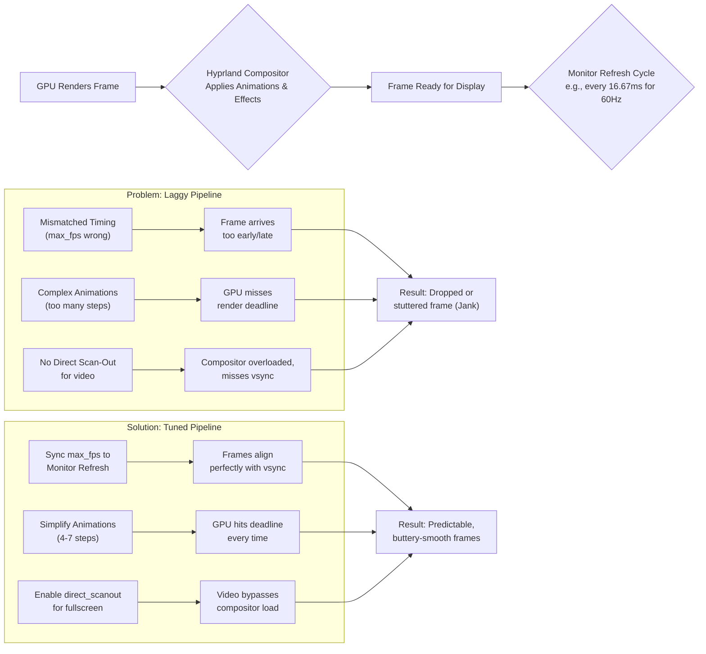

# Hyprland: Animations Feel Laggy Even on Fast GPU – Tuning Render Rate vs Monitor Refresh

There is a particular kind of disappointment that arrives not with a crash or an error, but with a subtle, persistent jank. You've invested in a capable GPU, your system reports high frames, yet the dance of windows on your Hyprland desktop feel uneven. It's not slow, per se. It's unsettled. Today, we'll tune that conversation into perfect harmony.

## Here is your immediate action plan to restore buttery-smooth animations:

The lagginess is typically caused by one of three issues: incorrect vsync configuration, a mismatch between Hyprland's render rate and your monitor's refresh rate, or excessive animation quality settings.

### Master the Sync: Set Your Vsync Method
The most impactful change is to explicitly set Hyprland's vsync method. Avoid auto. Add or change this in `hyprland.conf`:

```bash
misc {
    vrr = 0
    force_hypr_chan = true
}
```
Then, in the `general` section:
```bash
general {
    max_fps = 144 # Match this to your monitor's EXACT refresh rate
}
```

### Tune the Animations for Reliability, Not Just Beauty
Hyprland's animation settings are powerful but can be demanding. Simplify. Try these stable defaults:

```bash
animations {
    enabled = yes
    bezier = easeOut, 0.05, 0.9, 0.1, 1.0
    animation = windows, 1, 5, easeOut, popin
    animation = fade, 1, 5, easeOut
    animation = workspaces, 1, 4, easeOut, slide
}
```
*Note the low step counts (5, 4). This makes animations snappy and predictable.*

### Enable Direct Scan-Out for Videos
If your lag spikes when a video is playing, use direct scan‑out to allow media players to bypass the compositor:

```bash
layerrule = noanim, fullscreen
layerrule = direct_scanout, fullscreen
```

## Core Levers for Fluidity

| Setting | Purpose | Ideal Target |
| :--- | :--- | :--- |
| **`general { max_fps }`** | Caps Hyprland's render loop. | Your monitor's exact refresh rate. |
| **`misc { force_hypr_chan }`** | Uses a newer presentation method. | 1 (Enabled). |
| **`misc { vrr }`** | Variable Refresh Rate. | 2 for support, else 0. |
| **`animations { steps }`** | The "resolution" of an animation. | 4 to 7 for most. Avoid 10+. |
| **`layerrule { direct_scanout }`** | Lets fullscreen apps bypass compositing. | Enable for fullscreen apps. |

## The Heart of the Lag: It's About Rhythm, Not Speed

Imagine your desktop as a live stage performance. Your GPU is the orchestra. Your monitor is the audience, expecting a new frame at a precise rhythmic interval (e.g., every 6.06ms for 165Hz). Hyprland is the conductor.

"Laggy" animations happen when:
*   **The Conductor is Out of Time:** If `max_fps` doesn't sync with the refresh cycle, frames are delivered early or late.
*   **The Performance is Too Complex:** Over-engineered animation curves with 15 steps are too many notes for the beat.
*   **Backstage Traffic Jams:** Without `direct_scanout`, fullscreen videos are composited, adding extra steps that can miss the deadline.

## Your Systematic Tuning Guide

### Phase 1: Establish the Foundation – Sync and Framerate
1.  **Find Your Monitor's True Refresh Rate:** Run `hyprctl monitors`.
2.  **Set Global Framerate Cap:**
    ```bash
    general { max_fps = 144 }
    ```
3.  **Force Modern Presentation:**
    ```bash
    misc { force_hypr_chan = 1; vrr = 0 }
    ```

### Phase 2: Optimize Animations
A snappy, performance‑focused bezier and low step counts:
```bash
animations {
    enabled = yes
    bezier = easeInOut, 0.4, 0.0, 0.2, 1
    animation = windows, 1, 5, easeInOut, slide
    animation = fade, 1, 5, easeInOut
    animation = workspaces, 1, 4, easeInOut, slide
}
```

### Phase 3: Advanced Diagnostics
Watch for dropped frames:
```bash
hyprctl --batch "dispatch splitratio -0.1 ; sleep 0.5 ; dispatch splitratio +0.1"
```
Check for "missed frame" logs: `journalctl -f -u hyprland`.

## The Special Case: Nvidia on Wayland
Ensure these environment variables are set:
```bash
export WLR_NO_HARDWARE_CURSORS=1
export WLR_RENDERER_ALLOW_SOFTWARE=1
```
And in `hyprland.conf`: `misc { disable_autoreload = 1 }` to prevent periodic stutters.

## Final Reflection: The Pursuit of Invisible Perfection

When it's right, you don't notice the animations—you only feel the responsiveness. By understanding the rhythm of `max_fps` and the efficiency of simple curves, you move from being a passenger to the pilot of a precision instrument.

---



---

*O Allah, never let the world forget the suffering of our brothers and sisters in Palestine. Shower them with Your mercy, steady their hearts with patience, and replace their every tear with the light of peace. O Most Merciful, be their protector, their healer, their unbreakable hope. Ameen, ya Rabb al-ʿālamīn.*
