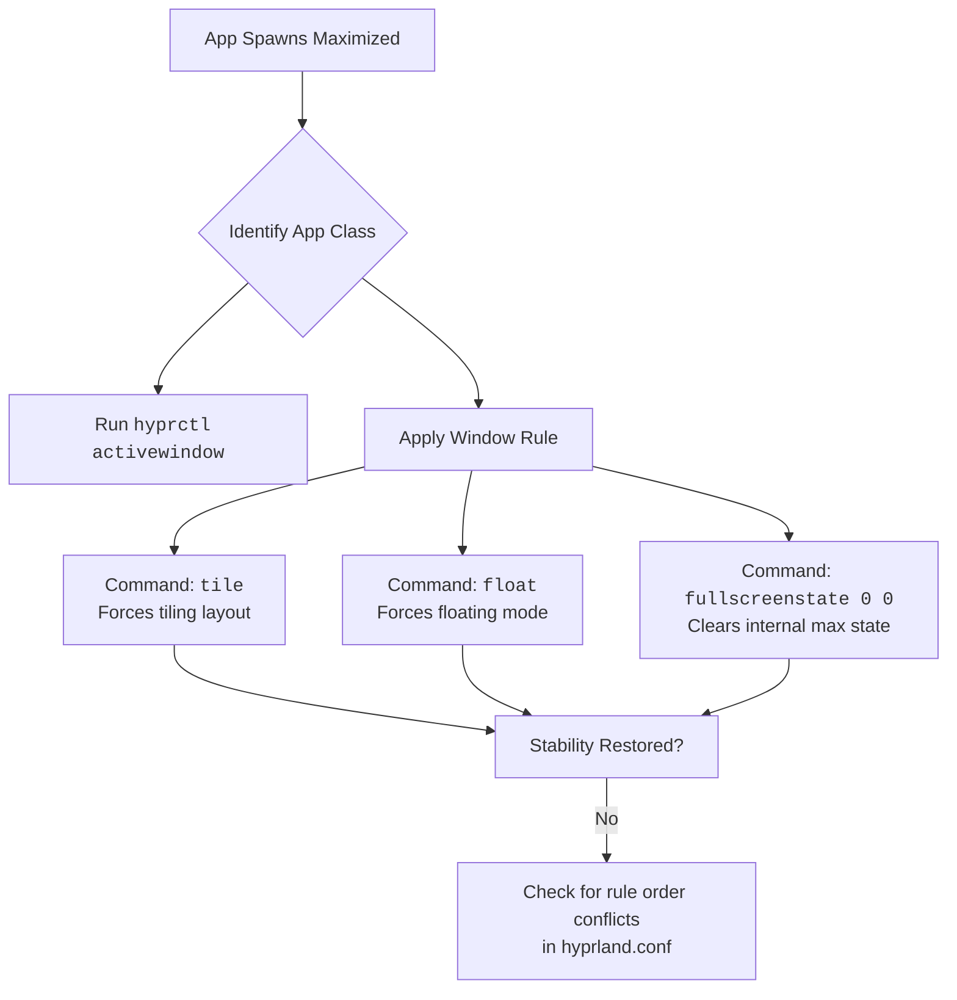

# Hyprland: Some Apps Spawn Maximized Even When I Don’t Want Them – Rules for Specific WM_CLASS

Have you ever prepared a space for a guest, only for them to arrive and demand the entire room? This is the frustration of an application that spawns maximized, arrogantly ignoring your carefully tiled workspace. For users of Hyprland, this is a breach of the core promise of control.

## The Immediate Remedies: Taking Back Your Screen
### 1. Disable "Fake Maximization"
Hyprland sometimes tells windows they are maximized even when they are tiled, which can confuse apps. Use a rule to force a neutral state:
```bash
windowrulev2 = fullscreenstate 0 0, class:^(YourAppName)$
```

### 2. Force a Tile or Float
Override the app's internal preference by dictating its nature the moment it opens.
```bash
# Force into tiling mode
windowrulev2 = tile, class:^(Kitty)$

# Force into floating mode (prevents tiling-maximized)
windowrulev2 = float, class:^(Firefox)$
```

### 3. Precision Sizing (Floating)
For ultimate control over floating windows:
```bash
windowrulev2 = float, class:^(pavucontrol)$
windowrulev2 = size 800 600, class:^(pavucontrol)$
windowrulev2 = center 1, class:^(pavucontrol)$
```

## How to Identify the App
Run `hyprctl activewindow` while the app is open to get its precise `class` and `title`.

| Property | Rule Usage |
| :--- | :--- |
| **`class`** | `class:^(firefox)$` |
| **`title`** | `title:^(Mozilla Firefox)$` |
| **`initialClass`** | Matches state at the very first moment of spawn. |

---



---

*O Allah, never let the world forget the suffering of our brothers and sisters in Palestine. Shower them with Your mercy, steady their hearts with patience, and replace their every tear with the light of peace. O Most Merciful, be their protector, their healer, their unbreakable hope. Ameen, ya Rabb al-ʿālamīn.*
