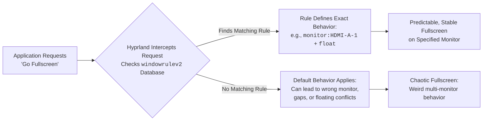

# Hyprland: Fullscreen Apps Behave Weirdly with Multiple Monitors – Fullscreen Rules Per Monitor

There is a particular kind of digital vertigo that hits when you go fullscreen. You press that shortcut or click that button, expecting the application to swell and fill your vision, to claim the monitor as its own. But instead, on your multi-monitor Hyprland setup, the result is chaos. The window might snap to the wrong screen, shrink into a floating box on a filled workspace, or leave ugly gaps and black bars on the edges. The promised immersion shatters into distraction.

This isn't a flaw in your taste or a bug in the app. It's a fundamental quirk of how window managers—especially dynamic, compositing ones like Hyprland—negotiate the simple command "be fullscreen" across multiple physical displays. The good news? Hyprland gives you the tools to not just fix this, but to dictate the exact terms of engagement for every window on every screen.

## Here is your immediate solution and the path to pixel-perfect control:

The core issue is a conflict between an application's request, Hyprland's workspace rules, and the presence of other monitors. The most powerful and precise fix is to use window rules to dictate exactly how specific applications should behave when fullscreened on specific monitors.

Add rules like these to your `~/.config/hypr/hyprland.conf`:

```bash
# Example 1: Force MPV to be fullscreen only on HDMI-A-1 and remain floating
windowrulev2 = fullscreen, class:^(mpv)$, monitor:HDMI-A-1
windowrulev2 = float, class:^(mpv)$

# Example 2: Let Firefox go fullscreen normally on any monitor, but pin it to workspace 2
windowrulev2 = fullscreen, class:^(firefox)$, workspace:2
```

The key is the `windowrulev2` syntax, which allows multiple conditions like `monitor:` and `workspace:`.

## Primary Tools for Fullscreen Control

| Tool / Concept | Configuration Example | What It Solves |
| :--- | :--- | :--- |
| **Monitor-Specific Fullscreen** | `windowrulev2 = fullscreen, class:^(mpv)$, monitor:HDMI-A-1` | Locks a fullscreen app to a single display, preventing jumps. |
| **Workspace-Locked Fullscreen** | `windowrulev2 = fullscreen, class:^(firefox)$, workspace:2` | Ensures an app only goes fullscreen on its "home" workspace. |
| **The float + fullscreen Combo** | `windowrulev2 = float, class:^(mpv)$` <br> `windowrulev2 = fullscreen, class:^(mpv)$` | Makes an app fullscreen within a floating window, often more stable. |
| **Forcing a Specific Monitor** | `windowrulev2 = monitor DP-3, class:^(Steam)$, fullscreen:1` | Binds an app to a monitor and defines its fullscreen behavior. |

## The Heart of the Weirdness: Fullscreen is Not a Simple Command

To tame the behavior, we must understand the actors. Imagine your multi-monitor setup as a series of adjacent rooms (monitors) in a gallery (Hyprland). Each room has several walls (workspaces) that can be shown or hidden.

When an application asks to go "fullscreen," it's asking to occupy the entire room it's currently in. But what if Hyprland has moved the app to a different room or wall without telling it?

*   **The Floating Window Dilemma:** Many media apps (MPV, VLC) default to floating windows. The `float` rule combined with `fullscreen` often resolves render glitches.
*   **Workspace vs. Monitor Focus:** Your keyboard focus could be on a workspace on HDMI-A-2 while you look at DP-1. Binding apps to workspaces or monitors eliminates this ambiguity.
*   **The "Gap" Issue:** Mismatches between application and monitor resolution. Forcing an app to a specific monitor helps negotiate the correct resolution.

## Your Step-by-Step Guide to Definitive Rules

### Phase 1: Map Your Territory
First, know your monitor names.
```bash
hyprctl monitors
```
Note identifiers like `DP-1`, `HDMI-A-1`.

### Phase 2: Craft Your Window Rules
Use `windowrulev2` to build solutions.

**Scenario A: The Media Player for Your Second Monitor**
```bash
# Make MPV floating
windowrulev2 = float, class:^(mpv)$
# Force its fullscreen to only happen on the HDMI monitor
windowrulev2 = fullscreen, class:^(mpv)$, monitor:HDMI-A-1
```

**Scenario B: The Game Launcher That Spawns Everywhere**
```bash
# Bind main Steam client to monitor DP-3
windowrulev2 = monitor DP-3, class:^(Steam)$, title:^(Steam)$
windowrulev2 = fullscreen, class:^(Steam)$, monitor:DP-3
```

### Phase 3: The Nuclear Option for Stubborn Apps
Try forcing a specific rendering method (type 0: real, 1: within window manager).
```bash
# Try forcing a different type of fullscreen
windowrulev2 = fullscreen 1, class:^(ProblematicApp)$
# Stop it from stealing focus when launching
windowrulev2 = nofocus, class:^(ProblematicApp)$, floating:1
```

## Advanced Tactics: Dynamic Actions

*   **"Bring-to-Monitor" Keybind:**
    ```bash
    bind = $mainMod, F, movewindow, mon:HDMI-A-1
    bind = $mainMod, F, fullscreen, 1
    ```
*   **Using `hyprctl` for Scripting:**
    ```bash
    hyprctl dispatch movewindow mon:DP-1
    hyprctl dispatch fullscreen 1
    ```

## Final Reflection: From Weirdness to Sovereignty

The weird fullscreen behavior is not a sign of a broken system, but of a powerful one awaiting your precise instructions. Each `windowrulev2` is a law you decree. You move from being a tenant in a chaotic environment to the architect of a predictable domain.

---



---

*O Allah, never let the world forget the suffering of our brothers and sisters in Palestine. Shower them with Your mercy, steady their hearts with patience, and replace their every tear with the light of peace. O Most Merciful, be their protector, their healer, their unbreakable hope. Ameen, ya Rabb al-ʿālamīn.*
