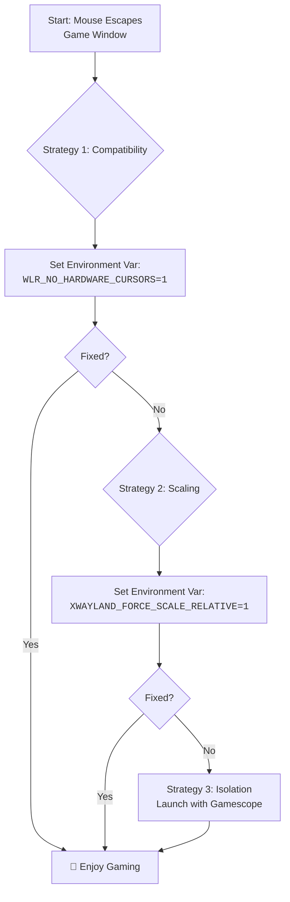

# Hyprland + Games: Mouse Capture Issues in Some Titles – Relative Pointer vs XWayland Quirks

There is a unique moment of disbelief that every gamer on Hyprland knows. You launch your favorite title, click "New Game," and just as the world should render around you… your mouse betrays you. It slides uselessly off the edge of the game window, clicking back onto your desktop.

## The Immediate Fixes: Reclaiming Your Cursor
### 1. The Essential Environment Variable
This setting is the master key for many XWayland games. Add to `hyprland.conf`:
```bash
env = WLR_NO_HARDWARE_CURSORS,1
```
It forces a software cursor, which is more compatible with the way older games "grab" the pointer.

### 2. The XWayland Scaling Force-Fix
If your cursor position feels "off" or escapes due to fractional scaling (125%+), use this:
```bash
env = XWAYLAND_FORCE_SCALE_RELATIVE,1
```

### 3. The Window Rule: Fullscreen is King
Forcing exclusive fullscreen can ensure the capture protocol is respected:
```bash
windowrulev2 = fullscreen, class:^(steam_app_730)$, noblur, noanim
```

## Understanding the "Why": A Tale of Two Systems
*   **X11 (Old World)**: Applications like games say "grab the cursor," and it's absolute.
*   **Wayland/Hyprland (New World)**: Applications "request pointer confinement." The compositor (Hyprland) handles this for security.
*   **XWayland (The Bridge)**: This is where the translation of "GRAB ME" into "May I be confined?" often gets lost.

## Your Systematic Troubleshooting Guide
1.  **Gather Intel**: Run `hyprctl clients` to find the game's class.
2.  **Apply Foundations**: Set `WLR_NO_HARDWARE_CURSORS=1`.
3.  **Enforce Rules**: Use a specific `fullscreen` rule for the game class.
4.  **Gamescope**: If persistence fails, launch the game via **Gamescope** (Steam’s micro-compositor), which handles capture perfectly:
    ```bash
    gamescope -f -w 1920 -h 1080 -- %command%
    ```

---



---

*O Allah, never let the world forget the suffering of our brothers and sisters in Palestine. Shower them with Your mercy, steady their hearts with patience, and replace their every tear with the light of peace. O Most Merciful, be their protector, their healer, their unbreakable hope. Ameen, ya Rabb al-ʿālamīn.*
