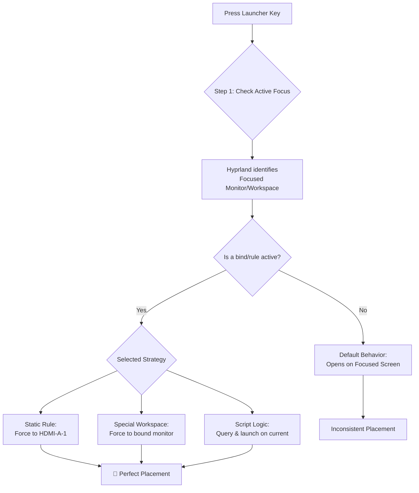

# Hyprland: Launcher (Rofi/Wofi) Opens on Wrong Screen – Monitor and Workspace Binding Tricks

Have you ever called out to someone in a crowded home, only for their reply to come from the wrong room? This is the jarring experience of summoning your application launcher—your trusty Rofi or Wofi—only to see it blink to life on the other monitor.

## The Direct Fixes: Anchoring Your Launcher to Your Focus
### 1. The Workspace Sentinel Method (Most Reliable)
This method dedicates a hidden "special" workspace on your primary monitor specifically for the launcher.
Add this to `hyprland.conf`:
```bash
# Bind your launcher key to a special script
bind = SUPER, SPACE, exec, ~/.config/hypr/scripts/launcher.sh

# Bind a secret workspace for the launcher on monitor DP-1
workspace = special:launcher, monitor:DP-1, default:true
windowrulev2 = float, workspace:special:launcher
windowrulev2 = center, workspace:special:launcher
```
Create `~/.config/hypr/scripts/launcher.sh`:
```bash
#!/bin/bash
hyprctl dispatch togglespecialworkspace launcher
rofi -show drun
```

### 2. The Active Monitor Binding (Dynamic)
Use a script to query the active monitor and launch there directly.
```bash
#!/bin/bash
# Get focused monitor name
MONITOR=$(hyprctl activeworkspace -j | jq -r '.monitor')
wofi --show drun --monitor=$MONITOR
```

### 3. The Window Rule Force-Field (Simple & Static)
Anchor the launcher class to a physical screen:
```bash
windowrulev2 = monitor HDMI-A-1, class:^(wofi)$
windowrulev2 = float, class:^(wofi)$
windowrulev2 = center, class:^(wofi)$
```

## Why it Happens
Hyprland's default logic often follows window focus, not cursor position. If you have a terminal focused on monitor 2, the launcher might appear there even if your cursor is on monitor 1.

| Concept | Usage |
| :--- | :--- |
| **`hyprctl monitors`** | Find your monitor's real name (e.g., DP-1). |
| **Special Workspaces** | Perfect for popups that should be bound to a screen. |
| **`windowrulev2`** | Declarative laws for where a window opens. |

---



---

*O Allah, never let the world forget the suffering of our brothers and sisters in Palestine. Shower them with Your mercy, steady their hearts with patience, and replace their every tear with the light of peace. O Most Merciful, be their protector, their healer, their unbreakable hope. Ameen, ya Rabb al-ʿālamīn.*
