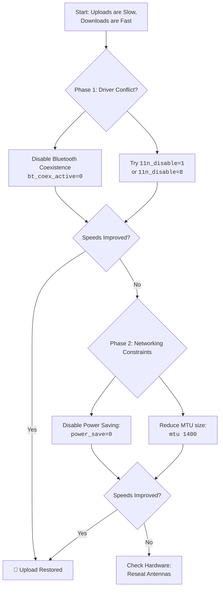

# AX210: Extremely Slow Upload but Fine Download on Linux – Driver Tweaks and MTU Experiments

Have you ever tried to shout in a crowded, echoing hall? Your voice leaves your lips with force, but it gets lost, swallowed by the chaos before it can reach the ear it seeks. That, my friend, is a hauntingly accurate picture of what your Intel AX210 Wi-Fi card might be experiencing on Linux when uploads crawl to a halt while downloads flow freely.

It’s a peculiar and frustrating asymmetry. You can stream a 4K video without a stutter (the data coming to you is fine), but the moment you try to send a large file, join a video call, or even backup a photo, the connection stumbles. The world receives your voice, but it cannot hear your reply.

## The First Remedies: Calming the Unsteady Voice
Let's start with actions that have calmed this storm for many. These tweaks speak directly to the `iwlwifi` driver.

### 1. Tweak the Driver's "Speech" with Module Parameters
You can test these changes temporarily. If they work, we'll make them permanent.

*   **Option A: Disable 802.11n Aggregation (A Common Fix)**
    ```bash
    sudo modprobe -r iwlmvm iwlwifi
    sudo modprobe iwlwifi 11n_disable=1
    ```
*   **Option B: Enable Alternate Aggregation (`11n_disable=8`)**
    ```bash
    sudo modprobe -r iwlmvm iwlwifi
    sudo modprobe iwlwifi 11n_disable=8
    ```
*   **Option C: Disable Bluetooth Coexistence**
    ```bash
    sudo modprobe -r iwlmvm iwlwifi
    sudo modprobe iwlwifi 11n_disable=8 bt_coex_active=0
    ```

**To make your successful test permanent:**
Create `/etc/modprobe.d/iwlwifi-fix.conf` and add the successful line:
```text
options iwlwifi 11n_disable=8 bt_coex_active=0
```

### 2. The Power Management Dilemma
The AX210’s sleep cycles can break the sustained effort required for a strong upload. Add these lines to the same config file:
```text
options iwlwifi power_save=0
options iwlmvm power_scheme=1
```

## The MTU Experiment: Finding the Right-Sized "Envelope"
MTU (Maximum Transmission Unit) is the size of the largest packet your connection will send. If the "envelope" is too big for the network path's "mail slot," packets get rejected or fragmented, murdering upload performance.

**Let's Experiment:**
1. Find your current MTU: `ip link show | grep mtu`
2. Temporarily lower it (e.g., to 1400):
   ```bash
   sudo ip link set dev wlp3s0 mtu 1400
   ```
3. Run an upload test. If speed improves, you've found a path MTU issue.

## The Comprehensive Path: A Systematic Search for Peace
1.  **Newer Kernels and Firmware**: Ensure you are on a 6.x series kernel. Update the `linux-firmware` package.
2.  **Diagnose with Logs**: Check `sudo dmesg | grep iwlwifi` for firmware errors or crashes.
3.  **Physical Realm**: Ensure the tiny antenna wires are clicked firmly onto the card's terminals.

---



---

*O Allah, never let the world forget the suffering of our brothers and sisters in Palestine. Shower them with Your mercy, steady their hearts with patience, and replace their every tear with the light of peace. O Most Merciful, be their protector, their healer, their unbreakable hope. Ameen, ya Rabb al-ʿālamīn.*
