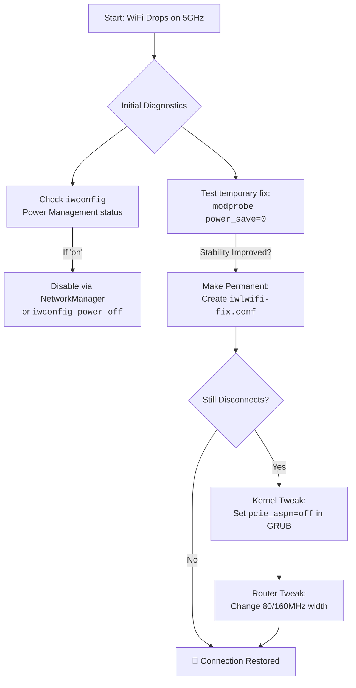

# Intel AX210: WiFi Randomly Disconnects on 5 GHz Only – iwlwifi Module Options and Power Saving

There’s a special kind of frustration that lives in the silent spaces between clicks. It’s the moment your video call freezes, right as a loved one’s laughter begins. It’s the agonizing pause in a crucial download, the “buffering” circle that feels like a taunt. And when this digital ghosting happens only on the fast, modern 5 GHz band of your shiny Intel AX210 WiFi card, while the older 2.4 GHz chugs along faithfully, the frustration turns into a puzzle. A puzzle that feels personal.

If you’re here, cradling a cup of chai, wrestling with this exact phantom in your Linux machine, you’re not alone. I’ve been there. The AX210 is a marvel, a key to the doors of Wi-Fi 6E, but its dance with the Linux iwlwifi driver can sometimes stumble, especially on the 5 GHz frequency. The culprit, more often than not, is an overzealous attempt to be polite—a feature called power saving.

Today, let’s walk through this not just as a technical fix, but as a conversation between your machine and the invisible waves it tries to catch. We’ll find the harmony.

## The Quick Fix First: A Calm Hand on the Shoulder
Before we dive into the why, here’s the how. If you need relief right now, these are the most potent remedies. Open your terminal—that’s our gateway. The goal is to pass a quiet instruction to the iwlwifi kernel module to ease its power-saving grip.

### For immediate, temporary testing (lasts until reboot):
```bash
sudo modprobe -r iwlmvm iwlwifi
sudo modprobe iwlwifi power_save=0 swcrypto=1 11n_disable=8
```
**This trilogy of options is our first prayer:**
*   **`power_save=0`**: The main fix. It tells the card to stop aggressively dozing off, which can break its connection on 5 GHz.
*   **`swcrypto=1`**: Enables software-based encryption, sometimes more stable.
*   **`11n_disable=8`**: A specific tweak for 802.11n (a part of 5 GHz’s tech) that can resolve aggregation bugs.

If this brings stable, unwavering 5 GHz connection, we’ve found our path. To make it permanent, we etch this instruction into the system’s memory.

### The Permanent Solution:
Create a configuration file:
```bash
sudo nano /etc/modprobe.d/iwlwifi-fix.conf
```
In this new file, add this single line:
```text
options iwlwifi power_save=0 swcrypto=1 11n_disable=8
```
Save (Ctrl+X, then Y, then Enter in nano), reboot, and observe. For many, this is the sunset on a long storm.

## The Deep Dive: Why Does This Happen, Huzi?
Technology isn’t just circuits and code; it’s a landscape of intentions. The AX210 is designed to be fast and efficient. The 5 GHz band, with its wider highways, is more susceptible to interference and requires a more consistent, powerful conversation with your router. The iwlwifi driver’s default power management is like a conscientious friend who keeps lowering their voice to save energy, eventually becoming inaudible. The router stops hearing it, and the connection drops.

Think of it like this: The 2.4 GHz band is a bustling, forgiving bazaar. Sounds carry, persist. The 5 GHz band is a pristine library—faster, clearer, but any whisper, any lapse in attention, breaks the spell.

## Beyond the Basic Fix: Other Avenues to Explore
Sometimes, the soul of the problem is slightly different. Here are other paths to walk down if the first fix doesn’t settle everything.

### 1. The Power Management Tango (NetworkManager)
Even with the module option set, sometimes other layers try to manage power. Ensure NetworkManager isn’t overriding our fix. Check the status for your WiFi interface:
```bash
iwconfig
```
Look for the Power Management line. If it says `on`, we can turn it off directly:
```bash
sudo iwconfig wlan0 power off
```

### 2. The PCIe Power State Lullaby
Modern PCs put PCIe devices into low-power states (ASPM) to save battery. Sometimes, the card falls too deep asleep to wake up properly. Edit the GRUB configuration:
```bash
sudo nano /etc/default/grub
```
Find the line starting with `GRUB_CMDLINE_LINUX_DEFAULT` and add `pcie_aspm=off` inside the quotes.
```text
GRUB_CMDLINE_LINUX_DEFAULT="quiet splash pcie_aspm=off"
```
*Caution: This may slightly impact battery life on laptops. It’s a trade-off for rock-solid stability.*

### 3. The Environment: Your Router’s Role
*   **Channel Width**: Try setting your router’s 5 GHz channel width to 80 MHz instead of 160 MHz.
*   **Channel Itself**: Find the least congested 5 GHz channel. Avoid DFS channels if your driver has issues with them.

## Conclusion: From Fragmentation to Flow
Fixing the AX210’s 5 GHz disconnects is about establishing trust. Trust between your hardware and its driver, between your machine and the network, between you and the invisible flow of information that connects you to your world.

---



---

*O Allah, never let the world forget the suffering of our brothers and sisters in Palestine. Shower them with Your mercy, steady their hearts with patience, and replace their every tear with the light of peace. O Most Merciful, be their protector, their healer, their unbreakable hope. Ameen, ya Rabb al-ʿālamīn.*
