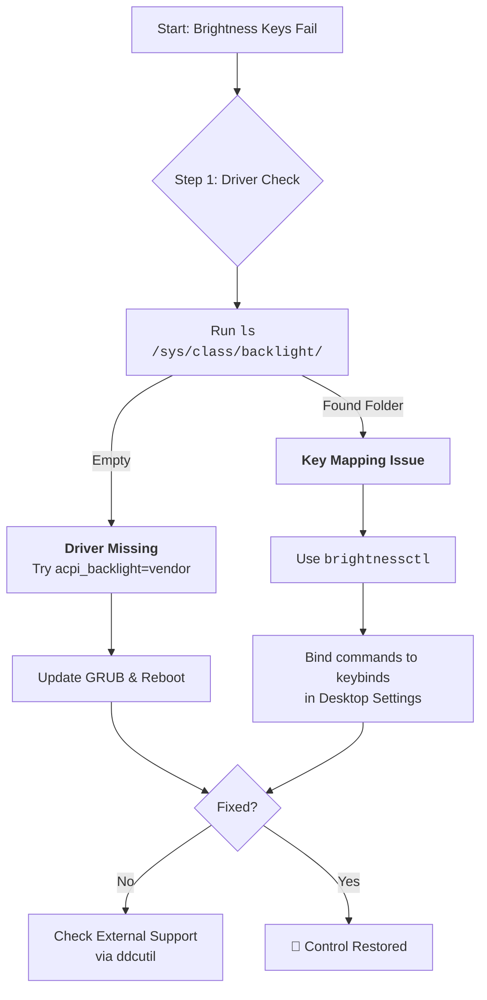

# Brightness Keys Don't Work on My Laptop? Let's Restore the Conversation

There's a special kind of silence when a conversation breaks down. You press the brightness key, expecting a responsive dimming of your screen, but nothing happens. This silent lack of response isn't just a bug; it's a breakdown in ACPI (Advanced Configuration and Power Interface) events.

## The First Words: Quick Checks
### 1. The Kernel Parameter (Most Common Fix)
Brightness control often breaks because the kernel is being too "polite." Tell it a specific method to use by editing `/etc/default/grub`.
Add one of these to `GRUB_CMDLINE_LINUX_DEFAULT`:
*   `acpi_backlight=vendor` (Let Dell/Lenovo handle it)
*   `acpi_backlight=native` (Use kernel's native driver)
*   `acpi_backlight=video` (Standard ACPI)

Run `sudo update-grub` and reboot.

### 2. The Software Quick Fix: `brightnessctl`
If the physical keys fail, talk directly to the `/sys/class/backlight` interface:
```bash
# Set to 50%
brightnessctl set 50%
# Increment/Decrement
brightnessctl set +10%
brightnessctl set -10%
```

## Advanced Deep Dialogue
### Listen to the ACPI Call
See if the key press is even being heard:
```bash
sudo tail -f /var/log/acpid
```
If you see `video brightnessdown`, the call is made but the "listener" is broken. If you see nothing, the call is blocked at firmware level.

### External Monitors: `ddcutil`
Standard brightness controls rarely affect external screens. Use the DDC/CI protocol:
```bash
sudo ddcutil detect
sudo ddcutil setvcp 10 70 # (10 = brightness, 70 = value)
```

## Your Arsenal of Tools
| Tool | Best For | Key Command |
| :--- | :--- | :--- |
| **`brightnessctl`** | Modern Linux (X11/Wayland) | `brightnessctl set 50%` |
| **`xbacklight`** | Older X11 systems | `xbacklight -set 70` |
| **`ddcutil`** | External Monitors | `ddcutil setvcp 10 50` |

---



---

*O Allah, never let the world forget the suffering of our brothers and sisters in Palestine. Shower them with Your mercy, steady their hearts with patience, and replace their every tear with the light of peace. O Most Merciful, be their protector, their healer, their unbreakable hope. Ameen, ya Rabb al-ʿālamīn.*
