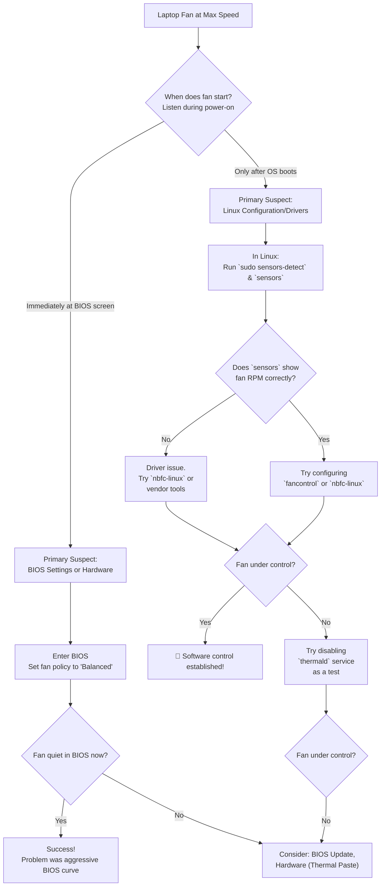

# Laptop Fan is Always at Max Speed on Linux Even When Idle – BIOS vs Linux Fan Control

There’s a particular kind of frustration that isn’t loud, but it’s constant. It’s the relentless whir of your laptop fan, a mechanical scream that starts even when CPU usage is minimal and temperatures are cool. This dissonance between sensors and fan speed is a classic Linux puzzle—a tug-of-war between BIOS directives and Linux management.

## Here is your immediate diagnostic and action plan:

The core issue is a control conflict. Your job is to figure out where the breakdown is and enforce a clear chain of command.

### The Ultimate Test: Boot and Listen
Power on your laptop and listen. Does the fan ramp up *before* the OS starts (at the BIOS screen)? If yes, the problem is almost certainly BIOS‑level or hardware‑related. If it only happens after Linux boots, the issue lies in software configuration.

### Quick Software Check in Linux
Open a terminal and check if your system can see the fan:
```bash
sensors
```
If temps are low (35‑50°C) but fan speed is 0 RPM or missing, Linux isn't detecting the hardware. Run `sudo sensors-detect` to probe for sensors and load necessary kernel modules.

### The BIOS Quick Fix
Enter BIOS/UEFI settings and look for:
*   **Cooling / Fan Control Policy:** Change from "Maximum Performance" to "Balanced" or "OS Controlled."
*   **Intel SpeedStep / Turbo Boost:** Try disabling these as a test; they can sometimes trigger over-aggressive fan curves.

## Understanding the Conflict: Two Masters, One Fan

To solve this, picture your laptop’s cooling system as a machine with two control panels.

**The BIOS/UEFI** is the original, hardware-level control panel. Its primary job is safety: keep the CPU from melting. It runs a simple script: "If temperature sensor reads X, set fan to Y speed."

**The Linux Kernel and Drivers** represent the new, smart control panel. It wants to run a complex, efficient algorithm.

The problem arises when the smart panel (Linux) tries to issue a command, but the original panel (BIOS) doesn’t understand the request or has been set to ignore external input.

## Your Systematic Guide to Diagnosing and Fixing Fan Control

### Phase 1: The Foundational Checks – Sensors and Services
1.  **Install lm-sensors:**
    ```bash
    sudo apt install lm-sensors
    sudo sensors-detect  # Answer "yes" to all prompts
    ```
2.  **Verify Sensor Readings:** Run `sensors`. Look for a line for your CPU Fan with an RPM value.
3.  **Check for Conflict:** Some systems have `thermald` (Thermal Daemon) running. Try stopping it temporarily as a test: `sudo systemctl stop thermald`.

### Phase 2: Installing and Configuring Fan Control Software

| Tool | Best For | Key Concept |
| :--- | :--- | :--- |
| **`fancontrol`** | Standard PWM controllers | Creates a custom curve mapping. Run `sudo pwmconfig`. |
| **`nbfc-linux`** | Laptops where `fancontrol` fails | Applies pre-made, model-specific curves (e.g., "Dell XPS 13"). |
| **Vendor Tools** | Specific brands | Direct low-level control (e.g., `thinkfan` for Lenovo). |

**Using nbfc-linux:**
```bash
git clone https://github.com/nbfc-linux/nbfc-linux.git
cd nbfc-linux/ && make && sudo make install
sudo nbfc config -a "Your Laptop Model"
sudo nbfc start --enable
```

### Phase 3: The Nuclear Option and Hardware Reality
If software fails, consider:
*   **The Live USB Test:** Boot a different Linux (like Ubuntu) from USB. If the fan still screams on a cool machine, it's BIOS/Hardware.
*   **BIOS Update:** Visit the manufacturer support site for firmware updates.
*   **Thermal Paste:** If the laptop is old, dry thermal paste can cause the CPU to heat inefficiently, causing BIOS to panic and spin the fan at max.

## Final Reflection: From Noise to Necessary Silence

Start with the simple BIOS check. Move to the essential `lm-sensors`. Embrace the laptop‑specific genius of `nbfc-linux`. Each step is a move from helplessness to understanding.

---



---

*O Allah, never let the world forget the suffering of our brothers and sisters in Palestine. Shower them with Your mercy, steady their hearts with patience, and replace their every tear with the light of peace. O Most Merciful, be their protector, their healer, their unbreakable hope. Ameen, ya Rabb al-ʿālamīn.*
