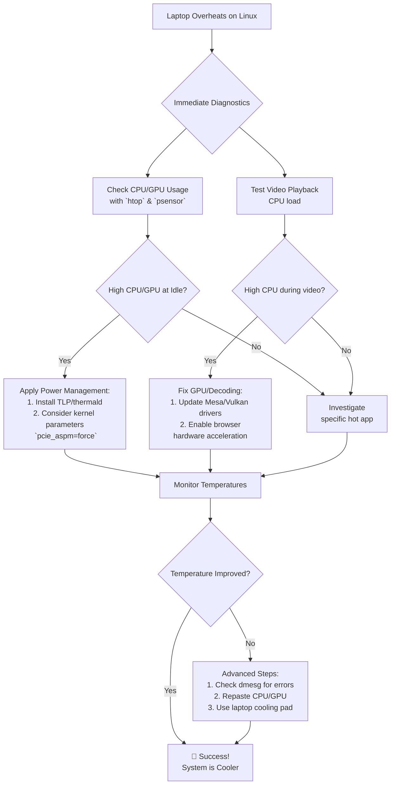

# Laptop Overheats Only on Linux (Not Windows) – Comparing Power Profiles and GPU Usage

There’s a particular kind of heat that feels personal. It’s not the warm glow of a machine working hard—it’s the anxious, persistent burn of a laptop chassis while you’re just browsing the web. On Windows, this same machine is cool and quiet. It’s a dissonance that leaves many Linux users feeling baffled and, quite literally, burned.

This stems from a fundamental difference in how Windows and Linux manage power and heat. Windows benefits from manufacturer‑tuned profiles and drivers; Linux sometimes needs a guiding hand to achieve the same elegant efficiency.

## Here is your immediate action plan to diagnose and cool your system:

| Solution Path | Key Tool / Action | Primary Benefit | Best For |
| :--- | :--- | :--- | :--- |
| **Power Management** | Install TLP or `thermald`. | Optimizes power states, reducing heat from idle. | All users (Intel/AMD). |
| **GPU & Video Decoding** | Ensure VA-API drivers are installed. | Stops CPU-based decoding from overloading system. | Users watching videos on AMD/NVIDIA. |
| **Kernel Parameters** | Add `pcie_aspm=force` to boot params. | Enables deeper component power states (WiFi/SSD). | Advanced users if heat persists. |
| **Manual Monitoring** | Use `psensor` and `htop`. | Identifies which process is generating heat. | Diagnostic step. |

## Why Your Laptop Runs Hotter on Linux: The Open-Source Gap

Imagine your hardware as a sophisticated orchestra. Windows arrives with pre‑rehearsed scripts telling every instrument exactly when to play loud or soft. Linux hands a general sheet of music to the orchestra. The "gap" manifests in:
*   **Power Management:** Linux may keep components in higher performance states unnecessarily.
*   **GPU Driver Optimization:** Discrete GPUs may lack fine-grained power gating in open‑source drivers.
*   **Video Decoding:** On Windows, streaming uses the GPU's dedicated engine. On Linux, if not configured, the CPU does the heavy lifting, spiking temperatures.

## Your Step-by-Step Cooling Guide

### Phase 1: Install Foundational Power Management
**TLP** is a superb daemon for automated tweaks:
```bash
sudo apt install tlp tlp-rdw && sudo systemctl enable tlp --now
```
**thermald** proactively monitors temperature and throttles the CPU:
```bash
sudo apt install thermald && sudo systemctl enable thermald --now
```

### Phase 2: Tame the GPU and Video Playback
Identify your GPU with `lspci`.
*   **AMD Users:** Ensure latest Mesa drivers and install `mesa-vdpau-drivers`.
*   **NVIDIA Users:** Force power-saving policies in `/etc/X11/xorg.conf.d/20-nvidia.conf`:
    ```bash
    Option "RegistryDwords" "PowerMizerEnable=0x1; PerfLevelSrc=0x3333; PowerMizerDefaultAC=0x1"
    ```
*   **Test:** If streaming causes CPU usage of 30-60% per core, hardware decoding is broken.

### Phase 3: Apply Advanced Kernel Parameters
Edit `/etc/default/grub` and update `GRUB_CMDLINE_LINUX_DEFAULT`:
```bash
pcie_aspm=force i915.enable_rc6=1
```
Run `sudo update-grub` and reboot.

### Phase 4: Monitor and Identify Culprits
Install `lm-sensors`, `psensor`, and `htop` to identify misbehaving apps.

## Final Reflection: From Passive User to Informed Steward

The journey to a cool machine is a passage to becoming an informed steward of your technology. Windows offers pre‑packaged silence. Linux offers the tools to understand the noise and craft your own silence—one that is personally tuned.

---



---

*O Allah, never let the world forget the suffering of our brothers and sisters in Palestine. Shower them with Your mercy, steady their hearts with patience, and replace their every tear with the light of peace. O Most Merciful, be their protector, their healer, their unbreakable hope. Ameen, ya Rabb al-ʿālamīn.*
