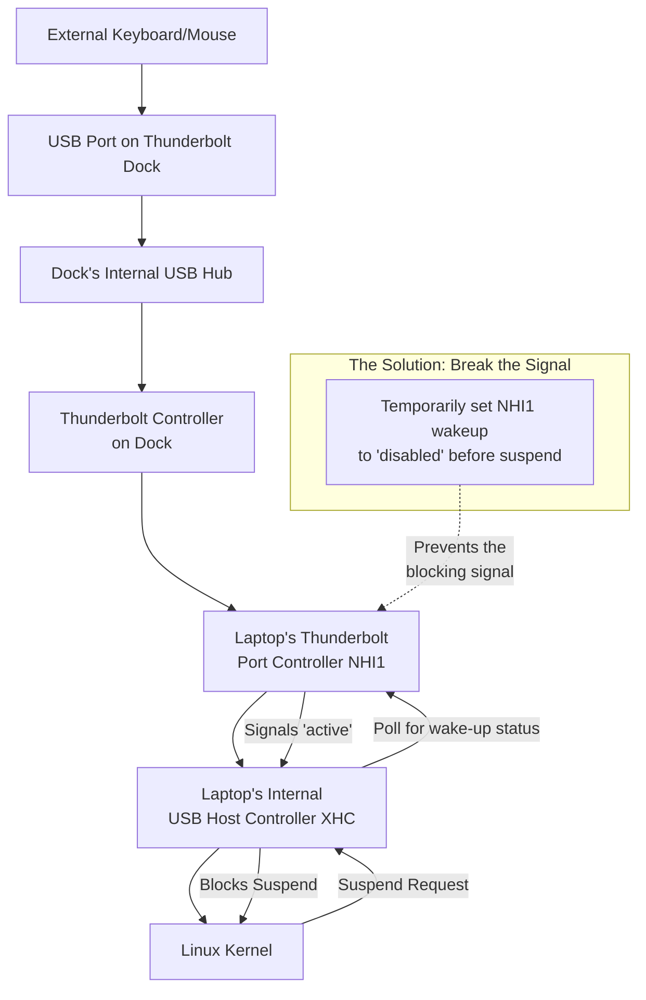

# Laptop: Suspend Fails When Thunderbolt Dock is Plugged In – Unbinding Devices Before Sleep

There's a special kind of betrayal that comes from silence. You close the lid, expecting the fans to wind down—a promise of rest. Instead, you're met with a stubborn hum. Your Thunderbolt dock stays lit, a silent vigil keeping sleep at bay.

This isn't just an inconvenience; it's a breakdown in a conversation between your OS and its hardware. The dock is sending mixed signals at the wrong time. Today, we'll teach your system to handle the dock's chatter gracefully.

## Here is your immediate action plan and the path to reliable suspend:

The core issue is a wake‑up signal conflict. When Linux tries to suspend, a device on the dock often says "No," or sends a signal that immediately wakes the system back up.

### 1. Diagnose the Culprit with `cat /proc/acpi/wakeup`
Run this in a terminal. You'll see a list of devices with their status. Target identifiers like `NHI1` (Thunderbolt) or `XHC` (USB controllers). If it shows `enabled`, it's a prime suspect.

### 2. Apply a Targeted Wake-Up Disable (Quick Test)
Identify the sysfs path. A common one is `/sys/bus/pci/devices/0000:00:08.3/power/wakeup`. Run:
```bash
echo "disabled" | sudo tee /sys/bus/pci/devices/0000:00:08.3/power/wakeup
```
Try to suspend. If it works, you've confirmed the cause.

### 3. Implement a Permanent, Automated Solution
*   **Use the `rebind-devices` Service:** This tool automatically unbinds and rebinds devices on resume, clearing the stuck state.
*   **Create a systemd sleep hook:** Write a short script that runs before suspend to disable problematic wake‑ups and re‑enable them after.

## Troubleshooting Tools Summary

| Tool / Concept | Purpose | Key Insight |
| :--- | :--- | :--- |
| **`/proc/acpi/wakeup`** | List wake-up capable devices. | Identifies the enabled device blocking suspend. |
| **sysfs wakeup control** | Disable/enable wake for a device. | Prevents a specific component from vetoing sleep. |
| **`rebind-devices`** | Reset device driver state on resume. | Cleans up driver errors that cause failures. |
| **systemd sleep hook** | Run custom scripts during sleep cycle. | Allows for surgical pre-sleep cleanup. |

## The Heart of the Conflict: Why Your Dock Fights Sleep

Think of the suspend process as a librarian trying to close the library. The dock is a busy annex full of active study rooms. The librarian shouts "Closing time!", but a room in the annex sends a late "I'm still here!" signal. The Librarian hears this and declares, "We can't close yet!"

## Your Step-by-Step Guide to a Silent Night

### Phase 1: Diagnosis – Identifying the Troublemaker
1.  **Check ACPI Wakeup List:** `cat /proc/acpi/wakeup`. Look for `enabled` devices like `NHI1`.
2.  **Find the Precise sysfs path:** Use `lspci | grep -i thunderbolt` to get the ID (e.g., `00:08.3`).
3.  **Test the Fix:** `echo "disabled" | sudo tee /sys/bus/pci/devices/0000:00:08.3/power/wakeup`.

### Phase 2: Permanent Solution – The `rebind-devices` Service
1.  **Install:** Clone from GitHub and run `./rebind-devices-setup install`.
2.  **Configure:** Edit `/etc/rebind-devices.conf` and add your PCI ID.
3.  **Enable:** `sudo systemctl enable --now rebind-devices`.

### Phase 3: Custom systemd Sleep Hook
Create `/usr/lib/systemd/system-sleep/fix-thunderbolt-suspend.sh`:

```bash
#!/bin/bash
case "$1" in
    pre)
        if [ -f "/sys/bus/pci/devices/0000:00:08.3/power/wakeup" ]; then
            echo "disabled" > "/sys/bus/pci/devices/0000:00:08.3/power/wakeup"
        fi
        ;;
    post)
        sleep 2
        if [ -f "/sys/bus/pci/devices/0000:00:08.3/power/wakeup" ]; then
            echo "enabled" > "/sys/bus/pci/devices/0000:00:08.3/power/wakeup"
        fi
        ;;
esac
```

## Final Reflection: Reclaiming the Command to Rest

By using these tools, you move from frustration to mastery, ensuring your powerful, connected laptop remains a servant to your will—able to work tirelessly, and rest obediently.

---



---

*O Allah, never let the world forget the suffering of our brothers and sisters in Palestine. Shower them with Your mercy, steady their hearts with patience, and replace their every tear with the light of peace. O Most Merciful, be their protector, their healer, their unbreakable hope. Ameen, ya Rabb al-ʿālamīn.*
