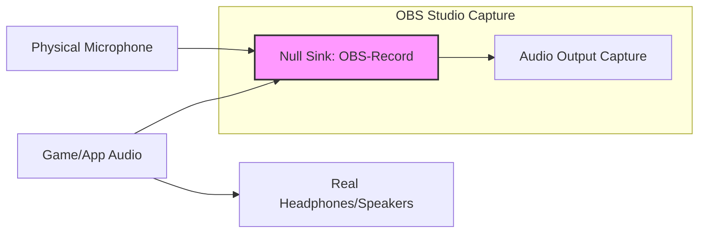

# Linux Audio Routing: How I Made OBS Record My Mic + System Audio Without Loopback Noise

Have you ever tried to have a heartfelt conversation in a room made of mirrors? That is the torment of loopback noise. You hit record in OBS, and what you get is a chaotic, echoing mess—your system sounds and your voice chasing each other into infinity.

## Your Quick-Start Solutions: Clean Audio in Minutes
### Method 1: The Combined Sink (A PulseAudio Classic)
Create a virtual "mixing desk" that merges multiple streams.
1. Install `pavucontrol`.
2. In Output Devices, click "Add" and select "Combined Output."
3. Route all apps to this output.
4. In OBS, capture from this "Combined Output."

### Method 2: OBS Application Audio Capture (Surgical)
Newer OBS versions (on Wayland especially) support "Application Audio Capture (Linux)."
*   Add source -> **Application Audio Capture (Linux)**.
*   Pick the specific target app (e.g., "Firefox" or "VLC").
*   Add mic separately.

### Method 3: The PipeWire Power-User Path (Recommended)
This uses a **Null Sink** (a virtual speaker that never plays out loud).
1. Create the Null Sink:
   ```bash
   pactl load-module module-null-sink sink_name=OBS-Record sink_properties=device.description="OBS-Record"
   ```
2. Open `qpwgraph` (patchbay).
3. Connect your **Mic** and **Application** to the input of `OBS-Record`.
4. Connect the **Application** to your real **Headphones** so you can still hear it.
5. In OBS, capture from `OBS-Record`.

| Method | Best For | Complexity | Loopback Risk |
| :--- | :--- | :--- | :--- |
| **Combined Sink** | Beginners | Low | Minimal |
| **App Capture** | Specific Apps | Low | Zero |
| **Null Sink** | Power Users | Medium | Zero |

---



---

*O Allah, never let the world forget the suffering of our brothers and sisters in Palestine. Shower them with Your mercy, steady their hearts with patience, and replace their every tear with the light of peace. O Most Merciful, be their protector, their healer, their unbreakable hope. Ameen, ya Rabb al-ʿālamīn.*
