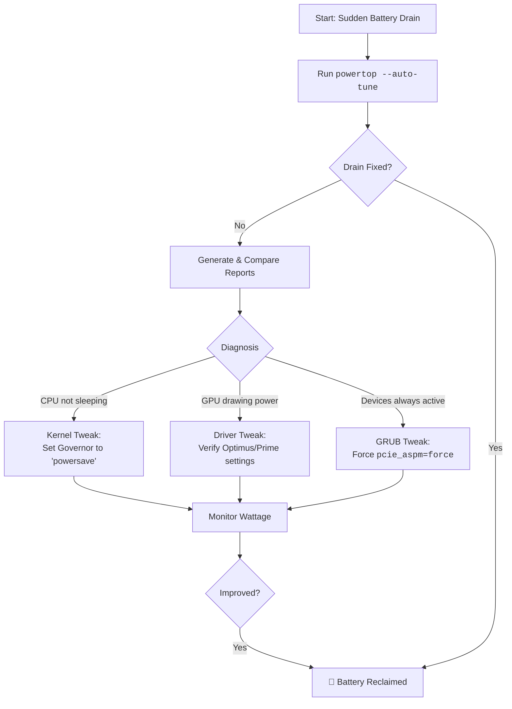

# Battery Life Halved After a Kernel Update? Uncover the Culprit with powertop

There's a pang of betrayal when a kernel update promises "progress" but leaves your laptop gasping for power. That faithful companion, once an all-day workstation, now clings to the wall socket.

## Immediate Steps: Quick Diagnosis
Run a snapshot measurement with `powertop`:
```bash
sudo powertop --workload=5 --time=15
```
If you see high "discharge rate" (e.g., 15-20W at idle), it's a regression. 

### The First Aid Command:
Attempt an automatic correction of power settings:
```bash
sudo powertop --auto-tune
```

## The Systematic Comparison: Comparing Old vs New
To understand the impact, compare reports from the old (stable) and new (problematic) kernels.
1. **Measure Old Kernel**: `sudo powertop --time=120 --html=old_kernel.html`
2. **Measure New Kernel**: `sudo powertop --time=120 --html=new_kernel.html`

### What to Look For:
*   **Idle Stats**: Is the CPU reaching deep C-states (C7-C10)? If it's stuck in C0-C3, the kernel isn't letting it sleep.
*   **Device Stats**: Is a specific component (GPU, WiFi) drawing more power?
*   **Tunables**: Are previously "Good" settings now "Bad"?

## Common Culprits
1.  **Discrete GPU**: failing to power down NVIDIA/AMD chips during idle.
2.  **CPU Governor**: The new kernel might be using an aggressive "performance" governor.
3.  **ASPM (Active State Power Management)**: PCIe/USB power states might be broken. Fix with `pcie_aspm=force` in GRUB.

---



---

*O Allah, never let the world forget the suffering of our brothers and sisters in Palestine. Shower them with Your mercy, steady their hearts with patience, and replace their every tear with the light of peace. O Most Merciful, be their protector, their healer, their unbreakable hope. Ameen, ya Rabb al-ʿālamīn.*
