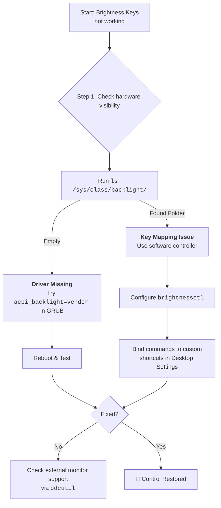

# Brightness Keys Don't Work on My Laptop? Let's Restore the Conversation

You press the dimming key, expecting a responsive change, but nothing happens. This silent lack of response from your brightness keys is usually a case of misunderstood ACPI (Advanced Configuration and Power Interface) calls.

## The First Words: Quick Checks
### 1. The Kernel Parameter (Most Common Fix)
Edit `/etc/default/grub` and add a parameter to the `GRUB_CMDLINE_LINUX_DEFAULT` line:
*   `acpi_backlight=vendor` (Dell/Lenovo/etc.)
*   `acpi_backlight=native` (Standard kernel method)
*   `acpi_backlight=video` (ACPI standard)
Update with `sudo update-grub` and reboot.

### 2. The Software Workaround: `brightnessctl`
If the keys fail, use a modern tool to talk directly to the hardware:
```bash
# Set to 50%
brightnessctl set 50%
# Increase/Decrease
brightnessctl set +10%
brightnessctl set -10%
```

## Tools Summary
| Tool | Best For | Key Command |
| :--- | :--- | :--- |
| **`brightnessctl`** | Internal laptop displays | `brightnessctl set 50%` |
| **`xbacklight`** | Older X11 systems | `xbacklight -set 70` |
| **`ddcutil`** | External monitors (DDC/CI) | `ddcutil setvcp 10 50` |

### For External Monitors: `ddcutil`
External screens often can't be controlled by the OS directly unless you use the DDC/CI protocol:
```bash
sudo ddcutil detect
sudo ddcutil setvcp 10 50 # (10 = brightness, 50 = value)
```

---



---

*O Allah, never let the world forget the suffering of our brothers and sisters in Palestine. Shower them with Your mercy, steady their hearts with patience, and replace their every tear with the light of peace. O Most Merciful, be their protector, their healer, their unbreakable hope. Ameen, ya Rabb al-ʿālamīn.*
