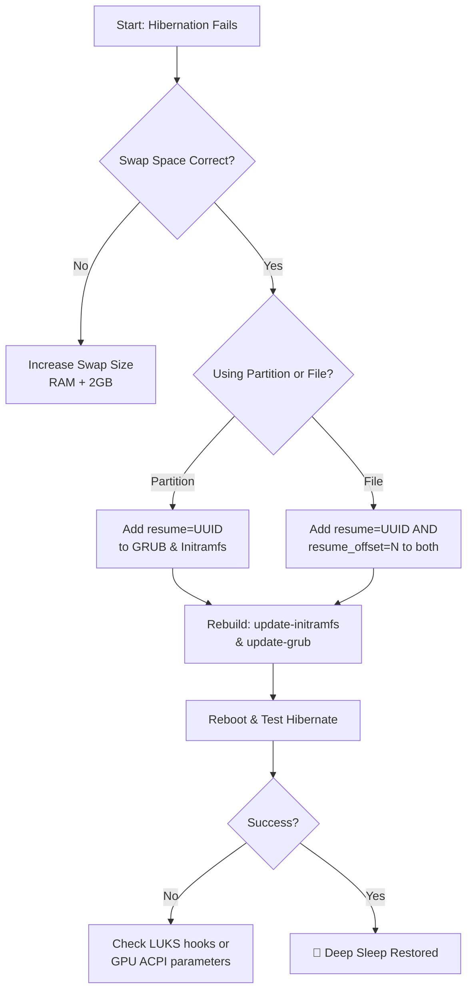

# Hibernation Never Works on My Linux Laptop – Swap Size vs Resume_offset and Initramfs Setup

There is a particular kind of trust we place in our machines. We close the lid, expecting the gentle sigh of hibernation—a deep, power‑free sleep—only to open it later to a blank screen or a rebooted system. That trust is broken.

If you've followed the "swap must be as large as RAM" mantra and it still fails, the secret lies in two concepts: the `resume_offset` and the `initramfs`.

## Step 1: Essential Checks
### Swap Size and Type
The kernel needs space to dump RAM contents.
*   **Rule of Thumb**: Swap = RAM + small buffer.
*   **Recommendation**: A dedicated **swap partition** is the gold standard for reliability.

### The Quick Test
Find your swap UUID: `sudo blkid | grep swap`. Note the UUID (e.g., `1234abcd`).
Test manually:
```bash
sudo systemctl hibernate
```
If it boots fresh, your boot configuration is missing the "map."

## Step 2: The Heart of the Matter
### 1. Understanding `resume_offset` (For Swap Files)
If you use a swap file (e.g., `/swapfile`), the kernel needs a "shelf number" to start reading from.
Find it:
```bash
sudo filefrag -v /swapfile | grep "first block"
```
Use the physical offset number (e.g., `123456`) as your `resume_offset`.

### 2. Configuring the Initramfs (The Courier)
The initramfs environment must know how to load the hibernated image before the normal boot starts.

**The Complete Setup Process:**
1. **Edit GRUB**: Add `resume=UUID=your-uuid` to `GRUB_CMDLINE_LINUX_DEFAULT`. (Add `resume_offset=123456` if using a swap file).
2. **Edit Initramfs Config**: Add the same line to `/etc/initramfs-tools/conf.d/resume`.
3. **Rebuild**:
   ```bash
   sudo update-initramfs -u -k all
   sudo update-grub
   ```

## Step 3: Troubleshooting
*   **Registry Check**: Run `lsinitramfs /boot/initrd.img-$(uname -r) | grep resume`. You must see a `conf/resume` file.
*   **LUKS/Encryption**: If swap is encrypted, the initramfs must unlock it *before* resuming. This requires `cryptsetup` hooks.

---



---

*O Allah, never let the world forget the suffering of our brothers and sisters in Palestine. Shower them with Your mercy, steady their hearts with patience, and replace their every tear with the light of peace. O Most Merciful, be their protector, their healer, their unbreakable hope. Ameen, ya Rabb al-ʿālamīn.*
