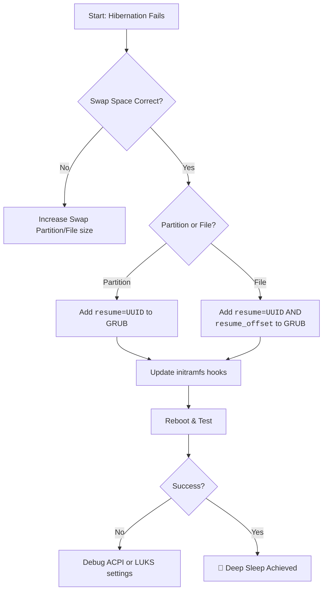

# Hibernation Never Works on My Linux Laptop – Swap Size vs Resume_offset and Initramfs Setup

You close the lid, expecting hibernation—a deep, power-free sleep—only to open it later to a blank screen or a rebooted system. The truth is, while swap size is important, the real secrets lie in the `resume_offset` and the `initramfs`.

## The Foundational Requirement: Swap
For hibernation to work, the kernel needs to dump the entire contents of your RAM into swap space.
*   **Rule of Thumb**: Swap size = RAM size + 2GB buffer.
*   **Check with**: `free -h` or `swapon --show`.

## The Heart of the Matter: `resume` and `resume_offset`
### 1. Using a Swap Partition
Find your swap UUID: `sudo blkid | grep swap`.
1. Edit `/etc/default/grub` -> `GRUB_CMDLINE_LINUX_DEFAULT="... resume=UUID=1234..."`.
2. Add `RESUME=UUID=1234...` to `/etc/initramfs-tools/conf.d/resume`.
3. Update: `sudo update-initramfs -u` & `sudo update-grub`.

### 2. Using a Swap File
You need a "grid reference" or **offset** to tell the kernel where the file starts on the physical disk.
1. Find offset: `sudo filefrag -v /swapfile | grep "first block"` (e.g., 123456).
2. Edit GRUB -> `resume=UUID=root-partition-uuid resume_offset=123456`.
3. Update initramfs as above.

## Troubleshooting Registry
| Error | Suspect | Fix |
| :--- | :--- | :--- |
| **System boots fresh** | `initramfs` courier | Check for `resume` hook in `lsinitramfs`. |
| **Stuck at image load** | Encrypted Swap | Configure `cryptsetup` hooks in initramfs. |
| **Hangs at power down** | GPU/ACPI | Try `acpi_sleep=nonvs` parameter. |

---

---

*O Allah, never let the world forget the suffering of our brothers and sisters in Palestine. Shower them with Your mercy, steady their hearts with patience, and replace their every tear with the light of peace. O Most Merciful, be their protector, their healer, their unbreakable hope. Ameen, ya Rabb al-ʿālamīn.*
