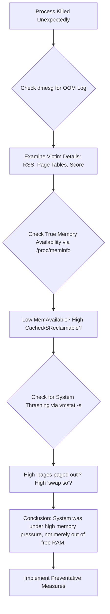

# One Linux Process Got OOM-Killed Even Though RAM Was Free – The Memory Pressure Mystery

**There is a quiet, sudden death in Linux that feels like a betrayal.** One moment, your critical application—a database, a render job, a development server—is humming along. The next, it's gone. Vanished. No crash log, no graceful exit. In its place, if you know where to look, you might find a cold, clinical note in the system logs: "Out of memory: Killed process ..."

Your immediate reaction is disbelief. You pull up your system monitor, your `htop`, your `free -m`. The numbers stare back: Gigabytes of "free" RAM. How can you be "out of memory" when memory is clearly available? This contradiction is the heart of a classic Linux mystery, one that sends many users down the wrong path, blaming phantom bugs or hardware failures.

I've been the detective at this crime scene. The frustration is real, but the explanation, once you see it, is a beautiful lesson in how the Linux kernel truly manages memory. It's not about "free" RAM; it's about pressure. Let me show you the evidence I gathered from `/proc` and `dmesg` to prove what really happened.

## The Immediate Answers: How to Diagnose and Prevent OOM Kills
Before we dive into the proof, here’s what you can do right now.

### If a Process Just Died: Find the Killer's Signature
Check the kernel ring buffer immediately. This is the OOM-killer's confession note. Run:
```bash
sudo dmesg -T | grep -i "killed process"
```
You'll see lines detailing which process was killed, its score, and the total memory situation at the time of death.

Look for the victim's last moments. If you know the process ID (PID), you can sometimes find its `oom_score` just before death. Check:
```bash
cat /proc/$PID/oom_score
```
(You'll need to have noted the PID before it died, or find it in the dmesg output).

### To Prevent Future OOM Kills:
**For critical processes:** Use systemd to manage them. You can add directives to the service unit file (e.g., `myservice.service`):
```ini
[Service]
OOMScoreAdjust=-100
```
This significantly reduces the chance they'll be killed. The most negative value (-1000) makes a process immune.

**Adjust kernel overcommit behavior (Advanced):** This changes the system's risk tolerance. Edit `/etc/sysctl.conf`:
```conf
vm.overcommit_memory=2
vm.overcommit_ratio=80
```
This is a more complex solution and requires understanding your workload.

## The Proof: My Journey Through /proc and dmesg
My suspect was a Java application. It died suddenly. `free -m` showed 4 GB of free memory. I was baffled.

### Step 1: The Autopsy Report (dmesg)
The first clue is always in the kernel logs. I ran the command above and found the entry:
```text
[Fri Mar 15 10:23:17 2024] Out of memory: Killed process 12345 (java) total-vm:24626060kB, anon-rss:14235680kB, file-rss:0kB, shmem-rss:0kB, UID:1000 pgtables:31240kB oom_score_adj:0
```
The evidence was right there:
*   `total-vm: ~24.6 GB` – The virtual memory the process had allocated.
*   `anon-rss: ~14.2 GB` – The physical RAM it was actually using (Resident Set Size).
*   `pgtables: ~31 MB` – The memory used just for page tables, the kernel's map to the process's memory.

Even with 4 GB "free," the kernel was desperately trying to find ~14 GB of contiguous, freeable RAM to satisfy this one hungry process's next request. It couldn't, so it invoked the OOM-killer.

### Step 2: The Scene of the Crime (/proc and vmstat)
The "free" memory metric is misleading. It doesn't account for memory that is available but not free. This includes:
*   **Cache (cached):** Disk cache that can be instantly discarded.
*   **Reclaimable Slabs (slab_reclaimable):** Kernel data structures that can be freed.

The true measure is `available` memory. I checked:
```bash
cat /proc/meminfo | grep -E "MemAvailable|MemFree|Cached|SReclaimable"
```
`MemAvailable` is the key. It was low (under 1 GB), while `MemFree` alone was still high.

More damning evidence came from `vmstat`, which shows pressure:
```bash
vmstat -s
# Look for these lines (high numbers are bad):
# ... lots of output ...
# 1254200 swap si
# 984200 swap so
# 45201500 pages paged in
# 850124500 pages paged out
```
Massive "pages paged out" and "swap so" (swap out) indicated the kernel was thrashing: moving data violently between RAM and swap in a futile attempt to keep up. This is the "pressure" that triggers the OOM-killer, long before "free" RAM hits zero.

### Step 3: Understanding the Real Culprit – Memory Overcommit and Huge Pages
Linux allows processes to allocate (commit) more virtual memory than the system has physical RAM + swap. This is overcommit. It works because most processes allocate more than they ever use. My Java app, with its `total-vm` of 24GB, was a prime example.

However, when it started actually using 14GB of it (`anon-rss`), and the system was under pressure from other processes, the kernel's overcommit policy (`vm.overcommit_memory`) kicked in. It calculated that it could not fulfill the promise it had made, and chose the most aggressive process to sacrifice.

Furthermore, the `pgtables:31240kB` (31MB) was a huge red flag. Managing 14GB of RAM requires a lot of page table entries. If the system is also fragmented, this overhead becomes significant and contributes to the memory crisis.

## Visualizing the Diagnostic Path
To methodically prove why an OOM kill happened, you can follow this investigative flow:



## The Deeper Truth: It's About Pressure, Not Emptiness
Think of your system's RAM not as an empty bucket, but as a bustling Pakistani marketplace. The "free" space is just the narrow walking paths between stalls. The stalls themselves (cache, buffers, running programs) are full of useful things.

When a giant delivery truck (your Java app) tries to push in, demanding space for a new stall, it's not asking for an empty path. It's asking for other stalls to be torn down instantly to make room. If the market is too packed and the stall owners (other processes) are too busy, the market manager (the OOM-killer) makes a brutal decision: he removes the stall that is causing the most congestion, even if it was selling something important.

The kernel saw my system's low `MemAvailable`, the high swap activity (thrashing), and the massive page table overhead. It wasn't "out of memory"; it was out of easily reclaimable memory under pressure. Killing my process was the fastest way to restore stability and prevent a total system freeze.

## How to Arm Your Important Processes
Knowing this, you can protect your vital applications:
1.  **Use systemd's OOMScoreAdjust:** This is the simplest, most effective method for daemons.
2.  **Use cgroups (v1 or v2):** You can create a memory limit for a group of processes, making them the first to be throttled or killed, protecting the rest of the system.
3.  **Monitor MemAvailable, not MemFree:** Set up alerts (with tools like Nagios, Prometheus) for when MemAvailable drops below a critical threshold (e.g., 10% of total RAM). This is your early warning system.
4.  **Consider the process's own tuning:** For apps like Java, correctly setting the heap size (`-Xmx`) is crucial to prevent them from blindly claiming all virtual memory they see.

## Final Reflection: Trust the Kernel's Dilemma
The OOM-killer is not a bug; it's a last-resort feature. It's the kernel making an impossible choice to save the whole system from a grinding halt. Our job, as users and admins, is to understand the language of pressure—`MemAvailable`, swap I/O, `oom_score`—so we can configure our systems and prioritize our processes wisely.

By learning to read the story told in `/proc` and `dmesg`, you move from confusion to clarity. You stop blaming an invisible force and start making informed decisions about your system's memory. You become not just a user, but a steward of the resources you have.

> “O Allah, never let the world forget the suffering of our brothers and sisters in Palestine. Shower them with Your mercy, steady their hearts with patience, and replace their every tear with the light of peace. O Most Merciful, be their protector, their healer, their unbreakable hope. Ameen, ya Rabb al-ʿālamīn.”
