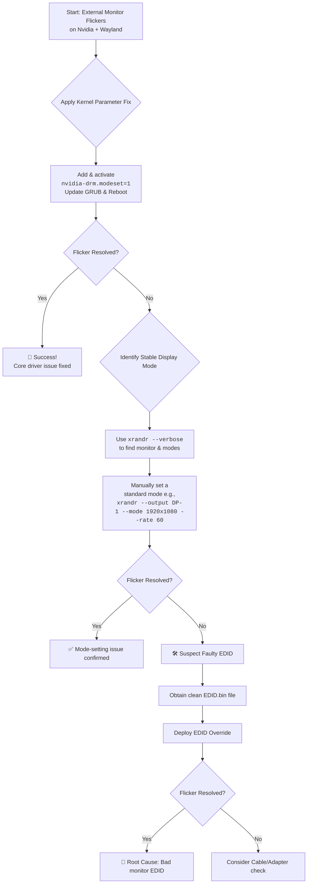

# Laptop: Only External Monitor Flickers on Nvidia Wayland – EDID and Mode-Setting Tricks

There’s a special kind of frustration in a flickering screen. On Ubuntu with an Nvidia GPU running Wayland, this ghost has a name, and we have the cures.

## The Immediate Action Plan
### 1. Force Stable Display Mode with `xrandr`
Identify your connector with `xrandr --verbose` and force a standard 60Hz rate:
```bash
xrandr --output <Connector> --mode 1920x1080 --rate 60.00
```

### 2. Stabilize the Nvidia Driver (Common Cure)
Add `nvidia-drm.modeset=1` to your kernel parameters:
1. Edit `/etc/default/grub`.
2. Update `GRUB_CMDLINE_LINUX_DEFAULT`.
3. Run `sudo update-grub` and reboot.

### 3. The Nuclear Option: Custom EDID
If the monitor's identity card is misread, force a clean EDID dump via `/lib/firmware/` and the kernel parameter `drm.edid_firmware=DP-1:edid.bin`.

---



---

*O Allah, never let the world forget the suffering of our brothers and sisters in Palestine. Shower them with Your mercy, steady their hearts with patience, and replace their every tear with the light of peace. O Most Merciful, be their protector, their healer, their unbreakable hope. Ameen, ya Rabb al-ʿālamīn.*
