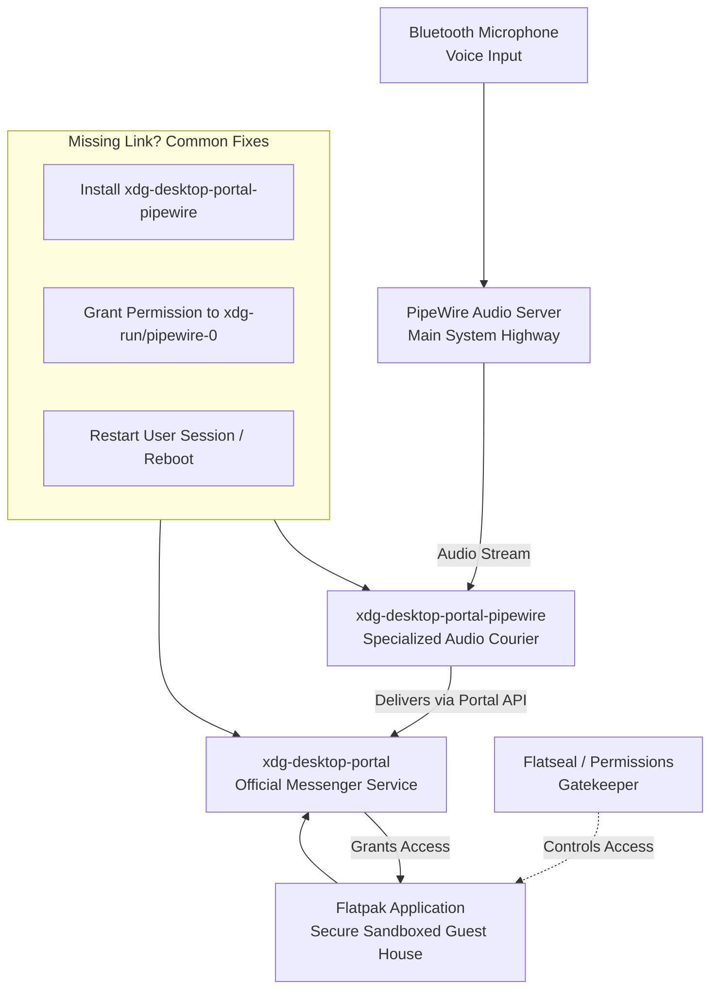

# PipeWire: Flatpak apps can’t see my Bluetooth mic – xdg-desktop-portal and pipewire.flatpak permissions

You’ve finally settled into your favorite chair, the one with just the right dip in the cushion. Your Bluetooth headset is charged, a glass of cool water sits nearby, and you’re ready—for that important online meeting, to record a heartfelt voice note for a friend, or to lose yourself in a cooperative game where clear communication is the key to victory. You click open the app, only to be met with a hollow, silent void. The microphone isn’t working. A flicker of confusion, then frustration. You check the system settings; the mic is there, it works perfectly in other apps. But inside this one particular application—often one you need the most—it’s as if your voice has been vanished.

If this scenario feels familiar, and you’re a Linux user navigating the modern waters of PipeWire and Flatpak applications, know this first and foremost: You are not shouting into a void. Your voice matters, and the fix is almost always within reach. The culprit is rarely a broken system, but a necessary, albeit sometimes complex, handshake of permissions between new technologies.

## The Immediate Solution

This issue occurs because Flatpak applications run in a secure sandbox and require explicit permission to access PipeWire, which controls your audio devices like Bluetooth microphones. The bridge between them is called `xdg-desktop-portal`. To fix it, ensure these three pillars are firmly in place:

1.  **Install the Critical Bridge:** `xdg-desktop-portal-pipewire`. This is the non-negotiable component. Open your terminal and run:
    ```bash
    sudo apt install xdg-desktop-portal-pipewire  # For Debian/Ubuntu
    # or
    sudo pacman -S xdg-desktop-portal-pipewire    # For Arch
    # or
    sudo dnf install xdg-desktop-portal-pipewire  # For Fedora
    ```
2.  **Restart the Portal System:** After installation, restart your user session completely (log out and back in) or reboot. This allows the new portal to take over properly.
3.  **Grant App Permissions:** Use the flatpak permission command or a graphical tool like **Flatseal** (highly recommended) to explicitly grant the affected application access to the PipeWire socket. In Flatseal, find your app, and under "Filesystem," ensure `xdg-run/pipewire-0` is added with read/write access.

For 95% of you, these steps will restore the connection, and your Bluetooth mic will spring to life within your Flatpak app. Now, let’s brew a metaphorical cup of doodh patti and understand the why behind the silence, so you never feel lost here again.

## The Story of Three Walls: Sandboxes, Servers, and Your Voice
To understand the fix, we must first appreciate the architecture of modern Linux audio and packaging. Think of it as a conversation happening in a beautifully complex, ancient city like Lahore.

*   **Your Bluetooth Microphone** is the musician in the distant Shalimar Gardens. He creates the raw, beautiful sound (your voice).
*   **PipeWire** is the main highway (Sharah-e-Quaid-e-Azam) that carries this audio signal efficiently across the entire city to its destination.
*   **The Flatpak Application** (like Discord, OBS, or Zoom) is a secure, well-appointed guest house in the Walled City. It’s safe, self-contained, and doesn't allow just anything from the bustling streets inside.
*   **xdg-desktop-portal** is the trusted, official messenger service. The guest house (Flatpak app) only accepts deliveries and communications through this verified courier.
*   **xdg-desktop-portal-pipewire** is the specific courier who knows the language of the audio highway (PipeWire). Without this specific courier, the message from the musician never reaches the guest house, no matter how wide the highway is.

The breakdown happens when the specialized courier (`xdg-desktop-portal-pipewire`) is missing. The guest house (Flatpak app) is waiting for a message, the highway (PipeWire) is busy with traffic, but there’s no one to translate and deliver the audio.

## A Deeper Dive: Checking the Foundations
Sometimes, the basic fix needs a little reinforcement. Let’s check the foundations of your audio system.

### 1. Verify PipeWire is Running:
Open a terminal and run:
```bash
pactl info | grep "Server Name"
```
You should see `Server Name: PulseAudio (on PipeWire X.Y.Z)`. This confirms PipeWire is your active sound server with PulseAudio compatibility.

### 2. Check for the Portal Service:
Run:
```bash
systemctl --user status xdg-desktop-portal
```
It should show "active (running)." If it’s not running, start it with:
```bash
systemctl --user start xdg-desktop-portal
```

### 3. The Nuclear Option: A Clean Rebuild of the Audio Stack
If permissions remain tangled, a structured rebuild can work wonders:
```bash
# 1. Remove portal configs (they will recreate)
rm -rf ~/.config/xdg-desktop-portal/*
rm -rf ~/.local/share/xdg-desktop-portal/*

# 2. Ensure all key pieces are installed (names may vary by distro)
sudo apt install --reinstall pipewire pipewire-pulse wireplumber xdg-desktop-portal xdg-desktop-portal-pipewire flatpak

# 3. Reboot. This is crucial for a clean slate.
```

## The Guardian of Permissions: Embracing Flatseal
While terminal commands are powerful, **Flatseal** is a gift for managing Flatpak permissions. Install it from your distribution’s store or via Flathub (`flatpak install flathub com.github.tchx84.Flatseal`). It presents all your Flatpak apps and their permissions in a clear, graphical interface.

1.  Open Flatseal.
2.  Select the problematic application from the left panel.
3.  Scroll to "Filesystem" under the "Permissions" section.
4.  Look for or add the path: `xdg-run/pipewire-0`.
5.  Ensure its permission is set to "Read/write."
6.  Close the application completely and reopen it. The mic should now be available.

This tool gives you the power to be the architect of your own sandbox’s gates.

## When the Problem Persists: Listening for Whispers in the Logs
For the stubborn cases, we must listen to the system’s own whispers—its logs. Open a terminal and run:
```bash
journalctl -f -u pipewire -u wireplumber -u xdg-desktop-portal
```
Then, try to use your mic in the Flatpak app. Watch the terminal for any error messages. These lines often hold the specific clue—a missing module, a permission denial—that points directly to the solution. You can share these logs in community forums for precise, expert help.

## Final Reflections: From Silence to Connection
Technology’s greatest promise is not in its complexity, but in its ability to connect us—to ideas, to creations, and to each other. The minor frustrations of permissions and sandboxes are the growing pains of a platform maturing, striving for both power and security.

So, when your voice feels lost between the walls of a sandbox, remember the three pillars: the portal (`xdg-desktop-portal-pipewire`), the permission (via Flatseal), and the patience to restart and renew the session. Your voice is meant to travel, to be heard, to connect across any distance.

May your conversations flow smoothly, and may your words always find their way.

---



---

*O Allah, never let the world forget the suffering of our brothers and sisters in Palestine. Shower them with Your mercy, steady their hearts with patience, and replace their every tear with the light of peace. O Most Merciful, be their protector, their healer, their unbreakable hope. Ameen, ya Rabb al-ʿālamīn.*
