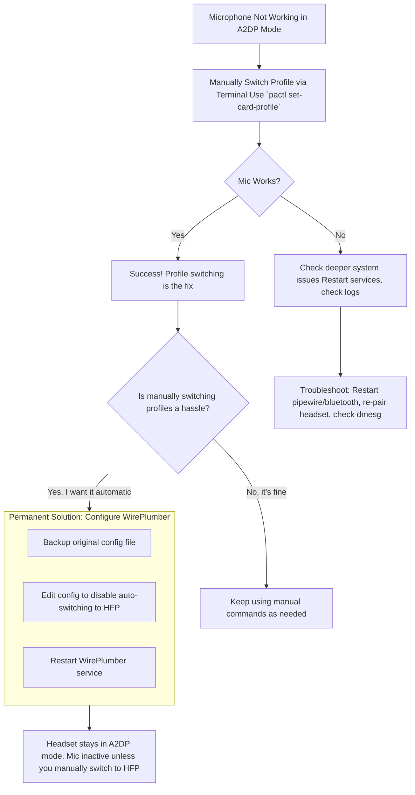

# PipeWire: When Your Bluetooth Headset Mic Goes Silent (And How to Wake It Up)

**There is a quiet loneliness in a broken digital conversation.** You put on your headset, join a call, and speak. Your friends see your lips move on their screen, but to you, the room responds only with silence. You tap the microphone, check the app—everything says you're live. Yet, in your own audio settings, that tiny bar that should dance with your voice lies still, a flatline of digital silence. Your headset, listed right there as "High Fidelity Playback (A2DP)," has become a one-way street: music flows in beautifully, but your voice cannot find its way out.

This is the classic PipeWire Bluetooth paradox. I've lived it. The solution lies not in fixing a bug, but in understanding a fundamental fork in the road of Bluetooth itself. You see, your headset isn't broken; it's just stuck on the wrong path—the high-quality audio path that, by design, has no lane for a microphone.

Let's rebuild that bridge for your voice.

## The Immediate Fix: Switch Profiles with a Command
The problem is that your headset is connected using the **Advanced Audio Distribution Profile (A2DP)**, which is designed for high-quality, one-way audio playback. To use the microphone, you must switch to the **Hands-Free Profile (HFP)** or **Headset Profile (HSP)**, often bundled together as "Headset Head Unit (HSP/HFP)" in your settings.

Here’s how to force the switch:

### Step 1: Identify Your Bluetooth Card
First, find the exact identifier for your headset in PipeWire's list of audio cards.
Open a terminal and run:

```bash
pactl list cards short | grep bluez
```
You'll get an output like: `2 bluez_card.XX_XX_XX_XX_XX_XX module-bluez5-device.c` Note the card name (e.g., `bluez_card.XX_XX_XX_XX_XX_XX`) and its number (e.g., `2`).

### Step 2: Switch to the Headset Profile
Now, use `pactl` to change the profile. Replace `CARD_NUMBER` or `CARD_NAME` with what you found above:

```bash
# Using the card number:
pactl set-card-profile CARD_NUMBER headset-head-unit

# Or using the full card name:
pactl set-card-profile bluez_card.XX_XX_XX_XX_XX_XX headset-head-unit
```

### Step 3: Verify the Switch
The sound quality will instantly become "telephone-like"—mono and narrowband. This is normal for HFP/HSP. Open your sound settings or an app like `pavucontrol`. You should now see two separate devices for your headset: one for "High Fidelity Playback" and one for "Headset Head Unit." Your microphone input should now be active on the headset device.

If you want to switch back to high-quality music listening later, use:
```bash
pactl set-card-profile CARD_NUMBER a2dp-sink
```
This manual switch is the core fix. The following flowchart visualizes this process and the decision you face for a more permanent solution.



## Understanding the "Why": The Bluetooth Trade-Off
To move from a quick fix to a true solution, we must understand the landscape. Bluetooth audio isn't a single, smart protocol—it's a collection of separate "profiles" for different jobs.

Think of it like a Swiss Army knife. You have:
*   **The Main Blade (A2DP Sink):** Excellent for one task: delivering beautiful, stereo sound to your ears. It's sharp and precise, but it's just a blade. It can't also work as a screwdriver.
*   **The Screwdriver (Headset Head Unit - HSP/HFP):** Built for two-way communication. It can both send your voice out and receive sound in. To do both jobs over a limited connection, it sacrifices audio quality, resulting in the mono, telephone-like sound you hear.

The core limitation, which is part of the Bluetooth specification itself, is that most headsets cannot use A2DP and HFP at the same time. It's one or the other. When you start an app that requests a microphone (like Zoom, Discord, or WebRTC in a browser), PipeWire tries to be helpful and automatically switches your headset to HFP mode so your mic will work. Sometimes, as in one user's case, this auto-switch fails silently, leaving you in a limbo where the mic still doesn't work.

## The Permanent Solution: Telling PipeWire to Stop "Helping"
If you find yourself constantly toggling profiles, or if the auto-switch consistently fails, you can take more direct control by configuring WirePlumber (PipeWire's session manager). This involves editing a configuration file to tell the system, "Don't automatically switch to HFP. Let me decide."

⚠️ **Important Warning:** Doing this will permanently disable the hands-free/microphone functionality of your Bluetooth headset until you revert the change. It is only recommended if you primarily use your headset for music/media and have a separate microphone (like a built-in laptop mic or a USB mic) for calls.

### Step-by-Step Configuration
1.  **Create a local WirePlumber configuration directory** and copy the default settings:
    ```bash
    mkdir -p ~/.config/wireplumber/bluetooth.lua.d/
    cp /usr/share/wireplumber/bluetooth.lua.d/50-bluez-config.lua ~/.config/wireplumber/bluetooth.lua.d/
    ```
2.  **Edit the local configuration file:**
    ```bash
    nano ~/.config/wireplumber/bluetooth.lua.d/50-bluez-config.lua
    ```
3.  **Find the `bluez5.roles` line.** It will likely be commented out (starting with `--`). Add or uncomment the following line to enforce A2DP only:
    ```lua
    ["bluez5.roles"] = "[ a2dp_sink ]"
    ```
4.  **Save the file, exit the editor, and restart WirePlumber** for the changes to take effect:
    ```bash
    systemctl --user restart wireplumber
    ```
5.  **Reconnect your Bluetooth headset.** It should now connect only in A2DP mode. Your microphone will not function, but high-quality audio playback will be guaranteed without automatic switching.

## Summary of Your Options

| Approach | How It Works | Best For... | Trade-off |
| :--- | :--- | :--- | :--- |
| **Manual Profile Switching** | Use `pactl` to toggle between `a2dp-sink` and `headset-head-unit`. | Users who make occasional calls and don't mind running a command. | Requires manual intervention each time you change activities. |
| **WirePlumber Config Edit** | Permanently disables HFP, forcing the headset to always use A2DP. | Users who only use the headset for media playback and have a separate mic. | Completely disables Bluetooth microphone functionality. |
| **Use a Separate Microphone** | Keep headset in A2DP mode for audio, and use your laptop's internal mic or a USB mic for input. | A practical hybrid solution for call quality and headset audio. | Requires a second microphone; laptop mics can pick up background noise. |

## Final Thoughts: Embracing the Choice
Solving this issue taught me that sometimes, technology presents us with a necessary choice, not a flaw. The quest for perfect, unified wireless audio and voice on Linux, especially with PipeWire, is an evolving story. While new codecs like FastStream and developments in LC3 aim to bridge this gap in the future, today's reality is about understanding the tools we have.

For us in places like Pakistan, where a stable digital connection for work and family calls is vital, this troubleshooting is more than technical—it's about ensuring our voice is heard, clearly and reliably, across any distance. It’s a small act of digital self-reliance, making global technology work on our own terms.

By learning these commands and concepts, you're not just fixing a microphone; you're mastering the flow of your own digital voice. You choose when to be a listener and when to be a speaker, in perfect clarity.

> “O Allah, never let the world forget the suffering of our brothers and sisters in Palestine. Shower them with Your mercy, steady their hearts with patience, and replace their every tear with the light of peace. O Most Merciful, be their protector, their healer, their unbreakable hope. Ameen, ya Rabb al-ʿālamīn.”
