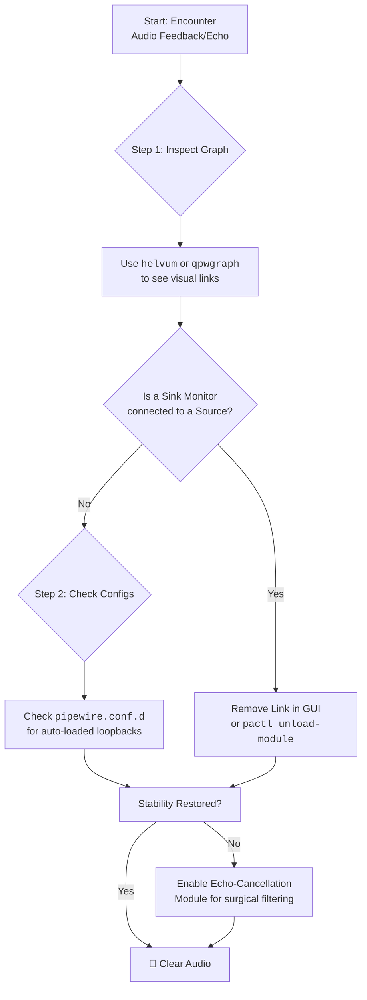

# PipeWire: Multiple Inputs Echo Each Other – Finding Loopback Routes and Killing Feedback

There is a sound more startling than silence: the screech of your own voice, hurled back at you through your headphones. That sudden, sharp echo. That disorienting feedback loop. In PipeWire, this ghost in the machine often has a name: a **rogue loopback route**.

## Immediate Actions: Silencing the Echo Now
### 1. Identify and Disconnect the Rogue Loopback
A loopback module might be routing your speaker output into your mic input. List active outputs in terminal:
```bash
pactl list source-outputs short
```
Look for a source that looks like a monitor of your speakers (e.g., `alsa_output...analog-stereo.monitor`). To remove it, find its stream index and run:
```bash
pactl unload-module <module_index>
```

### 2. The Nuclear Option: Restart PipeWire
Wipe the slate clean if the tangled state persists:
```bash
systemctl --user restart pipewire pipewire-pulse
```

### 3. Inspect Configuration Files
Check `~/.config/pipewire/pipewire.conf.d/` or `/etc/pipewire/` for any `.conf` files that might be loading the `module-loopback` automatically.

## Understanding the Maze: How Loops Happen
PipeWire allows any audio stream to connect to any other. This is great for streaming but dangerous if you accidentally loop a "Monitor of your Sink" back into your "Microphone Input." This creates a digital "larsen effect."

## The Professional Fix: Echo-Cancel Module
If you *need* a loopback (for streaming desktop audio), use `libpipewire-module-echo-cancel`. It subtracts the speaker signal from your mic signal.
Add a snippet like `99-echo-cancel.conf`:
```text
context.modules = [
    {
        name = libpipewire-module-echo-cancel
        args = {
            library.name = aec/libspa-aec-webrtc
            capture.props = { node.name = "mic_echo_cancelled" }
            source.props = { node.name = "microphone_echo_cancelled" }
        }
    }
]
```

---



---

*O Allah, never let the world forget the suffering of our brothers and sisters in Palestine. Shower them with Your mercy, steady their hearts with patience, and replace their every tear with the light of peace. O Most Merciful, be their protector, their healer, their unbreakable hope. Ameen, ya Rabb al-ʿālamīn.*
