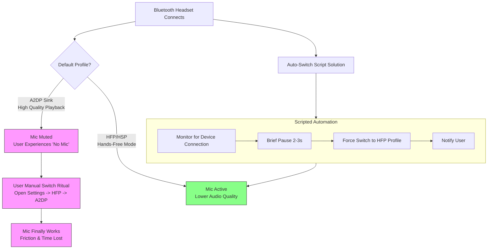

# PipeWire: ‘No Mic’ Until I Switch Profiles Multiple Times – Writing a Small Script to Auto-Switch on Connect

Have you ever stood before a familiar door, key in hand, only to find it stubbornly locked? You jiggle the key, push and pull, and just as frustration begins to simmer, the lock finally clicks open. This, my friends, is the exact ritual many of us perform with our Bluetooth headsets on Linux. You connect your trusted device, the one that worked perfectly yesterday, only to be met with a silent microphone. No warnings, no errors—just mute defiance. So begins the dance: you open the sound settings, switch from "High Fidelity Playback (A2DP Sink)" to "Hands-Free Head Unit (HFP/HSP)", hear the jarring drop in quality, and then switch back. Sometimes once, sometimes twice. And then, magically, the mic awakens.

This isn't a flaw in your patience; it's a quirk in the digital handshake. But what if the door could recognize you and unlock itself? What if your system could perform that switching ritual for you, silently and perfectly, every single time? Let's build that smart key.

## The Immediate Solution: Your Personal Audio Concierge
The core issue is that when some Bluetooth headsets connect, they default to a profile that prioritizes stereo sound (A2DP) but disables the microphone. The mic is only available in the telephony-focused "Hands-Free" profile (HFP). The following Bash script uses `pw-cli` (PipeWire's command-line tool) to automatically switch your headset to HFP upon connection, ensuring your mic is always available.

Create a file called `auto-switch-headset.sh`:
```bash
#!/bin/bash

# Target device name (adjust this! Use 'wpctl status' to find your device's name)
TARGET_DEVICE="alsa_card.00_1F_10_6A_BB_00"

# Target profile IDs: Use 'wpctl inspect' on the card to find these.
HIGH_QUALITY_PROFILE="profiles: a2dp-sink-sbc"
HANDS_FREE_PROFILE="profiles: hands-free-head-unit"

# Monitor PipeWire events for new cards (devices)
pw-monitor | while read -r line; do
  if echo "$line" | grep -q "card.object.created.*$TARGET_DEVICE"; then
    echo "Target headset connected. Waiting a moment..."
    sleep 2

    # Switch to Hands-Free profile for microphone access
    wpctl set-profile "$TARGET_DEVICE" "$HANDS_FREE_PROFILE"
    echo "Switched to Hands-Free profile. Microphone is active."
  fi
done
```

### To make it work:
1.  **Find Your Device Name:** Run `wpctl status` in your terminal. Look for your Bluetooth headset under the "Audio" section. The name will look like `alsa_card.XX_XX_XX_XX_XX_XX`.
2.  **Find Your Profile IDs:** Run `wpctl inspect <your_device_name>`. Look for the "Profiles:" section. Copy the exact string for `a2dp-sink-sbc` (or similar) and `hands-free-head-unit`.
3.  **Edit the Script:** Replace `TARGET_DEVICE` and the profile variables with your exact strings.
4.  **Make it Executable:** `chmod +x auto-switch-headset.sh`
5.  **Run it on login:** Add the script to your desktop environment's autostart applications.

## The Two Faces of Your Headset: A Tale of Two Profiles
Your Bluetooth headset is a device of compromise, gracefully juggling two identities.

*   **The High-Fidelity Musician (A2DP Sink Profile):** This is the profile for listening. It delivers rich, stereo sound to your ears—perfect for music, videos, and system sounds. But in this role, the microphone is asleep.
*   **The Conversationalist (Hands-Free Head Unit - HFP/HSP):** This is the profile for speaking. It enables the microphone but switches the audio to a monaural (single-channel), lower-bandwidth mode so your voice can be sent back.

The conflict arises because the initial connection preference is often set by the device itself, and many headsets stubbornly default to A2DP. PipeWire, respecting this, connects you to the best listening experience. Only when you explicitly demand the microphone—by switching profiles—does it re-negotiate the contract with the headset.

## Beyond the Basic Script: Crafting a Robust Solution
A more robust solution considers edge cases and gives you control. Here's an enhanced version using `logger` and `notify-send`.

```bash
#!/bin/bash
# robust-auto-switch.sh - A more thoughtful audio profile manager

DEVICE_NAME="alsa_card.00_1F_10_6A_BB_00" # UPDATE THIS
HFP_PROFILE="profiles: hands-free-head-unit"

logger "PipeWire Auto-Switch Daemon started, watching for $DEVICE_NAME."

switch_profile() {
  local target_profile="$1"
  if wpctl set-profile "$DEVICE_NAME" "$target_profile"; then
    logger "Successfully switched $DEVICE_NAME to $target_profile."
    notify-send -t 3000 "Audio Profile Switched" "Headset set to ${target_profile##*: }"
  else
    logger "ERROR: Failed to switch $DEVICE_NAME to $target_profile."
    notify-send -u critical "Audio Switch Failed" "Check system logs."
  fi
}

pw-monitor | while read -r line; do
  if echo "$line" | grep -q "card.object.created.*$DEVICE_NAME"; then
    logger "$DEVICE_NAME detected. Preparing for auto-switch in 3 seconds..."
    sleep 3
    switch_profile "$HFP_PROFILE"
  fi
done
```

## The WirePlumber Way: A More Integrated Approach
For the most elegant solution, use **WirePlumber** directly. Create `~/.config/wireplumber/policy.lua.d/10-bluetooth-auto-switch.lua`:

```lua
-- Auto-switch Bluetooth headsets to HFP on connect
rule = {
  matches = {
    {
      { "device.name", "matches", "alsa_card.*_*_*_*_*_*" },
      { "device.nick", "matches", "*Headset*" },
    },
  },
  apply_properties = {
    ["api.alsa.force-profile"] = "hands-free-head-unit",
  },
}
table.insert(bluetooth_policy.rules, rule)
```

## Final Reflection: From Repetition to Harmony
Technology should simplify, not complicate. The daily ritual of switching audio profiles is a small friction, but these are the very frictions that wear on our digital contentment. Writing a small script to solve it is more than a technical fix; it's an act of reclaiming agency over your tools.

---



---

*O Allah, never let the world forget the suffering of our brothers and sisters in Palestine. Shower them with Your mercy, steady their hearts with patience, and replace their every tear with the light of peace. O Most Merciful, be their protector, their healer, their unbreakable hope. Ameen, ya Rabb al-ʿālamīn.*
