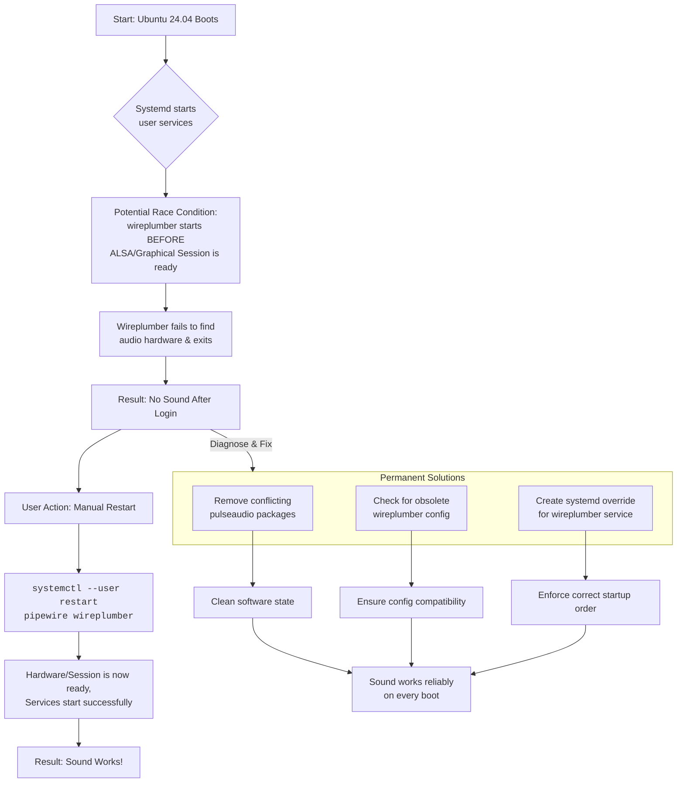

# PipeWire on Ubuntu 24.04: ‘No Sound’ Until I Restart the User Service – Debugging the Race Condition

There’s a quiet that isn’t peaceful. It’s the quiet of your machine booting up, the desktop blooming to life, and then… nothing. You click a video, and it loads in perfect, crushing silence. This ritual of typing `systemctl --user restart pipewire wireplumber` after every login isn't just a quirk; it's the symptom of a silent war of timing.

## The Immediate Fix
The problem is that the `pipewire` and `wireplumber` user services are starting before your graphical session or audio hardware is fully ready.

### Permanent Solution 1: Clean Up Conflict
Remove leftover PulseAudio components:
```bash
sudo apt remove pulseaudio pulseaudio-alsa
sudo apt install pipewire-pulse
systemctl --user restart pipewire wireplumber
```

### Permanent Solution 2: Systemd Service Override
Force `wireplumber` to wait and restart until it successfully connects:
1. Create override directory: `mkdir -p ~/.config/systemd/user/wireplumber.service.d/`
2. Create `override.conf`:
   ```ini
   [Service]
   Restart=on-failure
   RestartSec=3
   ```
3. Reload and restart:
   ```bash
   systemctl --user daemon-reload
   systemctl --user restart wireplumber
   ```

## Understanding the Symphony
*   **ALSA** is the individual musicians (hardware).
*   **PipeWire** is the conductor (stream manager).
*   **Wireplumber** is the orchestra manager (policy/discovery).

The race happens when the manager and conductor start before the musicians are on stage. The manager finds an empty stage, exits, and your symphony remains silent.

## Final Reflection
By alignments the timing of the symphony, we don't just apply a patch—we teach the system patience. We aligned the timing of the orchestra so the music starts on cue, every time.

---



---

*O Allah, never let the world forget the suffering of our brothers and sisters in Palestine. Shower them with Your mercy, steady their hearts with patience, and replace their every tear with the light of peace. O Most Merciful, be their protector, their healer, their unbreakable hope. Ameen, ya Rabb al-ʿālamīn.*
