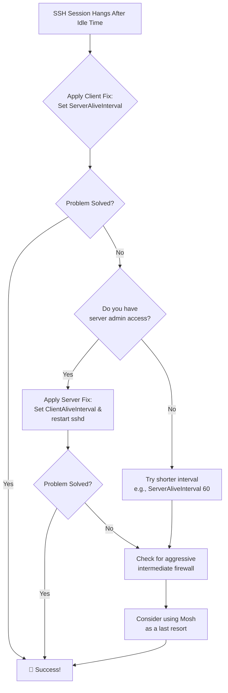

# SSH Hangs After 10–15 Minutes of Inactivity – ServerAliveInterval and TCPKeepAlive in One Post

There is a quiet, digital loneliness in a frozen terminal. You were deeply connected to a remote server, your work flowing across the wire. Then, you stepped away for a cup of chai. When you return, the cursor is dead. No amount of typing revives it. The connection has hung, suspended in a silent void, forcing you to close the window and start over.

This common frustration—SSH freezing after a period of inactivity—is not a bug, but a collision of well-intentioned defaults. Your router or firewall is trying to clean up idle connections, and your SSH client and server are being too polite. Let’s teach them to whisper, to keep the conversation alive.

## Here is your immediate action plan to banish frozen SSH sessions for good:

The solution is to enable keep‑alive messages—small packets that act as a heartbeat, telling every device in the chain that the connection is still in use.

### The Client-Side Path (Universal Fix)
Configure your machine to periodicially ping the server. Add to `~/.ssh/config`:

```bash
Host *
    ServerAliveInterval 120
    ServerAliveCountMax 3
```

**What this does:**
*   **`ServerAliveInterval 120`:** Send a keep-alive packet every 120 seconds (2 minutes).
*   **`ServerAliveCountMax 3`:** Disconnect only if 3 consecutive keep-alives go unanswered.

### Summary of Solutions

| Where to Configure | What to Set (Example) | Best For |
| :--- | :--- | :--- |
| **On Your SSH Client** | `ServerAliveInterval 120` | When you cannot modify the server (shared hosting, work servers). |
| **On the SSH Server** | `ClientAliveInterval 60` | When you have root access and want to fix it for everyone. |
| **Command-Line Argument** | `ssh -o ServerAliveInterval=120` | For a quick one-time test. |

## The Heart of the Silence: Why Connections Are Torn Down

Think of your SSH connection as a quiet phone call between two friends. In the background, the telephone exchange (your router) is busy. If it hears nothing—no typing, no commands—for too long (often 10‑15 minutes), it assumes the call is over and hangs up the line.

Keep-alive settings are the equivalent of one friend softly saying, “You still there?” every few minutes.

## Your Guide to Permanent Solutions

### Fix 1: Configure Your Client
Open or create `~/.ssh/config`:
```bash
Host *
    ServerAliveInterval 120
    ServerAliveCountMax 3
    TCPKeepAlive yes
```

### Fix 2: Configure the Server (The Admin’s Path)
Edit the daemon config (requires sudo):
```bash
sudo nano /etc/ssh/sshd_config
```
Add or modify:
```bash
ClientAliveInterval 60
ClientAliveCountMax 5
```
Restart with `sudo systemctl restart sshd`.

## Troubleshooting: When the Basic Fix Isn’t Enough

*   **Interval Too Long:** If you set `ServerAliveInterval` to 1 hour but your network times out after 15 minutes, it will still fail. Keep it under 5 minutes.
*   **Aggressive Firewalls:** Some networks require intervals as low as 30 seconds.
*   **Mosh (Mobile Shell):** For high latency or roaming between networks, `mosh` is a resilient alternative that survives network drops seamlessly.

---



---

*O Allah, never let the world forget the suffering of our brothers and sisters in Palestine. Shower them with Your mercy, steady their hearts with patience, and replace their every tear with the light of peace. O Most Merciful, be their protector, their healer, their unbreakable hope. Ameen, ya Rabb al-ʿālamīn.*
