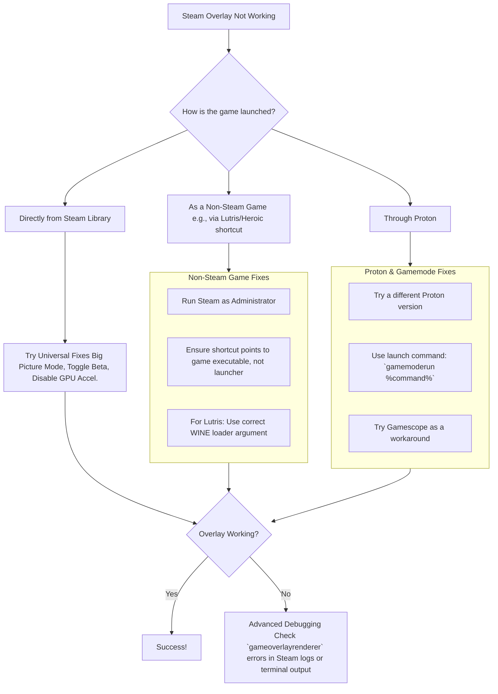

# Linux: When Your Steam Overlay Goes Missing - A Guide for Every Launcher

**Have you ever reached for a tool in the middle of a task, only to find the drawer empty?** That sharp, frustrating moment of interruption—that’s what it feels like when you press `Shift+Tab` in your game and nothing happens. The Steam Overlay, that handy Swiss Army knife for chatting, browsing guides, or tweaking controller settings, has vanished. On Linux, this problem has a peculiar habit of appearing in some games but not others, often depending on how you launched the game.

After wrestling with this ghost across Steam, Lutris, and Heroic, I’ve mapped the labyrinth. The solution is rarely in one place. It’s about understanding the conversation between your game, the launcher, and a piece of software called `gamemode`. Let’s get your tools back in reach.

## The Immediate Fixes: Start Here Before Diving Deeper
Before we untangle the launcher-specific knots, try these universal steps. They resolve a surprising number of issues.

1.  **The Big Picture Workaround:** One of the oldest and simplest tricks is to launch your game through Steam’s Big Picture Mode. For reasons buried in Steam’s code, this different interface can sometimes establish the overlay connection where the standard client fails.
2.  **Verify the Overlay is Enabled:** It sounds obvious, but ensure the overlay is turned on. In Steam, go to **Settings > In-Game** and check "Enable the Steam Overlay while in-game."
3.  **Toggle Steam Beta Participation:** Client bugs come and go. Try switching your Steam client between the beta and stable release. Go to **Settings > Account > Beta Participation** to change this.
4.  **Disable GPU Acceleration in Steam:** In Steam’s **Settings > Interface**, uncheck "Enable GPU accelerated rendering in web views." This can resolve overlay corruption or black screens.

## Deep Dive: Fixes for Every Launcher Ecosystem

### 🎮 For Native Steam Games & Proton
When a game from your Steam library lacks an overlay, the issue often sits between Proton, Steam, and performance tools.
*   **Proton Version is Key:** A very common culprit is the Proton version itself. If the overlay works with Proton 6.3 but not with Proton Experimental or GE, you have a clear answer. Roll back to a known-working version in the game’s **Properties > Compatibility** menu.
*   **Gamemode Integration:** The `gamemoded` daemon optimizes your system for gaming. However, it must attach to the correct process. Using the launch command `gamemoderun %command%` ensures it starts, but you must verify it attaches to the game process, not just the Proton prefix. Using `gamemoderun mangohud %command%` can sometimes help composite the overlay correctly.

### 🏺 For Games Launched via Lutris
Getting the overlay to work with Lutris shortcuts in Steam is a classic hurdle. The standard "Create application menu shortcut" method often fails because of how Lutris wraps the launch command.
*   **The Right Launch Command:** The key is to point Steam directly to the game’s executable within the WINE prefix, using Lutris as a precise wrapper. Your launch command should look something like `lutris -r -d 'GameName'`. The `-d` flag for debug output can help verify the path.
*   **Avoid the Launcher Trap:** If your game uses a separate launcher (like many EA or Ubisoft titles), ensure your Steam shortcut target is the `game.exe`, not the `launcher.exe`.

### ⚔️ For Games from Heroic Games Launcher
The issue with Heroic is similar to Lutris but has its own quirks, especially when run as a Flatpak.
*   **Target the Game, Not Heroic:** When adding a game from Heroic to Steam, don’t add the Heroic launcher. You need to find the actual native or WINE-wrapped game executable.

## When All Else Fails: The Diagnostic Mindset
If you’ve tried everything, it’s time to play detective.
**Inspect the Logs:** Launch Steam from a terminal with `steam > ~/steam.log 2>&1`, then launch your game and try the overlay. The terminal output or the log file at `~/.steam/steam/logs/` may contain golden error messages like the `gameoverlayrenderer.so` failure.

**Final Thoughts: Patience and Precision**
Fixing the Steam Overlay on Linux is a test of patience. It requires you to be a translator between different systems: the Windows-oriented game, the Proton or WINE compatibility layer, the Linux launcher, and the Steam client itself. There’s no single magic command, but by understanding the chain of custody—from your click to the game window—you can almost always find the weak link.

> “O Allah, never let the world forget the suffering of our brothers and sisters in Palestine. Shower them with Your mercy, steady their hearts with patience, and replace their every tear with the light of peace. O Most Merciful, be their protector, their healer, their unbreakable hope. Ameen, ya Rabb al-ʿālamīn.”
