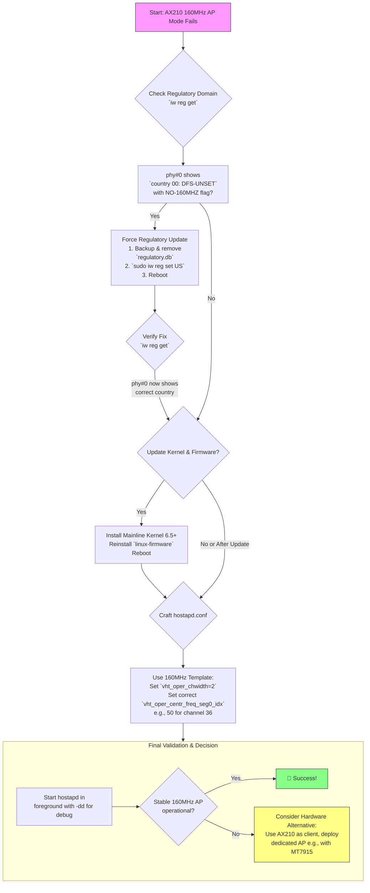

# Ubuntu 22.04 LTS + AX210: 160MHz Channels Not Working – Driver and hostapd Reality Check

There’s a particular kind of silence that follows a promise unfulfilled. You assemble the pieces—a modern machine, a flagship Wi-Fi 6E card like the Intel AX210, an LTS Ubuntu release promising stability. You envision creating a high-speed wireless hub, a 160MHz-wide superhighway for your devices. You configure `hostapd` with care, only to be met with a terminal’s cold rejection: `Could not set channel for kernel driver`, or the even more deflating, `HOSTAP mode not supported`.

The silence of a network that should be buzzing with data. If you’re standing in this frustrating quiet, know that you’re not alone. The gap between the AX210’s hardware potential and its software support on Linux, especially in Access Point (AP) mode, is a well-trodden path of community frustration.

## The Reality Check
The Intel AX210 is fully capable of 160MHz channels, but enabling it in AP mode on Ubuntu 22.04 is hindered by three core issues:

1.  **The Regulatory Lock:** Your card’s internal regulatory database (`phy#0`) is likely stuck in a generic `country 00: DFS-UNSET` state, which imposes restrictive flags like `NO-80MHZ`, `NO-160MHZ`.
2.  **The AP Mode Driver Gap:** The `iwlwifi` driver in the mainline kernel has historically had limited support for AP mode on certain AX2xx series cards.
3.  **The hostapd Configuration:** Your `hostapd.conf` must be meticulously configured for 160MHz operation.

## Diagnosing the Problem: The Regulatory Maze
Interrogate the regulatory agent:
```bash
iw reg get
```
If you see `country 00: DFS-UNSET` and `NO-160MHZ`, the card is ignoring your global country rules and defaulting to the most restrictive ones.

## The Fix: Forcing Regulatory Compliance
1.  **Backup and remove the old database:**
    ```bash
    sudo cp /lib/firmware/regulatory.db /lib/firmware/regulatory.db.backup
    sudo rm /lib/firmware/regulatory.db
    sudo rm /lib/firmware/regulatory.db.p7s
    ```
2.  **Set your global country code explicitly:**
    ```bash
    sudo iw reg set US  # Replace US with your ISO country code
    ```
3.  **Reboot.** Upon reboot, the system should generate a new regulatory database based on your set country.

## Laying the Foundation: Kernel and Firmware
Upgrade to a newer kernel (6.5+) using tools like `ukuu` and ensure latest `linux-firmware` is installed. Check `dmesg` after reboot for lines confirming `PNVM load`.

## Crafting The hostapd Configuration
Use this template for a 160MHz channel on the 5GHz band:

```conf
interface=wlp1s0 
driver=nl80211
ssid=My_160MHz_Network
country_code=US

hw_mode=a
channel=36

ieee80211n=1
ieee80211ac=1
ht_capab=[HT40+][SHORT-GI-40][DSSS_CCK-40]
vht_oper_chwidth=2                           # Critical: 2 = 160 MHz
vht_oper_centr_freq_seg0_idx=50              # Center frequency for channel 36 @ 160MHz
vht_capab=[MAX-MPDU-11454][RXLDPC][SHORT-GI-80][SHORT-GI-160][TX-STBC-2BY1][RX-STBC-1][SU-BEAMFORMER][SU-BEAMFORMEE][MU-BEAMFORMER][MU-BEAMFORMEE][VHT160]

ieee80211ax=1
he_oper_chwidth=2
he_oper_centr_freq_seg0_idx=50

wpa=2
wpa_passphrase=YourStrongPassword
wpa_key_mgmt=WPA-PSK
rsn_pairwise=CCMP
auth_algs=1
wmm_enabled=1
```

## Final Thoughts: Beyond the Silent Terminal
Our journey with technology is often a dialogue between ambition and reality. The Intel AX210 represents a peak of wireless ambition. The current reality of Linux driver development is a complex landscape. True connectivity is about achieving the goal—may your network, however you build it, be fast, stable, and free.

---



---

*O Allah, never let the world forget the suffering of our brothers and sisters in Palestine. Shower them with Your mercy, steady their hearts with patience, and replace their every tear with the light of peace. O Most Merciful, be their protector, their healer, their unbreakable hope. Ameen, ya Rabb al-ʿālamīn.*
