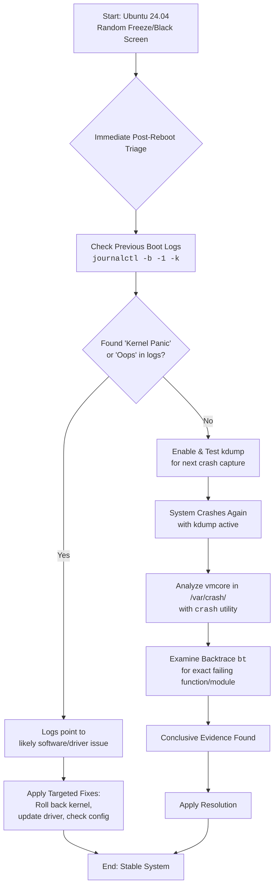

# Ubuntu 24.04 Random Freezes and Black Screen – How I Used journalctl + kdump to Find the Culprit

There is a particular kind of helplessness that comes when your machine simply stops. No warning, no error box—just a sudden, silent severance. On a fresh Ubuntu 24.04 install, it feels like a betrayal. Today, we move from helplessness to understanding.

## The Immediate Action Plan
Your freezes are likely symptoms of a "kernel panic". The key is to stop guessing and start collecting evidence.

### 1. Enable and Verify Kdump (The Detective)
Install the tools to capture memory snapshots during a crash:
```bash
sudo apt install linux-crashdump kdump-tools
sudo dpkg-reconfigure kdump-tools  # Select 'Yes'
```
Verify status with `sudo kdump-config show`.

### 2. Interrogate the Journals
After a hard reboot, check the last records:
```bash
journalctl -b -1 -p err
```
Look for `Kernel panic - not syncing`, `Oops`, or `BUG`.

### 3. The Autopsy (Analyzing the vmcore)
A `vmcore` file in `/var/crash/` is the "black box" of your crash. Analyze it with the `crash` utility:
```bash
sudo crash /usr/lib/debug/boot/vmlinux-$(uname -r) /var/crash/[timestamp]/vmcore
```
In the prompt, run `bt` to see the backtrace of failing code.

## Common Triggers
- **Faulty Drivers:** Especially GPUs or newer AMD Ryzen chips.
- **Hardware Failure:** Bad RAM or a failing SSD.
- **Filesystem Corruption:** Errors that force the kernel into read‑only mode.

---



---

*O Allah, never let the world forget the suffering of our brothers and sisters in Palestine. Shower them with Your mercy, steady their hearts with patience, and replace their every tear with the light of peace. O Most Merciful, be their protector, their healer, their unbreakable hope. Ameen, ya Rabb al-ʿālamīn.*
