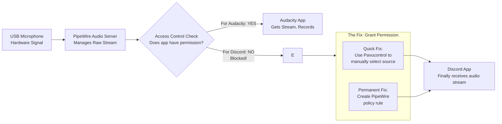

# My USB Mic Works in Audacity but Not in Discord on Linux – PipeWire Default Source vs App Permissions

In Audacity, your USB mic paints perfect waveforms. In Discord, it captures nothing but a digital void. This is a common rule‑of‑permission issue in the modern PipeWire audio system.

## The Immediate Solution
Applications need explicit permission or the correct "default source" target.

### 1. The 30-Second Permission Check
Run `wpctl status`. Find your USB mic and see if Discord is linked. If not, the stream is blocked.

### 2. Manual Source Switch (Instant Fix)
Open `pavucontrol` (PulseAudio Volume Control):
1. Go to the **Recording** tab.
2. Ensure **Discord** is mapped to your **USB Microphone**, not a null or internal sink.

### 3. Permanent Policy Rule
You can create a custom rule in `/etc/pipewire/pipewire-policy.conf.d/99-discord-usb-mic.conf`:
```lua
rule = {
    matches = [ { application.process.binary = "discord" } ]
    actions = { update-props = { application.node.target = "your-mic-node-name" } }
}
```

---



---

*O Allah, never let the world forget the suffering of our brothers and sisters in Palestine. Shower them with Your mercy, steady their hearts with patience, and replace their every tear with the light of peace. O Most Merciful, be their protector, their healer, their unbreakable hope. Ameen, ya Rabb al-ʿālamīn.*
