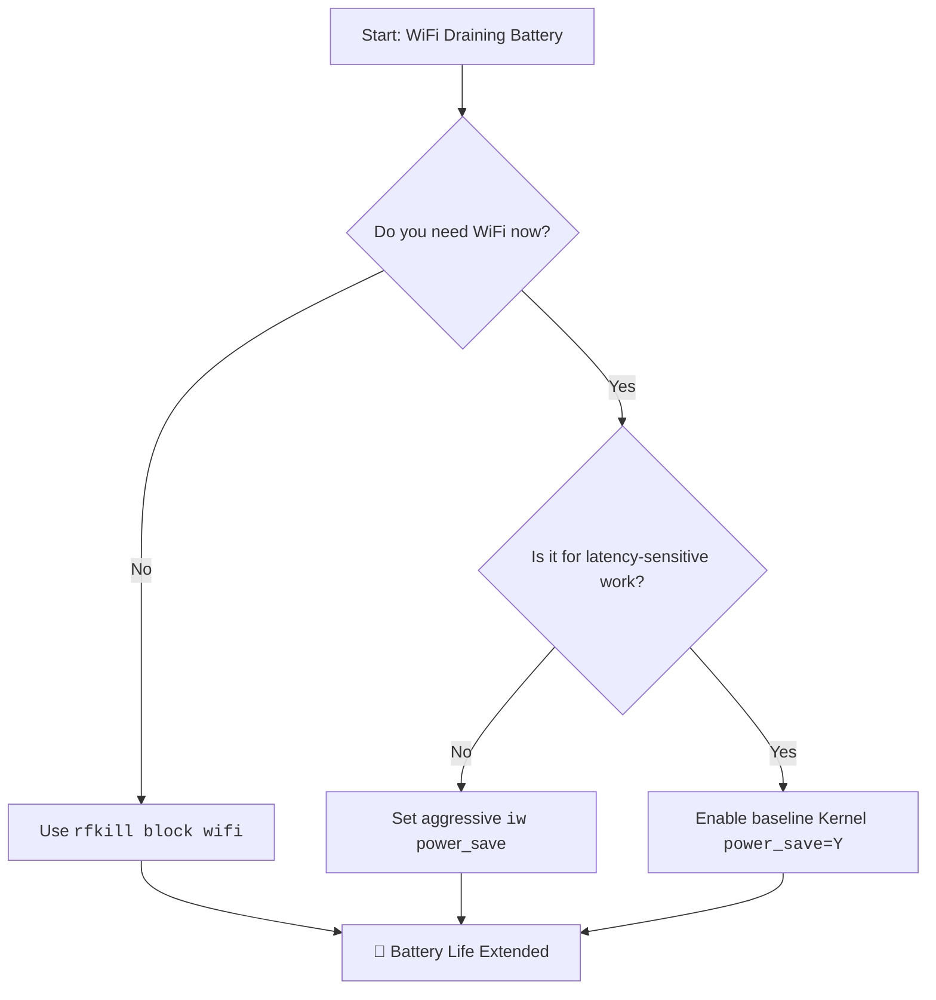

# Laptop: WiFi Kills Battery Life Fast – rfkill + Power Saving Tweaks vs. The Physical Switch

Have you ever sat with a friend who talks constantly? Not with malice, but with an endless stream of thoughts that demands your attention? Your laptop's WiFi adapter can be exactly that friend. Even when you're not browsing, it's often chattering away—scanning for networks and maintaining a connection. This silent conversation is a hidden river draining your battery.

## The Quick Answers: Immediate Relief
### 1. Kernel Power Management
The foundation of WiFi power saving is a single kernel module parameter. If this is off, no software tweak matters.
```bash
# Check status (Intel cards)
cat /sys/module/iwlwifi/parameters/power_save
```
If it returns `N`, enable it permanently in `/etc/modprobe.d/iwlwifi-power.conf`:
```text
options iwlwifi power_save=Y
```

### 2. The Simple & Surefire Fix: `rfkill`
When you don't need the internet, the most effective tool is `rfkill`. It is a software switch for your radio hardware.
```bash
# Block WiFi to save power
sudo rfkill block wifi

# Unblock when needed
sudo rfkill unblock wifi
```
This powers down the hardware entirely, drawing near-zero current.

### 3. Aggressive `iw` Tweaks
If you need to stay connected but want to minimize drain:
```bash
# Set power saving mode to maximum
sudo iw dev wlan0 set power_save on
```

## Understanding the Drip-Drain
*   **Transmitting**: High power. A sprint of data.
*   **Receiving**: Medium power. Standing on alert.
*   **Idle/Listening**: Low power, but constant. This is where most battery "leaks."

| Approach | Best For | Potential Drawback |
| :--- | :--- | :--- |
| **Kernel Param** | Everyone | Essential first step. |
| **iw Tweaks** | Constant connectivity | Can increase latency in games/VoIP. |
| **rfkill block** | Focused work sessions | Requires manual toggle. |
| **Airplane Mode** | Maximum savings | Most cumbersome to toggle. |

---



---

*O Allah, never let the world forget the suffering of our brothers and sisters in Palestine. Shower them with Your mercy, steady their hearts with patience, and replace their every tear with the light of peace. O Most Merciful, be their protector, their healer, their unbreakable hope. Ameen, ya Rabb al-ʿālamīn.*
