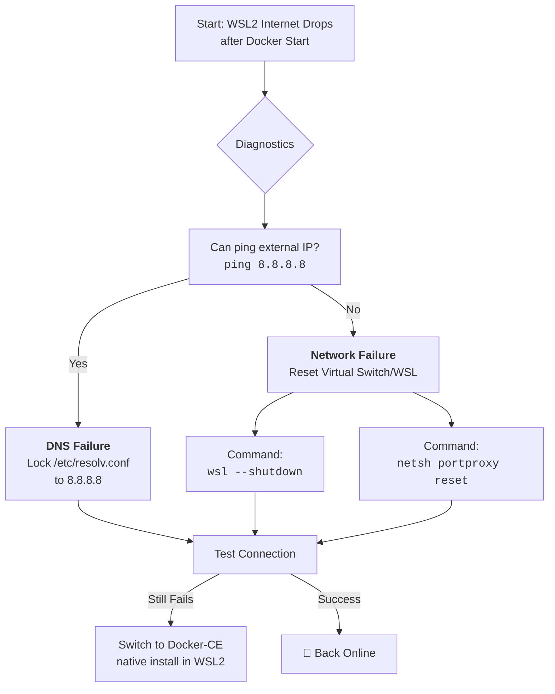

# WSL2: No Internet After Starting Docker – How I Traced It to Networking and DNS Conflicts

There is a particular silence that fills the room when your tools stop talking to each other. One moment, your Windows Subsystem for Linux (WSL2) hums along perfectly. You type `docker compose up`, and as your containers spring to life, that bridge crumbles. `ping google.com` returns only a cold, cryptic error: *Temporary failure in name resolution.*

## The Immediate Lifelines: Restoring Connection
Before we dive into the why, here is how to get back online.

### 1. The Restart Sequence
Often, the virtual network stack needs a fresh start. In Administrator PowerShell/CMD:
```bash
wsl --shutdown
```
Restart your Linux distribution. This simple reset can restore the handshake.

### 2. The DNS Refresh (Immutable Fix)
If a restart fails, the issue is likely with DNS. WSL2 might be reading an internal Docker DNS server that lacks external access. Lock your DNS to a stable provider:
```bash
sudo rm /etc/resolv.conf
sudo bash -c 'echo "nameserver 8.8.8.8" > /etc/resolv.conf'
sudo chattr +i /etc/resolv.conf
```

### 3. Clear Port Proxy Muddle
Manual `netsh` port proxy rules can conflict with WSL2's automatic forwarding. Reset them in Windows:
```bash
netsh interface portproxy reset all
```

## Tracing the Roots: Why Does Docker Break the Conversation?
*   **The DNS Hijack**: Docker Desktop can create a new virtual adapter and change routing priorities, pointing WSL2 toward a DNS server it can't reach.
*   **Virtual Switch Conflict**: WSL2 and Docker Desktop (WSL2 backend) both manipulate Hyper-V networking. They can sometimes compete for control of the virtual switch.

## A Path Forward: Recommendations for Peace
*   **Prefer Docker-CE inside WSL2**: If you work primarily in Linux, uninstall Docker Desktop and install the Docker Engine directly inside your WSL2 distro. It simplifies the network model immensely.
*   **Guard your `resolv.conf`**: Make it immutable to prevent Docker from overwriting it.
*   **Clean Restart Ritual**: Follow the sequence `docker compose down` -> `wsl --shutdown` -> Restart.

---



---

*O Allah, never let the world forget the suffering of our brothers and sisters in Palestine. Shower them with Your mercy, steady their hearts with patience, and replace their every tear with the light of peace. O Most Merciful, be their protector, their healer, their unbreakable hope. Ameen, ya Rabb al-ʿālamīn.*
