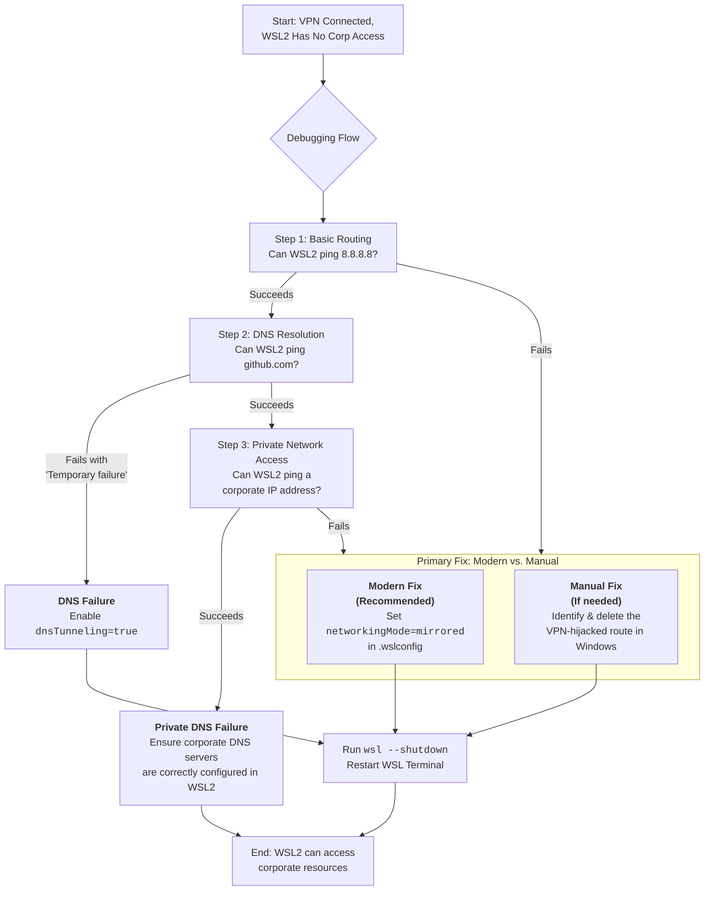

# WSL2 + OpenVPN: Host Can Access Corp Resources, But WSL2 Can’t – Static Routes and DNS Hacks

There’s an invisible wall that emerges the moment you connect to your corporate VPN. On one side, your Windows desktop hums along perfectly—email syncs, internal web portals load, and databases are just a connection string away. On the other side, within the familiar terminal of your WSL2 Linux distribution, lies silence. `ping` commands time out, `curl` fails, and your development environment is severed from the tools it needs. It feels like you’ve been granted a keycard to the building, but the door to your own office is locked.

This isn’t a flaw in your setup; it’s a fundamental quirk in how WSL2’s virtualized networking interacts with the VPN’s secure tunnel. The host is on the inside, while WSL2 is left knocking on the glass. Let’s build a bridge.

## The Modern Integrated FixES
Modern versions of WSL (2.2.1+ on Windows 11 22H2+) provide built‑in solutions that often make manual "hacks" obsolete.

### 1. Enable Mirrored Networking Mode (The Ultimate Fix)
This new architecture makes WSL2 share the host's network interface directly, solving most VPN routing issues. Add to your `C:\Users\<YourUsername>\.wslconfig` file:
```ini
[wsl2]
networkingMode=mirrored
```

### 2. Ensure DNS Tunneling is Active
This feature fixes VPN DNS by handling requests through Windows. Verify or enable it in the same `.wslconfig` file:
```ini
[wsl2]
dnsTunneling=true
```

## The Core of the Conflict
### Layer 1: The Routing Hijack
WSL2 operates using a virtual network adapter. When you connect to a VPN, it often incorrectly captures the traffic coming from the WSL2 virtual adapter and sends it through its secure tunnel, where the gateway doesn't recognize the IP and drops it.

### Layer 2: The DNS Silo
Corporate VPNs push internal DNS servers. A long‑standing bug in WSL2 often breaks the inheritance of these settings. DNS Tunneling solves this by having Windows (which is correctly configured) resolve the names for WSL.

## Manual Route Fix (Surgical Strike)
If Mirrored Mode is not an option, you can manually delete the bad route in Administrator PowerShell:
1. Identify the WSL virtual adapter Subnet via `ipconfig`.
2. Delete the offending route:
   ```powershell
   route delete <WSL_Subnet> mask <Mask> 0.0.0.0 IF <VPN_Index>
   ```

---



---

*O Allah, never let the world forget the suffering of our brothers and sisters in Palestine. Shower them with Your mercy, steady their hearts with patience, and replace their every tear with the light of peace. O Most Merciful, be their protector, their healer, their unbreakable hope. Ameen, ya Rabb al-ʿālamīn.*
