# The Phantom Port: Solving WSL2's "Port Already in Use" Mystery

**Have you ever tried to start a simple web server, only to be met with a stubborn error that defies all logic?** You type `python3 -m http.server 8080` or `npm start`, and the terminal coldly replies: `Error: listen EADDRINUSE: address already in use :::8080`. You check, double-check, and triple-check. `netstat` inside Linux shows nothing. `lsof` insists the port is free. You restart the service, restart WSL, and yet the ghost persists. Your port, it seems, is haunted.

If you've faced this digital ghost town in WSL2, where a port claims to be occupied by a process you cannot find, you have stumbled upon one of the most common and perplexing quirks of this beautiful, complex bridge between Windows and Linux. The culprit is rarely inside your Linux distribution. It’s almost always a **silent conflict on the Windows host side**, a remnant or a service that didn't get the memo when WSL restarted. I have spent hours tracing these phantom processes, and today, I’ll guide you through the exorcism.

## The Immediate Fix: Find and Silence the Windows Process
The core principle is this: **WSL2 ports are Windows ports.** When you listen on `localhost:8080` in WSL2, you are also binding to `localhost:8080` on Windows, thanks to WSL2's networking bridge. A Windows process holding that port will block your Linux app, and it won't show up in Linux tools.

Here’s your rapid-response plan:

### 1. Find the Culprit on Windows
Open **PowerShell** or **Command Prompt** as Administrator. The `netstat` command here is your truth-teller.
```powershell
netstat -ano | findstr :8080
```
(Replace 8080 with your blocked port). Look at the last column, the **PID** (Process Identifier).

### 2. Identify the Process
Take that PID and find out what it is.
```powershell
tasklist | findstr <PID>
```
Alternatively, check the "Details" tab in Windows Task Manager.

### 3. Make a Decision
*   If it's a known zombie app (like an old `node.exe`), kill it:
    ```powershell
    taskkill /PID <PID> /F
    ```
*   If it's a critical Windows service, you'll need to choose a different port for your Linux application.

This simple Windows-side check resolves the vast majority of "phantom port" errors.

## The Proactive Solution: Clean Port Binding on WSL Shutdown
Sometimes, the conflict arises because a previous WSL session didn't cleanly release the port.
*   **Inside Linux:** Before closing your terminal, stop your services (`Ctrl+C`).
*   **The Nuclear Option:** To ensure all WSL processes are cleared and ports released, run this from PowerShell:
    ```powershell
    wsl --shutdown
    ```
    This releases all ports. A subsequent `wsl` command will start a fresh instance.

## Understanding the Bridge: Why WSL2 Networking Creates This Puzzle
WSL2 is not a traditional virtual machine with its own isolated IP. It’s a deeply integrated utility VM. WSL2 has its own virtual interface, but Microsoft sets up an **automatic localhost forwarding relay**.

When you access `localhost:8080` from Windows, the Windows networking stack knows to forward that traffic to the WSL2 VM. This magic creates the conflict. The binding happens on two levels:
1.  **Linux Level:** Your app binds to the port inside the WSL2 kernel.
2.  **Windows Level:** The WSL2 relay mechanism binds to the same port on Windows to facilitate the forward.

If a Windows process grabs that port before the WSL2 relay can, or if a stale relay process lingers, the error appears.

## A Step-by-Step Diagnostic Flowchart
Follow this logical path to systematically eliminate the phantom.

```mermaid
flowchart TD
    A[Start: Port Error in WSL2] --> B{Is port free in WSL2? Use: `sudo ss -tulpn`}
    
    B -- Yes --> C{Is port free on Windows? Use: `netstat -ano &#124; findstr :PORT`}
    B -- No --> D[Stop the Linux process `sudo kill PID`]
    
    C -- Yes --> E[Potential Stale WSL Relay Restart WSL: `wsl --shutdown`]
    C -- No --> F[Identify & stop the Windows process]
    
    D --> G[Try binding port again]
    F --> G
    E --> G
    
    G --> H{Success?}
    H -- No --> I[Advanced: Check for Hyper-V reserved ports]
    H -- Yes --> J[Problem Solved!]
```



## Advanced Scenarios and Permanent Fixes

### Scenario 1: The Persistent System Process
If `svchost.exe` or "System" is holding your port, it might be the **Windows Background Transfer Service** or **BranchCache**. You can try limiting their port ranges or, more simply, move your dev server to a less common port (e.g., 3001, 8081).

### Scenario 2: Hyper-V Port Reservations
Hyper-V can reserve large ranges of ports for its own use, blocking them from apps. Check reserved ranges in PowerShell:
```powershell
netsh int ipv4 show excludedportrange protocol=tcp
```
If your port falls in a range here, you have two choices:
1.  Change your app's port (Recommended).
2.  Reset the Winsock catalog (Complex/Risky: `netsh int ip reset`, restart).

### Making Your Service Bind to the WSL2 IP
For services that don't need to be reached via `localhost` on Windows, you can bind them specifically to the WSL2 instance's internal IP.
1.  Find your IP: `ip addr show eth0 | grep inet`
2.  Bind your server: `python3 -m http.server 8080 --bind 172.24.32.1`

## A Philosophy of Coexistence
Solving the phantom port issue is more than a technical fix. It is a lesson in the philosophy of WSL2 itself. This tool is a bridge between two worlds. The traffic on that bridge flows both ways, and sometimes the traffic controllers—the port bindings—get their signals crossed.

When you learn to check both sides of the bridge, you stop being a passenger in WSL2 and become its steward. The `netstat` command in PowerShell becomes as familiar as `ss` in Bash. You solve the mystery in seconds, and return to your real work: building something wonderful.

> “O Allah, never let the world forget the suffering of our brothers and sisters in Palestine. Shower them with Your mercy, steady their hearts with patience, and replace their every tear with the light of peace. O Most Merciful, be their protector, their healer, their unbreakable hope. Ameen, ya Rabb al-ʿālamīn.”
